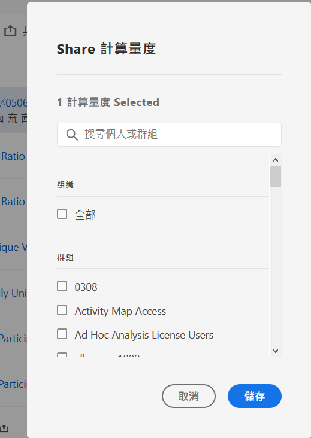

# 共用計算量度

在[計算量度管理員](cm-manager.md)中，您可以共用計算量度。 您可以將計算量度共用給整個組織、群組或個別使用者（視您的許可權而定）：

* **管理員**：管理員可以將計算量度共用給整個組織、組織內的群組以及個別使用者。 如需詳細資訊，請參閱 [Admin Console 文件](https://helpx.adobe.com/tw/enterprise/using/manage-products.html)。
* **非管理員**：非管理員只能與其建立的計算量度共用，而且只能與個別使用者共用。

若要共用一或多個計算量度：

1. 在[計算量度管理員](cm-manager.md)中，選取一或多個要共用的計算量度。
1. 從動作列中選取 **[!UICONTROL 共用]**。
1. 在&#x200B;**[!UICONTROL 共用計算量度]**&#x200B;對話方塊中：

   

   1. （選擇性）使用至&#x200B;*搜尋個人或群組*，並限制您要共用計算量度的群組或個人清單。

   1. 從&#x200B;**[!UICONTROL 組織]**&#x200B;或&#x200B;**[!UICONTROL 群組]**&#x200B;區段中選取一或多個選項，或搜尋並選取一或多個個人。 可用的選項取決於您的角色。

   1. 選取&#x200B;**[!UICONTROL 儲存]**&#x200B;以共用計算量度。 選取「**[!UICONTROL 取消]**」即可取消。

## 最佳做法

以下是您應共用計算量度的一些最佳實務，以及您應共用計算量度的對象。

* 作為管理員，只有在您確信組織中的任何人都習慣使用計算量度時，才應將計算量度與全部共用。 您也可以考慮偏好這些計算量度。 如需詳細資訊，請參閱[將計算量度標示為我的最愛](cm-favorite.md)。

* 身為管理員，如果計算量度為特定群組的使用者提供商務值，請將計算量度共用給該群組。

* 身為管理員或個人使用者，可將計算量度共用給一或多個個人來驗證計算量度。 如果區段被證實沒有用，您可以刪除計算量度。

<!--
Depending on your permissions, you can share metrics with your whole organization, groups, or individual users.

|  Role | Permissions |
|---|---|
|  Administrator  | Can share metrics with All, with Groups, and with Users. Groups are set up as permission groups in the Admin Console. |
|  Non-Administrator  | Can share metrics only with individual users.  |

To share a calculated metric:

1. In Adobe Analytics, select the **[!UICONTROL Components]** tab, then select **[!UICONTROL Calculated metrics]**. 

1. In the Calculated metrics manager, select the checkbox to the left of any metrics that you want to share. 

1. Select the **[!UICONTROL Share]** icon. 
   
   The Share Calculated metric dialog box displays.

   

1. Select **[!UICONTROL Share]**.

1. Choose who you want to share with:

   * **[!UICONTROL All]** (Administrators only): Shares with all users in the organization.

     Consider sharing with all only if it's of use to the entire company and everyone is comfortable using it. In this case, you should also consider making it an [approved metric](/help/components/c-calcmetrics/c-workflow/cm-workflow/cm-approving.md).
   
   * **[!UICONTROL Groups]** (Administrators only): Select any groups you want to share with.

     Consider sharing with a group if the metric provides good business value for that team.
   
   * **[!UICONTROL Individual users]**: Search for and select the individual users you want to share with.

      This is the only share option available to all users. Administrators might want to use this option to vet and validate a metric prior to making it available to a group or to everyone. If the metric isn't useful, it can be discarded. Administrators should not officially approve this type of metric.

1. Select **[!UICONTROL Share]**.

   The Shared icon appears next to the metric: .

1. You can filter on metrics shared with you by going to **[!UICONTROL Filters]** > **[!UICONTROL Other Filters]** > **[!UICONTROL Shared with Me]**.

1. (Optional) To filter the list of calculated metrics in the Calculated metrics manager to show only metrics that are shared with you, select the **Filter** icon, expand **[!UICONTROL Other filters]**, then select **[!UICONTROL Shared with me]**.
-->
