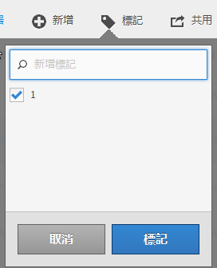

# 標記計算量度

在[計算量度管理員](cm-manager.md)中，您可以使用標籤來組織計算量度。 管理員可以標籤所有計算量度。 非管理員只能標籤他們建立或已與他們共用的計算量度。

若要標籤一或多個計算量度：

1. 在[計算量度管理員](cm-manager.md)中，選取一或多個您要標籤的計算量度。
1. 從動作列中選取 **[!UICONTROL 標籤]**。
1. 在&#x200B;**[!UICONTROL 標籤計算量度]**&#x200B;對話方塊中

   

   1. （選擇性）使用來搜尋並限制標籤清單。

   2. 根據標籤清單：

      * 從清單中選取一或多個現有標籤，或
      * 輸入新標籤並按&#x200B;**[!UICONTROL ENTER]**。 重複以上步驟以新增多個新標籤。

1. 選取&#x200B;**[!UICONTROL 儲存]**&#x200B;以儲存計算量度的標籤。 選取「**[!UICONTROL 取消]**」即可取消。

儲存後，標籤會列在[!UICONTROL 計算量度產生器]中選取之計算量度的[標籤](cm-tagging.md)欄位中。

<!--
In the Calculated metric manager, you can organize segments by tagging them.

All users can create tags for calculated metrics and apply one or more tags to a metric. However, you can see tags only for those calculated metrics that you own or that have been shared with you. 

>[!TIP]
>
>The most useful types of tags are usually tags that are based on the following criteria:
>
>* **Team names**, such as Social Marketing or Mobile Marketing.
>* **Projects** (analysis tags), such as Entry-page analysis.
>* **Categories**, such as Women's or Geography.
>* **Workflows**, such as To be approved or Curated for (a specific business unit)

## Apply tags to a calculated metric

1. In Adobe Analytics, select [!UICONTROL **Components**] > [!UICONTROL **Calculated metrics**].

1. In the Calculated metrics manager, select the checkbox next to any metrics that you want to tag. 

   
   
1. In the **[!UICONTROL Tag Calculated metric]** dialog box:

    * Add a new tag. Type the name in the [!UICONTROL **Add tags**] field, then press Enter.
    * Select one or more existing tags to apply to the selected metrics. 

1. Select [!UICONTROL **Save**] to apply the tags.

## View applied tags

1. In Adobe Analytics, select [!UICONTROL **Components**] > [!UICONTROL **Calculated metrics**] to go to the Calculated metrics manager.

1. In the Calculated metrics manager, tags appear in the [!UICONTROL **Tags**] column. (Click the gear icon on the top-right to manage your columns.)

## Filter metrics by tags

1. In Adobe Analytics, select [!UICONTROL **Components**] > [!UICONTROL **Calculated metrics**] to go to the Calculated metrics manager.

1. In the Calculated metrics manager, select the **Filter** icon, then select the tags that you want to filter by. 

   Only metrics that have the filter you select are shown.
-->