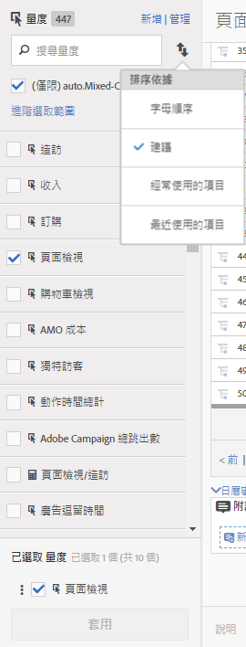

# 計算與進階計算 (衍生) 量度

計算與進階計算 (或衍生) 量度為您可從現有量度建立的自訂量度。

我們的計算量度工具可讓您以極為靈活的方式建立、管理和規劃量度。無論您是行銷人員、產品經理或分析人員，不需變更 [!DNL Analytics] 實作就能詢問資料相關問題。每個 [!DNL Analytics] 套裝中可用的自訂量度為：

* Adobe [!DNL Analytics] Foundation：計算
* [Adobe Analytics Select](https://www.adobe.com/tw/data-analytics-cloud/analytics/select.html)：計算 + 進階計算
* [Adobe Analytics Prime](https://www.adobe.com/tw/data-analytics-cloud/analytics/prime.html)：計算 + 進階計算
* [Adobe Analytics Ultimate](https://www.adobe.com/tw/data-analytics-cloud/analytics/ultimate.html)：計算 + 進階計算

以下為計算量度與進階計算量度功能比較：

| Builder 選項 | 計算量度 | 進階計算 (衍生) 量度 |
|---|---|---|
| [格式類型 (小數、時間、百分比、貨幣)](/help/components/c-calcmetrics/c-workflow/cm-workflow/c-build-metrics/cm-build-metrics.md) | 是 | 是 |
| [歸因變更 (預設、線性、參與率等)](/help/components/c-calcmetrics/c-workflow/cm-workflow/c-build-metrics/m-metric-type-alloc.md) | 是 | 是 |
| [量度類型 (標準、總計)](/help/components/c-calcmetrics/c-workflow/cm-workflow/c-build-metrics/m-metric-type-alloc.md) | 是 | 是 |
| 基本運算元 (加、減、乘、除) | 是 | 是 |
| [套用區段](/help/components/c-calcmetrics/c-workflow/cm-workflow/c-build-metrics/metrics-with-segments.md) | 無 | 是 |
| [基本函數 (計數、abs 值、平均值等)](/help/components/c-calcmetrics/cm-reference/cm-functions.md) | 無 | 是 |
| [進階函數 (迴歸、if/then、t 分數等)](/help/components/c-calcmetrics/cm-reference/cm-adv-functions.md) | 無 | 是 |

## 功能 {#section_A0A5C275B68A4D628950BBB0B1EE631F}

您可以

* 在 [!UICONTROL Analysis Workspace]、[!UICONTROL Reports &amp; Analytics]、[!UICONTROL Report Builder]、[!UICONTROL 異常偵測]以及[!UICONTROL 貢獻分析]。
* [無須變更實作](https://youtu.be/CuQTm9RaUpY)，即可建立衍生自報表執行時間的區段量度。因為這些量度的根據是區段，所以可查看其歷史資料。
* 在報表套裝間共用量度。這表示所有新建立的量度都會套用至相同登入公司的所有報表套裝。
* (僅限進階計算量度) 量度上的區段。例如，您可以建立「新訪客」的量度，計算這是他們第一次工作階段的人員數量。
* (僅限進階計算量度) 納入統計函數以協助您說明資料。例如，您可以計算報表中的項目數或加入每個項目的標準差數字。

## 限制 {#section_CB878B02451541D68A68B508D4DBD19A}

部分 [!DNL Analytics] 功能可讓您使用事件，但無法使用計算量度：

* Reports &amp; Analytics 中的「漏斗」
* Analysis Workspace 中的「副產品」
* [!UICONTROL Analysis Workspace 中的「同類群組分析」]
* [!UICONTROL Data Warehouse]
* [!UICONTROL 區段]
* [!UICONTROL 即時報表]
* [!UICONTROL 目前的資料報表]
* [!DNL Analytics] for [!DNL Target]

## 工具 {#section_D65E9C067E9C45E1A50DD30F50561BB2}

以下為[!UICONTROL 計算量度]工具的簡要概覽：

<table id="table_520AFE97DB514958ABE23FD3C9CE0ABD"> 
 <thead> 
  <tr> 
   <th colname="col1" class="entry"> 工具 </th> 
   <th colname="col2" class="entry"> 功能 </th> 
  </tr>
 </thead>
 <tbody> 
  <tr> 
   <td colname="col1"><a href="/help/components/c-calcmetrics/c-workflow/cm-workflow/c-build-metrics/cm-build-metrics.md"  > 計算量度產生器</a> </td> 
   <td colname="col2"> 
    <ul id="ul_E6F02AB9DF204C2F9A0AC92A31594B3E"> 
     <li id="li_A4A6E716374243A190C539A3F4A41C0C">使用進階配置模型建立計算量度和進階計算量度。 </li> 
     <li id="li_C8C97BA4E227463E98077ABA5818FFC6">新增區段內嵌至量度公式。 </li> 
     <li id="li_8503D9E06A3C46569B5CDB4B90F72446">比較同一份報表中的區段。例如，比較當地訪客和國際訪客。 </li> 
     <li id="li_4B528FDE1F96400DBA0D3276408FF919">使用統計函數。 </li> 
     <li id="li_C1162B1EA6784B8189A8A87E2B0DA79A">提供詳細的量度說明 (顯示其用途、使用位置、不應使用的位置)。 </li> 
     <li id="li_DEA13F5E8BF94AF1B311C467FE6E2A74">複製定義至新量度。 </li> 
     <li id="li_8C21F55015D44910904202D2BF74221C">提供內嵌量度預覽。 </li> 
     <li id="li_3704F66C321C477F9D4F52E068C231BD">設定量度極性，指定當特定自訂事件 (量度) 上升時是好事還是壞事。 </li> 
     <li id="li_9D45319FA965476FB1C90DE8AA72BBD7">標記量度。 </li> 
    </ul> </td> 
  </tr> 
  <tr> 
   <td colname="col1"><a href="/help/components/c-calcmetrics/c-workflow/cm-workflow/cm-manager.md"  > 計算量度管理員</a> </td> 
   <td colname="col2"> 
    <ul id="ul_E4D20D5DD3904CC6A85785B5BD4C1B1E"> 
     <li id="li_E0B216BA1478406EB6212263DF71D85B">與他人共用量度。 </li> 
     <li id="li_96EB16FAF3454211AAEF78EA5B08927F">核准和管理量度。 </li> 
     <li id="li_3ADBD2428EAC4B0AA61222D87C3AF2B7">組織 (標記) 量度，讓別人找得到。 </li> 
     <li id="li_726F3C3390744E49BA63606FE196880E">刪除量度。 </li> 
     <li id="li_F306BA4FA8AF4A6E987BA62634659A2F">重新命名量度。 </li> 
    </ul> </td> 
  </tr> 
  <tr> 
   <td colname="col1"> 量度選擇器邊欄 </td> 
   <td colname="col2"> 
取代  Reports &amp; Analytics 中的顯示量度快顯功能表。 
 
此邊欄可讓您搜尋並新增/套用量度至報表。您也可以變更<a href="/help/components/c-calcmetrics/c-workflow/cm-workflow/cm-finding.md"  >排序</a>順序 (選項為：字母順序、建議、經常使用、最近使用。)此外，您也可以篩選報表套裝，只顯示在特定報表套裝中建立的量度。 
 
若要存取此量度選擇器，請按一下報表左側的「量度」圖示 。量度選擇器的外觀如下： 
 
 
 </td> 
  </tr> 
  <tr> 
   <td colname="col1"><a href="https://www.adobe.io/apis/experiencecloud/analytics/docs.html#!AdobeDocs/analytics-2.0-apis/master/README.md"  > 計算量度的 API</a> </td> 
   <td colname="col2"> 
Adobe Analytics 2.0 API 集的一部分。 
 </td> 
  </tr> 
 </tbody> 
</table>

