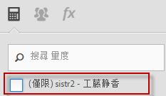

# 常見問題集

[!DNL Analytics] 中的以下計算量度運作方式有所變更，可能會對您造成影響。

[如何存取計算量度產生器？](/help/components/c-calcmetrics/cm-transition.md#section_D9AE9A0ACF824BACB5D05F0C2F7E9CA1)

[如何存取計算量度管理員？](/help/components/c-calcmetrics/cm-transition.md#section_DD0BD13E9EC940268EBE8BC88241A152)

[為什麼會看到許多名稱相同的計算量度？](/help/components/c-calcmetrics/cm-transition.md#section_E15C5B6CCC58498CAEC3FBDA8988F0A1)

[全域計算量度有什麼改變？](/help/components/c-calcmetrics/cm-transition.md#section_7351D4C7361F4ABAA1B43F8E89AAD211)

[在登入公司間共用的全域計算量度有什麼改變？](/help/components/c-calcmetrics/cm-transition.md#section_59E5CD948ED643AE9AD3D2E4277647F8)

[具有數值或數值 2 分類的計算量度有什麼改變？](/help/components/c-calcmetrics/cm-transition.md#section_71AFE6C4A7CD4AA19AB3A9D3C41D115B)

[期限量度有什麼改變？](/help/components/c-calcmetrics/cm-transition.md#section_AEDB02EF24584DAD8731BED9DDCE4F48)

[根據每日/每週/每月/每季/每年獨特訪客量度的計算量度有哪些需知事項？](/help/components/c-calcmetrics/cm-transition.md#section_E9A77EBB41CE4881B196CC1C282B2DF3)

[使用舊版報表套裝 API 方法建立或管理的計算量度有什麼改變？](/help/components/c-calcmetrics/cm-transition.md#section_13ED1BAD02634674BDAEB479B060A4B6)

[目前的資料支援所有計算量度類型嗎？](/help/components/c-calcmetrics/cm-transition.md#section_1DAA718BB8DB4413BAF8AD4B4FAAFFA2)

[「未提供名稱」和移轉的計算量度一起出現代表什麼意思？](/help/components/c-calcmetrics/cm-transition.md#section_C90CBB72A67644F38D583301981F8D03)

[刪除某個使用者後，該使用者的計算量度會發生什麼事？](/help/components/c-calcmetrics/cm-transition.md#section_42ED4C15830540879C4A161423690E5A)

[為什麼會看到對其他報表套裝無效的「未知」計算量度 (即使可對這些報表套裝建立和套用這些量度)？](/help/components/c-calcmetrics/cm-transition.md#section_6772818EFDED46E9B7095D64C3B77211)

[為什麼我對舊式計算量度進行的變更無法儲存？](/help/components/c-calcmetrics/cm-transition.md#section_81CDEFCA1FD542579AF183DA1494EAF0)

[為什麼我的計算量度沒有顯示在行銷管道報表中？](/help/components/c-calcmetrics/cm-transition.md#section_FC350359A775433AB5F43C7CAB304D62)

[為什麼有些計算量度只顯示公式，卻沒有我加入的括號？](/help/components/c-calcmetrics/cm-transition.md#section_AC0D1E9714AD487F9A1C73359F518B5E)

[(僅適用於 Ad Hoc Analysis) 仍支援包含嵌入或內嵌區段定義的計算量度嗎？](/help/components/c-calcmetrics/cm-transition.md#section_B25C924A282F49388AB604E3D826F44C)

[(僅適用於 Report Builder) 為什麼計算量度沒有出現在我的請求中？](/help/components/c-calcmetrics/cm-transition.md#section_DA4792FE5D7945218CD5E6328DE08E82)

[計算量度總計如何運作？](/help/components/c-calcmetrics/cm-transition.md#section_57BA3A299C7948ABB82B0392A9B0F33E)

## 如何存取計算量度產生器？{#section_D9AE9A0ACF824BACB5D05F0C2F7E9CA1}

* 按一下計算量度管理員頂端的「**[!UICONTROL + 新增]**」，或者
* 在任何 Analytics 報表中，按一下報表左側的「量度」圖示 ，即可顯示量度欄，然後按一下&#x200B;**[!UICONTROL 「新增」]**。

## 如何存取計算量度管理員？{#section_DD0BD13E9EC940268EBE8BC88241A152}

* 前往左側導覽中的「**[!UICONTROL 分析]**」>「**[!UICONTROL 元件]**」。然後按一下&#x200B;**[!UICONTROL 「計算量度」]**。

* 在任何 [!DNL Analytics] 報表中，按一下報表左側的「量度」圖示 ，即可顯示量度欄，然後按一下&#x200B;**[!UICONTROL 「管理」]**。

## 為什麼會看到許多名稱相同的計算量度？{#section_E15C5B6CCC58498CAEC3FBDA8988F0A1}

(先前，全域計算量度並非為特定管理員使用者所擁有，因此該報表套裝的所有使用者都能看到。這些量度是以報表套裝來做區隔。如果某個報表套裝中的量度與另一個報表套裝中的量度名稱相同，則當使用者切換報表套裝時，就會看到相同的量度。)

現在，量度不再是以報表套裝來做區隔。如果某個報表套裝中的量度與另一個報表套裝中的量度名稱相同，則這些量度都會出現在計算量度產生器以及量度選擇器中，即使其定義不一定相同，仍會顯示為重複量度。

除非您取消勾選此處顯示的「(僅限 `<report suite>`)」核取方塊，否則不會看到數個名稱相同 (但建立在不同的報表套裝中) 的計算量度：

**您需要執行的操作**

您可考慮將名稱與定義類似的計算量度合併起來，但執行時請謹慎小心。您可在計算量度管理員中查看計算量度所屬的報表套裝，以確認其原始報表套裝。在刪除可能的重複項目時，您也應查看量度的定義，以確認您是在正確地合併量度。

> [!NOTE] 即使計算量度已不再繫結至特定的報表套裝，且可用於該登入公司可見的所有報表套裝中，建立或上次儲存該計算量度的報表套裝仍會顯示在計算量度管理器中。

> [!NOTE] 即使刪除計算量度，參考該量度的書籤或控制面板報表仍可運作。

## 全域計算量度有什麼改變？{#section_7351D4C7361F4ABAA1B43F8E89AAD211}

(以前管理員可以透過「管理工具」，在報表套裝中建立計算量度 (稱為「全域計算量度」或「報表套裝計算量度」)。

全域計算量度現在是由登入公司的管理員使用者清單中的第一位管理員使用者所擁有。而且預設與「所有人」共用。此模式符合區段的共用模型與移轉計劃。

**您需要執行的操作**

無。不過，新的管理員擁有者在修改或刪除計算量度時應小心 - 這些計算量度可能用在一些書籤化報表和控制面板中。

> [!NOTE] 即使刪除計算量度，參考該量度的書籤或控制面板報表仍可運作。

## 在登入公司間共用的全域計算量度有什麼改變？ {#section_59E5CD948ED643AE9AD3D2E4277647F8}

(以前管理員可以透過「管理工具」，在報表套裝中建立計算量度 (稱為「全域計算量度」或「報表套裝計算量度」)。接著可將報表套裝新增至多個登入公司，即可在登入公司間「共用」這些量度。)

全域計算量度無法再於登入公司間共用。這些量度不再繫結或關聯至特定的報表套裝，改為關聯至特定的登入公司。以前在登入公司間共用的計算量度

* 已移轉至能夠存取該報表套裝的所有登入公司。
* 預設值為「與所有人共用」。
* 在各登入公司中都是獨立的複本。

> [!NOTE] 如果計算量度用於書籤、控制面板、警報或計劃報表中，編輯新複本「不會」影響原本存在的計算量度。

## 具有數值或數值 2 分類的計算量度有什麼改變？{#section_71AFE6C4A7CD4AA19AB3A9D3C41D115B}

(先前具有數值或數值 2 分類的計算量度，只會顯示在 [!UICONTROL Reports &amp; Analytics]、[!UICONTROL Report Builder] 與 API 中。)

現在，具有數值或數值 2 分類的計算量度仍會顯示在 [!UICONTROL Reports &amp; Analytics]、[!UICONTROL Report Builder] 與 API 中。但套用了區段的報表將不支援這些量度。

此外，下列元件也不支援具有數值或數值 2 分類的計算量度：[!UICONTROL Ad Hoc Analysis]、[!UICONTROL Analysis Workspace]、[!UICONTROL 即時]報表、[!UICONTROL 異常偵測]以及[!UICONTROL 貢獻分析]。當您建立或編輯具有數值或數值 2 分類的計算量度時，會出現相容性警告，指出計算量度和產品的某些區域不相容。

**您需要執行的操作**

如果您的量度要用於區段或其他不相容元件，請避免建立具有數值 1 或數值 2 分類的計算量度。

## 期限量度有什麼改變？{#section_AEDB02EF24584DAD8731BED9DDCE4F48}

期限量度 (也稱為所有時間量度) 不再受支援，也不再顯示於 [!UICONTROL Reports &amp; Analytics] UI 或任何其他 UI 中。您無法透過報表 API 查詢此量度。

任何包含所有時間量度的書籤、控制面板、計劃報表或警報，只要該報表上仍有至少一個其他的有效量度，就能在沒有該量度的情形下繼續執行。如果書籤、控制面板、計劃報表或警報上的唯一一個量度是所有時間量度，則該報表將停止執行。

## 根據每日/每週/每月/每季/每年獨特訪客量度的計算量度有哪些需知事項？{#section_E9A77EBB41CE4881B196CC1C282B2DF3}

根據獨特訪客量度的計算量度會顯示在下列 [!DNL Analytics] 元件中：[!UICONTROL Reports &amp; Analytics]、[!UICONTROL Report Builder] 以及 Reporting API。

但是，下列元件不支援這些量度：[!UICONTROL 區段]、[!UICONTROL Analysis Workspace]、[!UICONTROL 即時]報表、[!UICONTROL 異常偵測]以及[!UICONTROL 貢獻分析]。當您建立或編輯根據獨特訪客量度的計算量度時，會出現相容性警告，指出該量度和產品的某些區域不相容。

請在具有區段的報表上使用基本不重複訪客量度。您可以建立根據獨特訪客量度的計算量度；但該計算量度無法套用至具有區段的報表，該計算量度也不能內嵌區段。

## 使用舊版報表套裝 API 方法建立或管理的計算量度有什麼改變？ {#section_13ED1BAD02634674BDAEB479B060A4B6}

以往，使用 (1.3 或 1.4) API 方法 ReportSuite.SaveCalculatedMetrics 儲存計算量度，與在管理控制台中建立或更新計算量度的方式相同。ReportSuite.DeleteCalculatedMetrics 也一樣。此外，管理控制台中顯示的計算量度清單或呼叫 ReportSuite.GetCalculatedMetrics 時產生的清單相同。

目前 ReportSuite CalculatedMetrics API 方法 (1.3 或 1.4 版) 仍可使用舊商店儲存、刪除和擷取計算量度。現有的計算量度則會移轉並顯示在新的計算量度產生器中。**使用 API 方法建立的新計算量度只會顯示在 API 中。仍可在報告 API 中使用。**

**您需要執行的操作**

如果您需要同時使用 API 和計算量度產生器，則應停止使用 ReportSuite CalculatedMetrics API 方法，改為使用新的 CalculatedMetrics API 方法 (Get、Save、Delete 和 GetFunctions)。

## 目前的資料支援所有計算量度類型嗎？{#section_1DAA718BB8DB4413BAF8AD4B4FAAFFA2}

目前的資料不支援包含區段或統計函數的計算量度。唯一支援的函數是基本數學函數，例如加、減、乘、除和否定 (-x)。

## 「未提供名稱」和移轉的計算量度一起出現代表什麼意思？{#section_C90CBB72A67644F38D583301981F8D03}

「未提供名稱」代表沒有量度名稱與此移轉的量度相關聯 (只有公式，沒有說明性名稱)。

## 刪除某個使用者後，該使用者的計算量度會發生什麼事？{#section_42ED4C15830540879C4A161423690E5A}

該使用者建立的所有計算量度也會一併刪除。但是刪除的計算量度仍可做為已儲存的書籤、控制面板或計劃報表的一部分來運作。

## 為什麼會看到對其他報表套裝無效的「未知」計算量度 (即使可對這些報表套裝建立和套用這些量度)？{#section_6772818EFDED46E9B7095D64C3B77211}

如果計算量度包含對所選報表套裝不存在的基本量度或維度，使用者介面就會將該量度顯示為「未知」。

## 為什麼我對舊式計算量度進行的變更無法儲存？{#section_81CDEFCA1FD542579AF183DA1494EAF0}

這可能是因為移轉到新計算量度資料庫的時間點所造成，移轉時間為 2015 年 6 月 15 日到 6 月 18 日。

**您需要執行的操作**

您需要重做您對舊式量度所進行的變更。

## 為什麼我的計算量度沒有顯示在行銷管道報表中？{#section_FC350359A775433AB5F43C7CAB304D62}

(以往所有計算量度都會列在行銷管道報表的量度選擇器中，並附帶「首次接觸」和「上次接觸」選項。)

現在，只有在計算量度產生器中將配置類型明確設定為「首次接觸」或「上次接觸」的計算量度，才會顯示在行銷管道報表的量度選擇器中。請注意，已套用至行銷管道報表的計算量度仍會繼續套用並如以往一般運作。若要為行銷管道建立計算量度，請按一下量度產生器中的設定圖示並選取「首次接觸」或「上次接觸」做為配置類型。請記住，這麼做會讓計算量度只與行銷管道報表相容，該量度將無法用於其他報表。

## 為什麼有些計算量度只顯示公式，卻沒有我加入的括號？ {#section_AC0D1E9714AD487F9A1C73359F518B5E}

在移轉期間，Adobe 會從部分公式移除多餘的括號。我們只會移除對量度計算方式沒有影響的括號。這不會改變資料，只是簡化公式。

## (僅適用於 Ad Hoc Analysis) 仍支援包含嵌入或內嵌區段定義的計算量度嗎？{#section_B25C924A282F49388AB604E3D826F44C}

在 Ad Hoc Analysis 中建立的計算量度之前可能包含內嵌區段定義。現在已不可能。

**您需要執行的操作**

您必須明確儲存區段。包含內嵌區段定義的現有計算量度仍可在 Ad Hoc Analysis 中正確執行並加以檢視，但若未明確儲存區段，將無法儲存該量度。

## (僅適用於 Report Builder) 為什麼計算量度沒有出現在我的請求中？{#section_DA4792FE5D7945218CD5E6328DE08E82}

如果要求是在 5.2 版中建立且包含計算量度，這些量度將無法顯示在 5.1 版 (或更早版本) 中。這是因為計算量度現在使用全域 ID (非報表套裝專屬 ID)。

**您需要執行的操作**

您需要升級至 5.2 版才能看到這些量度。

## 計算量度總計如何運作？{#section_57BA3A299C7948ABB82B0392A9B0F33E}

[!UICONTROL Reports &amp; Analytics] 在 [!UICONTROL Reports &amp; Analytics] 中顯示計算量度總計時，只是將公式套用至總計而已。例如，計算量度「訂購/造訪」的總計是將「訂購總量」除以「存取總數」。但是在某些情況下，計算量度總計不只是行項目的總和，而是網站的總計。

範例 1：某個搜尋詞的訪客：同一位訪客可能搜尋了多個詞，所以在這種情況下，訪客總數並不等於行項目總和。

範例 2：產品的頁面檢視：在購物車中可能有多項產品，因此導致該購物車有多個頁面檢視。如需行項目總和與報表總計之比較的詳細資訊，請參閱[此知識庫文章](https://helpx.adobe.com/tw/analytics/kb/sum-line-items-different-from-total.html)。
