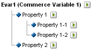

# 關於子分類

Adobe Analytics支援單級和多級分類模型。 分類階層可以讓您將分類套用到分類。

>[!NOTE] 子分類表示在分類中建立分類的能力。However, this is not the same as a [!UICONTROL Classification Hierarchy] used to create [!UICONTROL Hierarchy] reports. 如需分類階層的詳細資訊，請參閱[分類階層](classification-hierarchies.md)。

例如：

此模型中的每個分類都是獨立的，並對應至所選報表變數的新子報表。 此外，每個分類在資料檔案中組成一個資料欄，其分類名稱為欄標題。 例如：

| KEY | 屬性1 | 屬性2 |
|---|---|---|
| 123 | ABC | A12B |
| 456 | DEF | C3D4 |

For more information about the data file, see [Classification Data Files](/help/components/c-classifications2/c-classifications-importer/c-saint-data-files.md).

多級分類由父分類和子分類組成。 例如：

**父分類：**&#x200B;父分類是指任何具有相關聯子分類的分類。分類可以是父分類和子分類。 頂層父分類對應至單層分類(請參閱 [單層分類](/help/components/c-classifications2/c-sub-classifications.md))。

**子分類：**&#x200B;子分類是指任何具有其他作為父分類 (而非變數) 的分類。子分類提供其父分類的其他相關資訊。 例如，分類可 [!UICONTROL Campaigns] 能有「促銷活動擁有者」子分類。 [!UICONTROL Numeric] 分類也可當成分類報表中的量度。

每個分類（父分類或子分類）都構成資料檔案中的一個資料欄。 子分類的欄標題使用以下命名格式：

`<parent_name>^<child_name>`

如需資料檔案格式的詳細資訊，請參閱[分類資料檔案](/help/components/c-classifications2/c-classifications-importer/c-saint-data-files.md)。

例如：

| KEY | 屬性1 | 屬性 1&amp;Hat;屬性 1-1 | 屬性 1&amp;Hat;屬性 1-2 | 屬性 2 |
|---|---|---|---|---|
| 123 | ABC | 綠色 | 小 | A12B |
| 456 | DEF | 紅色 | 大 | C3D4 |

雖然多級分類的檔案範本比較複雜，但多級分類的強大功能是，可將個別層級上傳為個別檔案。 此方法可用來將資料分組為可隨著時間改變的分類層級，而不是不需要定期（每日、每週等）上傳的資料量，以將之減至最少。

>[!NOTE] 如果資 [!UICONTROL Key] 料檔案中的欄空白，Adobe會自動為每個資料列產生唯一的索引鍵。 為避免在上傳含第二級或更高級分類資料的資料檔案時造成檔案損毀，請在欄的每一列填入星號(*) [!UICONTROL Key] 。

如需疑難排解說明，請參閱「[常見的分類上傳問題](https://marketing.adobe.com/resources/help/en_US/home/index.html#kb-common-saint-upload-issues)」。

## 範例

>[!NOTE] 產品分類資料限於直接與產品相關的資料屬性。資料不限於產品在網站上的分類或銷售方式。 銷售類別、網站瀏覽節點或銷售項目等資料元素不是產品分類資料。 這些元素會擷取到報表轉換變數中。

上傳此產品分類的資料檔案時，您可以將分類資料以單一檔案或多個檔案的形式上傳（請參閱下面）。 將檔案1中的色彩程式碼與檔案2中的色彩名稱分開後，只有在建立新的色彩程式碼時，才需要更新色彩名稱資料（可能只有幾列）。 這可以免除較常更新之檔案 1 裡的顏色名稱 (代碼&amp;Hat;色彩) 欄位，並減少檔案大小和產生資料檔案時的複雜性。

### 產品分類 - 單一檔案 {#section_E8C5E031869C449F9B636F5EB3BFEC17}

| KEY | 產品名稱 | 產品詳細資訊 | 性別 | 大小 | 程式碼 | 代碼&amp;Hat;色彩 |
|---|---|---|---|---|---|---|
| 410390013 | Polo-SS | M&#39;s Polo Shirt, Short Suew(M,01) | 一 | 一 | 01 | Stone |
| 410390014 | Polo-SS | 短袖男士Polo衫(L,03) | 一 | L | 03 | 海瑟 |
| 410390015 | Polo-LS | 長袖女子Polo衫(S,23) | 五 | S | 23 | Aqua |

### 產品分類——多個檔案（檔案1） {#section_A99F7D0F145540069BA4EEC0597FF13F}

| KEY | 產品名稱 | 產品詳細資訊 | 性別 | 大小 | 程式碼 |
|---|---|---|---|---|---|
| 410390013 | Polo-SS | M&#39;s Polo Shirt, Short Suew(M,01) | 一 | 一 | 01 |
| 410390014 | Polo-SS | 短袖男士Polo衫(L,03) | 一 | L | 03 |
| 410390015 | Polo-LS | 長袖女子Polo衫(S,23) | 五 | S | 23 |

### 產品分類——多個檔案（檔案2） {#section_19ED95C33B174A9687E81714568D56A3}

| KEY | 程式碼 | 代碼&amp;Hat;色彩 |
|---|---|---|
| * | 01 | Stone |
| * | 03 | 海瑟 |
| * | 23 | Aqua |
