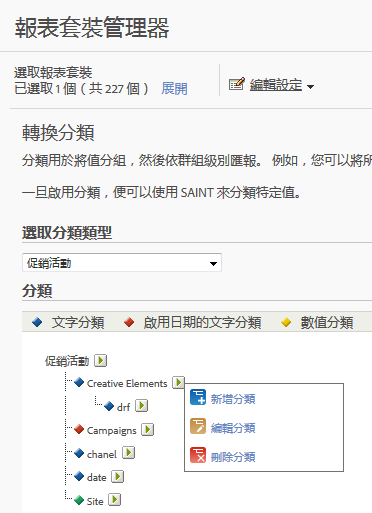

# 轉換分類

分類用於將值分組，然後依群組級別匯報。例如，您可以將所有「付費搜尋」促銷活動歸類為「流行音樂術語」類別，並報告該類別相對於「例項」(點進次數) 等量度的成功，以及成功事件的轉換。

## 轉換分類 {#concept_B4B1478A8CB540599AC9D4A58CA4B6FE}

分類用於將值分組，然後依群組級別匯報。例如，您可以將所有「付費搜尋」促銷活動歸類為&#x200B;*流行音樂術語*&#x200B;類別，並報告該類別相對於「例項」(點進次數) 等量度的成功，以及成功事件的轉換。

轉換分類可讓您歸類轉換變數。分類後，透過關鍵資料產生的任何報告，亦可透過相關聯的資料屬性產生。

啟用分類後，請使用[分類匯入工具](/help/components/c-classifications2/c-classifications-importer/c-working-with-saint.md)將特定值指派給適當的分類。

## 轉換分類說明 {#section_4A98DD5F5C314B9DAEE710AEE4EE51D4}

<table id="table_0B72C485467348E2A34BF913441F4AF5"> 
 <thead> 
  <tr> 
   <th colname="col1" class="entry"> 元素 </th> 
   <th colname="col2" class="entry"> 說明 </th> 
  </tr> 
 </thead>
 <tbody> 
  <tr> 
   <td colname="col1">  名稱 </td> 
   <td colname="col2"> 分類名稱。 </td> 
  </tr> 
  <tr> 
   <td colname="col1">  啟用日期 (僅限文字) </td> 
   <td colname="col2"> 
指出文字分類是否為促銷活動變數的日期範圍。 
 </td> 
  </tr> 
  <tr> 
   <td colname="col1">  選項 (僅限文字) </td> 
   <td colname="col2">建立可用於此分類的分類值清單。使用選項搭配促銷活動變數，可在促銷活動管理員中為使用者提供分類的支援值清單。 </td> 
  </tr> 
  <tr> 
   <td colname="col1">  數目類型 (僅限數值) </td> 
   <td colname="col2">指定數值分類中的數目類型。選項包括數值、百分比與貨幣。 </td> 
  </tr> 
 </tbody> 
</table>

## 新增轉換分類 {#task_D535D09E3EAF4CD1A15A6B93C0BB1BB5}

<!-- 

t_classification_conversion.xml

 -->

說明如何在「管理」中新增轉換分類的步驟。

1. 按一下&#x200B;**[!UICONTROL 「管理員]** &gt; **[!UICONTROL 報表套裝」]**。
1. 選取報表套裝。
1. 按一下&#x200B;**[!UICONTROL 「編輯設定]** &gt; **[!UICONTROL 轉換]** &gt; **[!UICONTROL 轉換分類」]**。
1.  在&#x200B;**「選取分類類型」**&#x200B;下拉式清單中，選取您要新增分類的變數。

   

1. 將游標移至&#x200B;**[!UICONTROL 編輯分類]**&#x200B;圖示上方，然後選取&#x200B;**[!UICONTROL 「新增分類」]**。
1.  在&#x200B;**選擇類型**&#x200B;欄位中，選取您要新增至變數的分類類型。

   選項包括&#x200B;**[!UICONTROL 文字]**&#x200B;和&#x200B;**[!UICONTROL 數值]**。如需分類類型的詳細資訊，請參閱[關於分類](/help/components/c-classifications2/c-classifications.md)。
1. 在&#x200B;**[!UICONTROL 文字分類]**&#x200B;對話方塊中，視需要設定分類。

   如需這些元素的相關資訊，請參閱[轉換分類說明](/help/components/c-classifications2/conversion-classifications.md#section_4A98DD5F5C314B9DAEE710AEE4EE51D4)。

1. 在&#x200B;**[!UICONTROL 下拉式清單]**&#x200B;對話方塊中，新增或移除選項。

   新增選項可建立用於此分類的分類值清單。您可以使用這個選項搭配促銷活動變數，在「促銷活動管理員」裡提供使用者一份受支援分類值的清單。使用此清單作為分類維度，可讓您擁有一小部分幾乎不會或絕對不會變更的許可值。例如您可能會針對不同等級的客戶忠誠度進行不同的促銷活動: 銀級、金級和白金級。您可以使用下拉式清單確保只有接受的值是符合這三個等級的值。如果有其他人嘗試使用其他值，就會被捨棄。
1. 按一下&#x200B;**[!UICONTROL 「儲存」]**。

## 刪除轉換分類 {#task_566651BC245944618A6A833E58211FDE}

<!-- 

t_classification_delete_conversion.xml

 -->

刪除不再需要的轉換分類。

1. 開啟「報表套裝管理器」，方法是按一下套裝標題中的&#x200B;**[!UICONTROL 「管理員]** &gt; **[!UICONTROL 報表套裝」]**。
1. 選取報表套裝。
1. 按一下&#x200B;**[!UICONTROL 「編輯設定]** &gt; **[!UICONTROL 轉換]** &gt; **[!UICONTROL 轉換分類」]**。
1. 在&#x200B;**選取分類類型**&#x200B;下拉式清單中，選取您要刪除分類的變數。
1. 將游標移至&#x200B;**[!UICONTROL 編輯分類]**&#x200B;圖示上方，然後選取&#x200B;**[!UICONTROL 「刪除分類」]**。
1. 在「刪除分類」對話方塊中，按一下&#x200B;**[!UICONTROL 「刪除」]**。
