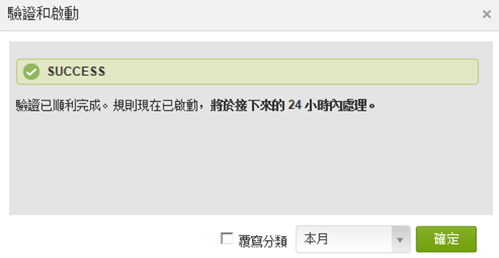
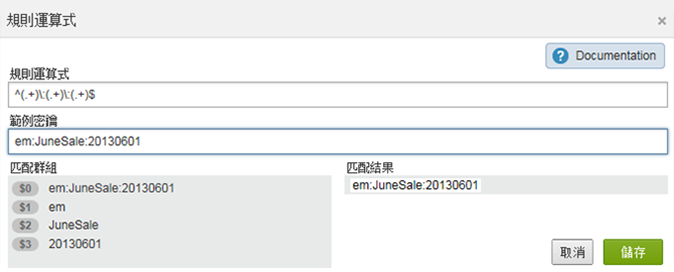
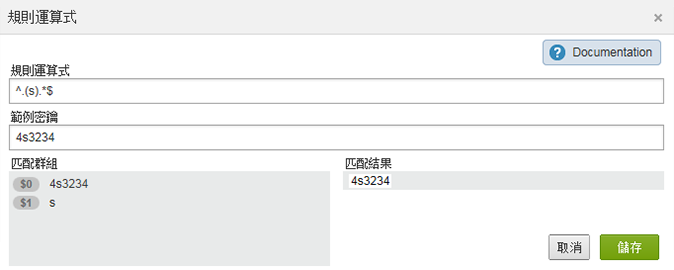
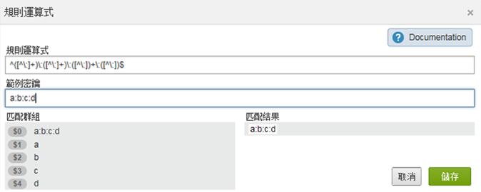
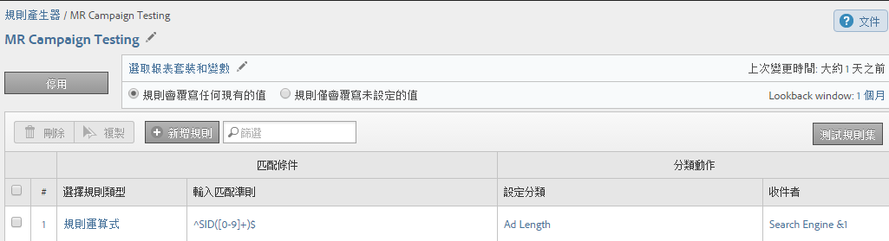
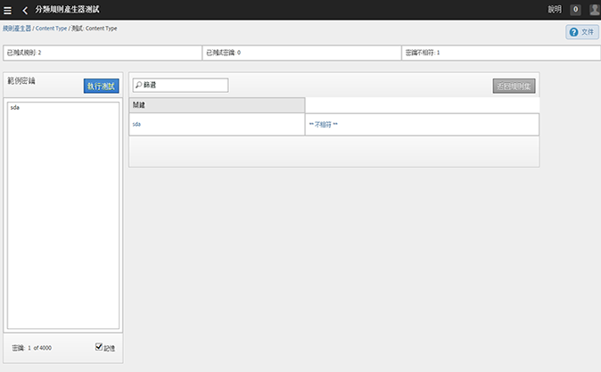

# 分類規則

分類規則會經常尋找未分類的詞語。如果找到符合規則的結果，規則會自動將詞語新增到您的分類資料表格中。您也可以使用分類規則覆寫現有的索引鍵。

## Classification rules {#concept_CF2F64BD96454FBFAA84638FC7DEA263}

分類規則會經常尋找未分類的詞語。如果找到符合規則的結果，規則會自動將詞語新增到您的分類資料表格中。您也可以使用分類規則覆寫現有的索引鍵。

**[!UICONTROL 「分析]** &gt; **[!UICONTROL 管理]** &gt; **[!UICONTROL 分類規則產生器」]**

The Rule Builder lets you create a *`classification rule set`*, which is a list of *`classification rules`*. 規則會匹配您指定的準則，然後執行動作。

分類規則可方便執行下列作業:

* **電子郵件**&#x200B;和&#x200B;**顯示廣告**: 建立分類規則以便將個別顯示廣告促銷活動分組，讓您能瞭解針對電子郵件促銷活動執行顯示促銷活動的成果。

* **追蹤程式碼**: 建立分類規則將衍生自追蹤程式碼內之字串的索引鍵值分類，並和您定義的特定準則比對。
* **搜尋詞**：使用 [規則運算式](../../../components/c-classifications2/crb/classification-quickstart-rules.md#concept_8A63F9BCF9484963962E14E6286D312D) 和萬用字元簡化搜尋詞的分類。For example if a search term contains *`baseball`*, you can set a *`Sports League`* classification to *`MLB`*.

例如，假設電子郵件促銷活動 ID 的追蹤程式碼是:

`em:Summer:2013:Sale`。

您可以在規則集裡設定三個規則，以識別字串的各部分，然後將值分類:

| 選擇規則類型 | 輸入匹配準則 | 設定分類 | 收件者 |
|---|---|---|---|
| 開始於 | em: | 管道 | 電子郵件 |
| 終止於 | Sale | 類型 | Sale |
| 包含 | 2013 | 年 | 2013 |

## 規則的處理方式 {#concept_A67A23F523844D37898583C632DB9D25}

關於如何處理分類規則的重要資訊。

<!-- 

about_classification_rules.xml

 -->

* [關於規則的重要資訊](/help/components/c-classifications2/crb/classification-rule-builder.md)
* [規則什麼時候不會將索引鍵分類?](/help/components/c-classifications2/crb/classification-rule-builder.md)
* [關於規則優先順序](../../../components/c-classifications2/crb/classification-quickstart-rules.md#concept_93527FEB3C9B48FB96FB7DF857E5F980)

>[!NOTE]
>
>[!UICONTROL 規則產生器] 不支援數值分類。

## 關於規則的重要資訊 {#section_0BD46702FBEC4D98A4DD2EA0BD428046}

* Specify [group permissions](https://marketing.adobe.com/resources/help/en_US/reference/?f=groups) for classifications in [!UICONTROL Admin Tools].

* **規則運算式**：「分類規則」中 [的「規則運算式」下提供說明](../../../components/c-classifications2/crb/classification-quickstart-rules.md#concept_8A63F9BCF9484963962E14E6286D312D)。

* **報表套裝**: 至少要選取一個報表套裝後，才能選擇分類。您必須先建立規則集並指派變數後，才能套用報表套裝。

   當您測試規則集時，使用報告中的索引鍵 (要分類的變數) 查看規則集對它們有何影響。(此[索引鍵](../../../components/c-classifications2/c-classifications-importer/c-saint-data-files.md#concept_0B77B3079B5C414F9956058688990443)是要分類的變數，或分類上傳表格中的第一欄)。

* **規則優先順序**: 如果一個索引鍵符合設定同一個分類的多個規則 (在「[!UICONTROL 設定分類]」欄裡)，則會使用符合分類的最後一個規則。請參閱 [關於規則優先順序](../../../components/c-classifications2/crb/classification-quickstart-rules.md#concept_93527FEB3C9B48FB96FB7DF857E5F980).

* **規則數目上限**: 您可以建立的規則數目並無限制。但是，大量的規則可能會影響瀏覽器效能。
* **處理**: 視您的分類相關流量大小而定，會以頻繁間隔處理規則。

   每 4 小時會處理作用中的規則，通常會往回追溯一個月內的分類資料並予以檢查。規則會自動檢查是否有新值，並使用匯入工具上傳分類。

* **覆寫現有的分類**: 請參閱「[規則什麼時候不會將索引鍵分類?」](../../../components/c-classifications2/crb/classification-quickstart-rules.md#section_4481E88CA28246B6B19EA16E2D83A3A8) 如有必要，您可以使用匯入工具刪除或移除現有分類。

## 規則什麼時候不會將索引鍵分類? {#section_4481E88CA28246B6B19EA16E2D83A3A8}

當您啟動規則時，可以覆寫現有的分類。在下列情況下，分類規則不會將[索引鍵](../../../components/c-classifications2/c-classifications-importer/c-saint-data-files.md#concept_0B77B3079B5C414F9956058688990443) (變數) 分類: 

* 索引鍵已經分類，而您並未選取「[覆寫分類](../../../components/c-classifications2/crb/classification-rule-definitions.md#overwrite_classifications)」。

   您可在[](../../../components/c-classifications2/crb/classification-quickstart-rules.md#task_86F216DFD2534FA181E64ABDF306782B)新增和啟用規則時以及啟用 Data Connectors 整合時覆寫分類。(若是 Data Connectors，規則由合作夥伴於開發中心建立，並顯示於[!UICONTROL 分類規則產生器]中)。

* 覆寫索引鍵時，在指定的時間範圍後，即使在您啟用「[覆寫分類](../../../components/c-classifications2/crb/classification-rule-definitions.md#overwrite_classifications)」後，分類的索引鍵仍未在資料中顯示。
* 索引鍵並未分類，而且在約一個月之前開始的時間範圍之後，索引鍵從未傳入 [!DNL Adobe Analytics]。

   >[!NOTE]
   >
   >在報表中，分類會套用至指定的任何時間範圍(當關鍵字存在時)。報告的日期範圍不會影響報告。



## 分類規則裡的規則運算式 {#concept_8A63F9BCF9484963962E14E6286D312D}

使用規則運算式匹配格式一致的字串值和分類。例如，您可以利用追蹤程式碼中的特定字元建立分類。您可以匹配特定的字元、字詞或字元模式。

<!-- 

regex_classification_rules.xml

 -->

* [規則運算式 - 追蹤程式碼範例](../../../components/c-classifications2/crb/classification-quickstart-rules.md#section_2EF7951398EB4C2F8E52CEFAB4032669)
* [規則運算式 - 將特定字元分類](../../../components/c-classifications2/crb/classification-quickstart-rules.md#section_5D300C03FA484BADACBFCA983E738ACF)
* [規則運算式 - 匹配各種長度的追蹤程式碼](../../../components/c-classifications2/crb/classification-quickstart-rules.md#section_E86F5BF5C2F44ABC8FFCE3EA67EE3BB2)
* [規則運算式 - "Does Not Contain" 範例](../../../components/c-classifications2/crb/classification-quickstart-rules.md#section_FCA88A612A4E4B099458E3EF7B60B59C)
* [規則運算式 - 參考表格](../../../components/c-classifications2/crb/classification-quickstart-rules.md#section_0211DCB1760042099CCD3ED7A665D716)

>[!NOTE]
>
>作為最佳實務，規則運算式最適合使用分隔字元的追蹤代碼。

## 規則運算式 - 追蹤程式碼範例 {#section_2EF7951398EB4C2F8E52CEFAB4032669}

>[!NOTE]
>
>If the tracking code is URL encoded, it will **not** be classified by the Rules Builder.

在這個範例中，假設您要將以下的促銷活動 ID 分類:

[!UICONTROL Sample Key]: `em:JuneSale:20130601`

您要分類的追蹤程式碼的部分為:

* `em` = email
* `JuneSale` =促銷活動名稱
* `20130601` =日期

[!UICONTROL Regular Expression]: `^(.+)\:(.+)\:(.+)$`

規則運算式如何與促銷活動 ID 關聯:


[!UICONTROL 匹配群組]: 顯示規則運算式對應到促銷活動 ID 字元的情形，以便您能夠將促銷活動 ID 裡的位置分類。



This example tells the rule that the campaign date `20140601` is at the third group `(.+)`, identified by `$3`.

** [!UICONTROL 規則產生器] **

在[!UICONTROL 規則產生器]中，設定規則如下:

| 選擇規則類型 | 輸入匹配準則 | 設定分類 | 收件者 |
|---|---|---|---|
| 規則運算式 | &amp; amp；Hat；(.+)\:(.+)\:(.+)$ | 促銷活動日期 | $3 |

**語法**

| 規則運算式 | 字串或匹配結果 | 對應的匹配群組 |
|--- |--- |--- |
| `^(.+)\:(.+)\:(.+)$` | em:JuneSale:20130601 | `$0`：em：JuneSale：20130601 `$1`：em `$2`：JuneSale `$3`：20130601 |
| 建立語法 | `^` = start the line()= group字元，並讓您擷取括號中的相符字元。`(.+)` = 擷取一個 ( . ) 字元和(+)更多\=字串的開始。`$` =指出前一個字元(或字元群組)是行中最後一個。 |

關於規則運算式中的字元代表意義的詳細資訊，請參閱[規則運算式 - 參考表格](../../../components/c-classifications2/crb/classification-quickstart-rules.md#section_0211DCB1760042099CCD3ED7A665D716)。

## 規則運算式 - 將特定字元分類 {#section_5D300C03FA484BADACBFCA983E738ACF}

使用規則運算式的一種方式，是將字元字串裡的特定字元分類。例如，假設以下追蹤程式碼包含兩個重要的字元:

[!UICONTROL Sample Key]: `4s3234`

* `4` =品牌名稱
* `s` = 識別搜尋引擎，例如 Google



** [!UICONTROL 規則產生器] **

在[!UICONTROL 規則產生器]中，設定規則如下:

| 選擇規則類型 | 輸入匹配準則 | 設定分類 | 收件者 |
|--- |--- |--- |--- |
| 規則運算式 | `^.(s).*$` | 品牌和引擎 | `$0` (擷取品牌名稱和搜尋引擎的前兩個字元。) |
| 規則運算式 | `^.(s).*$` | 搜尋引擎 | `$1` (擷取Google的第二個字元)。 |

## 規則運算式 - 匹配各種長度的追蹤程式碼 {#section_E86F5BF5C2F44ABC8FFCE3EA67EE3BB2}

這個範例顯示如果有各種長度的追蹤程式碼，要如何識別冒號分隔字元間的特定字元。Adobe 建議針對每個追蹤程式碼使用一個規則運算式。

範例密鑰:

* `a:b`
* `a:b:c`
* `a:b:c:d`

**語法**




** [!UICONTROL 規則產生器] **

在[!UICONTROL 規則產生器]中，設定規則如下:

| 選擇規則類型 | 輸入匹配準則 | 設定分類 | 收件者 |
|--- |--- |--- |--- |
| 規則運算式匹配字串a：b | `^([^\:]+)\:([^\:]+)$` | a | `$1` |
| 規則運算式匹配字串a：b | `^([^\:]+)\:([^\:]+)$` | b | `$2` |
| 規則運算式匹配字串a：b：c | `^([^\:]+)\:([^\:]+)\:([^\:]+)$` | a | `$1` |
| 規則運算式匹配字串a：b：c | `^([^\:]+)\:([^\:]+)\:([^\:]+)$` | b | `$2` |
| 規則運算式匹配字串a：b：c | `^([^\:]+)\:([^\:]+)\:([^\:]+)$` | c | `$3` |
| 規則運算式匹配字串a：b：c：d | `^([^\:]+)\:([^\:]+)\:([^\:]+)\:([^\:])$` | d | `$4` |

## 規則運算式 - "Does Not Contain" 範例 {#section_FCA88A612A4E4B099458E3EF7B60B59C}

這個範例提供一個規則運算式，會匹配不包含特定字元的任何字串，在這個例子裡是 `13`。

規則運算式:

`^(?!.*13.*).*$`

測試字串:

```
a:b:
a:b:1313
c:d:xoxo
c:d:yoyo
```

匹配結果:

```
a:b:
c:d:xoxo
c:d:yoyo
```

In this result, `a:b:1313` does not indicate a match.

## 規則運算式 - 參考表格 {#section_0211DCB1760042099CCD3ED7A665D716}

| 運算式 | 說明 |
|---|---|
| `(?ms)` | 讓整個規則運算式配對多行輸入，可讓 .萬用字元符合任何新行字元 |
| (`?i`) | 讓整個規則運算式不區分大小寫 |
| [`abc`] | a、b 或 c 其中一個字元 |
| [`^abc`] | 除了下列之外的任何單一字元: a、b 或 c |
| [`a-z`] | a-z 範圍內的任何單一字元 |
| [`a-zA-Z`] | a-z 或 A-Z 範圍內的任何單一字元 |
| `^` | 行的開始 (匹配行的開始) |
| `$` | 匹配行的結尾 (或結尾處的新行之前) |
| `\A` | 字串的開始 |
| `\z` | 字串的結尾 |
| `.` | 匹配任何字元 (新行除外) |
| `\s` | 任何空白字元 |
| `\S` | 任何非空白字元 |
| `\d` | 任何數字 |
| `\D` | 任何非數字 |
| `\w` | 任何單詞字元 (字母、數字、底線) |
| `\W` | 任何非單詞字元 |
| `\b` | 任何單詞邊界 |
| `(...)` | 擷取括住的所有內容 |
| `(a|b)` | a 或 b |
| `a?` | 零個或一個 a |
| `a*` | 零個或更多 a |
| `a+` | 一或多個 a |
| `a{3}` | 剛好 3 個 a |
| `a{3,}` | 3 個或更多 a |
| `a{3,6}` | 介於 3 到 6 個 a |

測試規則運算式有效性的好資源是https://rubular.com/。

## 關於規則優先順序 {#concept_93527FEB3C9B48FB96FB7DF857E5F980}

如果一個索引鍵符合多個規則，而且設定的分類欄和「[!UICONTROL 設定分類]」欄裡顯示的相同，會使用最後一個規則。因此，您可能要將最重要的規則排在規則集的最後面。

<!-- 

rule_priority.xml

 -->

如果您建立未共用同一個分類的多個規則，那麼處理順序並不重要。

以下是將運動員的搜尋類型分類的搜尋詞規則範例:

| 規則編號 | 規則類型 | 符合 | 設定分類 | 收件者 |
|---|---|---|---|---|
| 1 | 包含 | Cowboys | 搜尋類型 | Team |
| 2 | 包含 | Fantasy | 搜尋類型 | Fantasy |
| 3 | 包含 | Romo | 搜尋類型 | Player |

如果使用者搜尋 *`Cowboys fantasy Tony Romo`*&#x200B;因為詞語 *`Player`* 會與「設定分類」欄中顯示的最後一個指定分類相符。

同樣地，假設您在一個規則集裡面為下列搜尋詞設定兩個規則:

| 規則編號 | 規則類型 | 符合 | 設定分類 | 收件者 |
|---|---|---|---|---|
| 1 | 包含 | Cowboys | 城市 | Dallas |
| 2 | 包含 | Broncos | 城市 | Denver |

使用者搜尋 *`Cowboys vs. Broncos`*。如果規則產生器在規則匹配中發現衝突，會套用第二個規則的分類 (Denver) 到這個搜尋。

## Add a Classification Rule to a Rule Set {#task_86F216DFD2534FA181E64ABDF306782B}

<!-- 

t_classification_rule.xml

 -->

說明如何新增或編輯分類規則的步驟。

匹配條件與分類，並指定動作以新增規則。

>[!NOTE]
>
>在此程序中，您必須將規則套用至一或多個報表套裝。每個規則集的建議規則數是介於 500 到 1000 個規則之間，但是沒有限制。如果您有 100 多個規則，請考慮使用[子分類](../../../components/c-classifications2/c-sub-classifications.md#concept_19EE5513A7DC43C38CC396E96F306CFE)簡化您的規則集。

1. [建立分類規則集](../../../components/c-classifications2/crb/classification-rule-set.md#task_86F216DFD2534FA181E64ABDF306782B) 。
1. On the rule set page, click **[!UICONTROL Add Rule]**.

   

1. Next to **[!UICONTROL Report Suites]**, click **[!UICONTROL Add Suites]** to specify one or more report suites to assign to this rule set.

   接著會顯示&#x200B;**[!UICONTROL 「選取報表套裝」]頁面。**

   >[!NOTE]
   Report suites display on this page *`only`* when the following conditions are met:        &gt;

   * 報表套裝的[!UICONTROL 「管理工具」]中，至少為該變數定義了一個分類。
   (請參閱&#x200B;*`Variable`*[在分類規則集中，以](../../../components/c-classifications2/crb/classification-rule-set.md#concept_CD3D510F5070486584F3BB535AE41524) 取得此先決條件的說明。)

   * You selected the report suite on the **[!UICONTROL Available Report Suites]** page, which displays after you click [Add Rule Set](/help/components/c-classifications2/crb/classification-rule-set.md) to create the rule set.


1. 指定是否覆寫現有規則:

   | **規則會覆寫任何現有的值** | (預設設定) 一律覆寫現有分類索引，包括透過匯入工具 (SAINT) 上傳的分類。 |
   |---|---|
   | **規則僅會覆寫未設定的值** | 只會填入空白 (未設定) 的儲存格。現有分類不會變更。 |

1. [定義一個或多個規則](../../../components/c-classifications2/crb/classification-rule-definitions.md#section_4A5BF384EEEE4994B6DC888339833529)。

   

   For examples of building rules, see [Classifications Rule Builder](/help/components/c-classifications2/crb/classification-rule-builder.md) and [Regular Expressions in Classification Rules](../../../components/c-classifications2/crb/classification-quickstart-rules.md#concept_8A63F9BCF9484963962E14E6286D312D).

   >[!NOTE]
   >
   >如果索引鍵符合設定相同分類的多個規則(在「設定分類」欄中)，則會使用符合分類的最後一個規則。See **About Rule Priority** above for more information about sorting rules.

1. [測試您的規則集](../../../components/c-classifications2/crb/classification-quickstart-rules.md#task_618A1E7CC8664E728F312250E8367158)。
1. After testing, click **[!UICONTROL Active]** to validate and activate the rule.

   啟動規則會自動建立 檔案，並幫您上傳檔案。

   Field definitions: See [Classification Rule Builder](../../../components/c-classifications2/crb/classification-rule-definitions.md#concept_6CAEFB1CA4564E2CA5808097C11EF468) for complete definitions of interface options on this page.

## Test a Classification Rule Set {#task_618A1E7CC8664E728F312250E8367158}

<!-- 

t_classifications_test_rule.xml

 -->

說明如何測試分類規則或規則集的步驟。執行測試會檢查規則集內所有的規則。

1. [建立分類規則集](../../../components/c-classifications2/crb/classification-rule-set.md#task_86F216DFD2534FA181E64ABDF306782B) 。
1. 在「[!UICONTROL 分類規則產生器]」上，按一下規則集名稱。
1. 確定規則集已和一個報表套裝關聯。
1. On the rule editor, click **[!UICONTROL Test Rule Set]**.

   

1. 在「[!UICONTROL 範例索引鍵]」欄位中輸入或貼上測試索引鍵。

   範例索引鍵包括:

   * 追蹤程式碼
   * 搜尋關鍵字或片語
   請參閱[分類規則裡的規則運算式](../../../components/c-classifications2/crb/classification-quickstart-rules.md#concept_8A63F9BCF9484963962E14E6286D312D)，以取得測試規則運算式的相關資訊。
1. Click **[!UICONTROL Run Test]**.

   符合的規則會在「[!UICONTROL 結果]」表格裡顯示。
1. (Optional) Click **[!UICONTROL Activate]** to activate the rule, and to overwrite existing classifications.

   如需使用規則覆寫現有分類的詳細資訊，請參閱。

## Validate and Activate Classification Rules {#task_2B4FA41F1EE64F4AAC6170C5EFC066AC}

<!-- 

t_validate_rules.xml

 -->

說明如何驗證和啟動分類規則的步驟。

1. [建立分類規則集，然後](../../../components/c-classifications2/crb/classification-rule-set.md#task_86F216DFD2534FA181E64ABDF306782B)[新增分類規則](../../../components/c-classifications2/crb/classification-quickstart-rules.md#task_86F216DFD2534FA181E64ABDF306782B) 至規則集。
1. On the rule editor, click **[!UICONTROL Activate]**.

   

1. (Optional) To overwrite classifications, enable **[!UICONTROL Overwrite classifications for]** *`<selection>`*.

   此選項可讓您覆寫受影響索引鍵的現有分類。

   如需此選項的定義，請參閱「[規則頁面](../../../components/c-classifications2/crb/classification-rule-definitions.md#section_4A5BF384EEEE4994B6DC888339833529)」。
