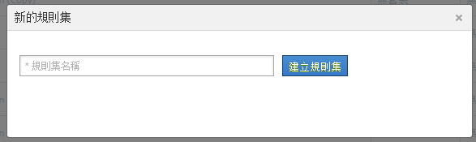

# 分類規則集

規則集是一組特定變數的分類規則。您將變數套用到規則集。如果要為一個變數建立多個規則集，必須將每個規則集套用到多個報表套裝。

## 分類規則集 {#concept_CD3D510F5070486584F3BB535AE41524}

規則集是一組特定變數的分類規則。您將變數套用到規則集。如果要為一個變數建立多個規則集，必須將每個規則集套用到多個報表套裝。

## 分類規則產生器頁面 {#section_C60B0888C76D49C596EF19F11808B718}

**[!UICONTROL Analytics]** &gt;管 **[!UICONTROL 理]** &gt;分類規 **[!UICONTROL 則產生器]**

「[!UICONTROL 分類規則產生器]」上有下列的欄位和選項。

<table id="table_A5D92409969747E39E041216A5AA32CD"> 
 <thead> 
  <tr> 
   <th colname="col1" class="entry"> 元素 </th> 
   <th colname="col2" class="entry"> 說明 </th> 
  </tr> 
 </thead>
 <tbody> 
  <tr> 
   <td colname="col1"> 
<a href="../../../components/c-classifications2/crb/classification-rule-set.md#task_86F216DFD2534FA181E64ABDF306782B" format="dita" scope="local"> 新增規則集</a> 
 </td> 
   <td colname="col2"> 
建立規則集。 
 </td> 
  </tr> 
  <tr> 
   <td colname="col1"> 
規則 
 </td> 
   <td colname="col2"> 顯示規則集內包含的規則數目。 </td> 
  </tr> 
  <tr> 
   <td colname="col1"> 
狀態 
 </td> 
   <td colname="col2"> 顯示規則集的活動狀態，例如「草稿」或「作用中」。每日均會處理作用中的規則，通常會往回追溯一個月內的分類資料並予以檢查。規則會自動檢查是否有新值並上傳分類。 </td> 
  </tr> 
  <tr> 
   <td colname="col1"> 
上次變更時間 
 </td> 
   <td colname="col2"> 指示上次編輯規則集的時間。 </td> 
  </tr> 
  <tr> 
   <td colname="col1"> 
複製 
 </td> 
   <td colname="col2"> 複製 (拷貝) 規則集，以便將規則集套用到其他變數，或套用到不同報表套裝裡的同一個變數。 </td> 
  </tr> 
 </tbody> 
</table>

## Create a Classification Rule Set {#task_86F216DFD2534FA181E64ABDF306782B}

<!-- 

t_classification_rule_set.xml

 -->

命名分類規則集、套用變數及指定覆寫設定。

1. (Prerequisite) Define the classification structure in **[!UICONTROL Admin]** &gt; **[!UICONTROL Report Suites]**.

   (請參閱「管理工具」說明中的[「分類」](https://marketing.adobe.com/resources/help/en_US/reference/classifications.html)，了解如何新增分類。)

   必須先為變數定義至少一個分類，變數才會顯示在[!UICONTROL 「新的規則集」]面板中。

   You can create classifications on a variable in **[!UICONTROL Admin]** &gt; **[!UICONTROL Report Suites]** &gt; **[!UICONTROL Traffic]** &gt; **[!UICONTROL Traffic Classifications]** (or **[!UICONTROL Conversion]** &gt; **[!UICONTROL Conversion Classifications]**). Then select the variable, then click **[!UICONTROL Add Classification]**.

1. To create the rule set, click **[!UICONTROL Admin]** &gt; **[!UICONTROL Classification Rule Builder]** &gt; **[!UICONTROL Add Rule Set]**.

   

1. Name the rule set, then click **[!UICONTROL Create Rule Set]**.
1. 選取要編輯的規則集。

   

1. Click **[!UICONTROL Select Report Suites and Variables]**.

   報表套裝和變數清單會填入您的登入公司裡所有報表套裝中可用的所有分類變數。報表套裝中單一的變數只能屬於一個規則集。

   See *`Variable`* in the definitions for the [Classification Rule Builder](../../../components/c-classifications2/crb/classification-rule-definitions.md#section_4D1A70A607C9419EB2116A5174EACB72) page for more information.
1. Specify the report suites and variables to use, then click **[!UICONTROL Save]**.
1. Continue by [adding classification rules](../../../components/c-classifications2/crb/classification-rule-set.md#task_86F216DFD2534FA181E64ABDF306782B) to the rule set.
