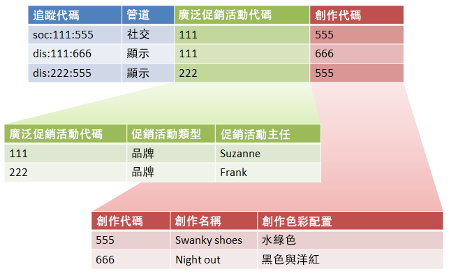
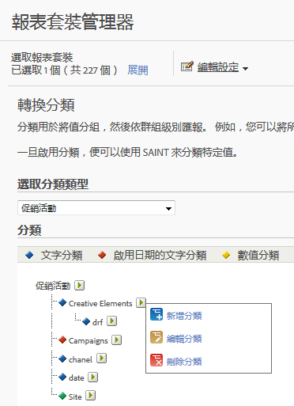

# 子分類和規則產生器

如果您確定每個子分類都有父級值，您可以將「分類規則產生器」與子分類結合。

將分類規則產生器與子分類結合可簡化分類管理並減少所需的規則數目。 如果您的追蹤代碼包含您想要個別分類的代碼，您可能會想要執行此動作。

請參閱[子分類](/help/components/c-classifications2/c-sub-classifications.md)，瞭解子分類的概念資訊。

## 範例

假設使用下列追蹤程式碼：

`channel:broad_campaign:creative`

分類階層可以讓您將分類套用到分類 (稱為 *`sub-classification`*)。也就是說，您可以搭配多個表格使用匯入工具，例如關係式資料庫。 一個表格會將完整追蹤代碼對應至索引鍵，而另一個表格則會將這些索引鍵對應至其他表格。

在建立此結構後，您可以使用「分類規則產生器」  ，上傳只更新查閱表格（上圖中的綠色和紅色表格）的小型檔案。 然後，您可以使用規則產生器，讓主要分類表格保持最新狀態。

以下任務說明如何完成此任務。

## 使用規則產生器設定子分類{#task_2D9016D8B4E84DBDAF88555E5369546F}

說明如何使用「規則產生器」上傳子分類的範例步驟。

>[!NOTE]
>
>以下步驟說明如何完成[子分類和規則產生器](/help/components/c-classifications2/crb/sub-classification-rule-builder.md)中所述的使用案例。

1. 在「[分類管理員](https://marketing.adobe.com/resources/help/en_US/reference/classifications.html)」中建立分類和子分類。

   範例：

   

1. 在[分類規則產生器](/help/components/c-classifications2/crb/classification-rule-builder.md)中，分類來自原始追蹤程式碼的子分類索引鍵。

   您使用規則運算式來執行此動作。 在此範例中，填入規則會使 *`Broad Campaign code`* 用此規則運算式：

   | `#` | 規則類型 | 符合 | 設定分類 | 結束日期 |
   |---|---|---|---|---|
   |  | 規則運算式 | `[^\:]:([^\:]):([^\:]`) | 廣泛促銷活動代碼 | `$1` |
   |  | 規則運算式 | `[^\:]:([^\:]):([^\:]`) | 創作代碼 | `$2` |

   >[!NOTE]
   >
   >此時不要填入子分類 *`Campaign Type`* 和 *`Campaign Director`*。

1. 上傳僅含指定子分類的分類檔案。

   請參閱[多級分類](/help/components/c-classifications2/c-sub-classifications.md)。

   範例：

   | 金鑰 | 管道 | 廣泛促銷活動代碼 | 廣泛促銷活動代碼&amp;Hat;促銷活動類型 | 廣泛促銷活動代碼&amp;Hat;促銷活動主管 | ... |
   |---|---|---|---|---|---|
   | * |  | 111 | 品牌 | 蘇珊娜 |  |
   | * |  | 222 | 品牌 | Frank |  |

1. 若要維護查詢表格，請上傳小型檔案 (如以上所示)。

   例如，您可在導入新 *`Broad Campaign code`* 時上傳此檔案。此檔案會套用至先前分類的值。 同樣地，如果您建立新的子分類(例如 *`Creative Theme`* 子分類 *`Creative code`*)，則只會上傳子分類檔案，而不是上傳整個分類檔案。

   若要報告這些子分類的功能與頂層分類完全相同。 這可減輕使用這些工具的管理負擔。-->
