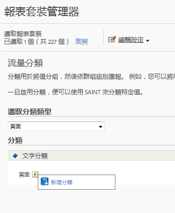

# 流量分類

流量分類可讓您對流量變數 (屬性) 進行分類。流量分類只能使用文字分類。

## 流量分類 {#concept_028079B29A9C412AA68910A87E11176F}

流量分類可讓您對流量變數 (屬性) 進行分類。流量分類只能使用文字分類。

「流量分類」頁面可讓您建立選定報表套裝的分類。分類後，透過關鍵資料產生的任何報告，亦可透過相關聯的屬性產生。

啟用分類後，請使用[分類匯入工具](/help/components/c-classifications2/c-classifications-importer/c-working-with-saint.md)，將特定值指派給適當的分類。

## 新增流量分類 {#task_4DB49CCB1D764483907BC33A5CEB7315}

<!-- 

t_classification_add_traffic.xml

 -->

說明如何為選取的報表套裝新增或編輯分類的步驟。

1. 在「套裝」標題中，按一下&#x200B;**[!UICONTROL 「管理員]** >**[!UICONTROL 報表套裝」]**。
1. 選取報表套裝。
1. 在&#x200B;****「選取分類類型」欄位中，選取您要新增分類的變數。
1. 按一下「**[!UICONTROL 編輯設定]** > **[!UICONTROL 流量]** > **[!UICONTROL 流量分類]**」。

   

1. 將滑鼠移至&#x200B;**[!UICONTROL 編輯分類]**&#x200B;圖示上方，然後選取&#x200B;**[!UICONTROL 新增分類]**&#x200B;或&#x200B;**[!UICONTROL 編輯分類]**。
1. 在&#x200B;**[!UICONTROL 文字分類]**&#x200B;對話方塊中，視需要設定分類：

   **[!UICONTROL 名稱]**：指定分類名稱。

   **[!UICONTROL 說明]**：提供更詳細的說明。
1. 按一下&#x200B;**[!UICONTROL 「儲存」]**。
