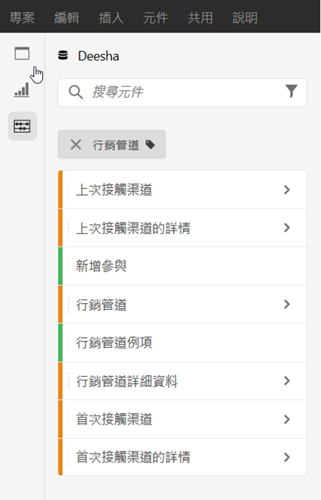
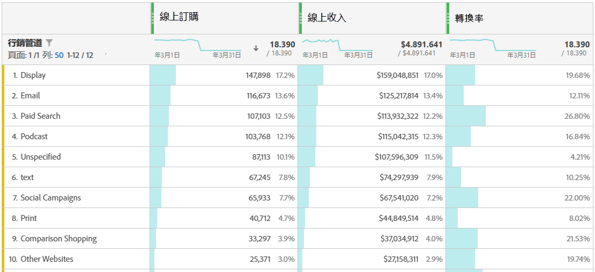
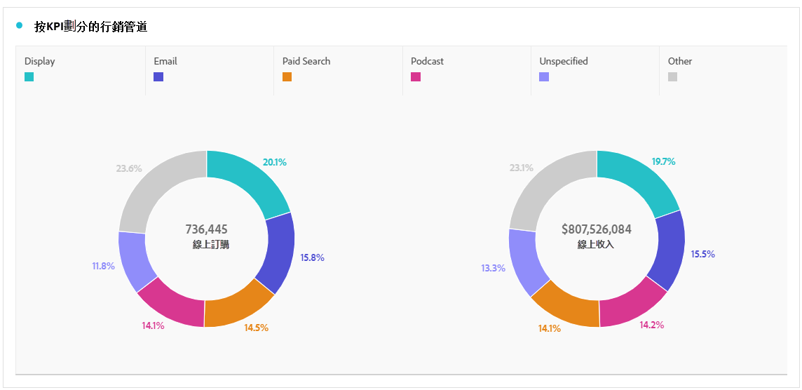
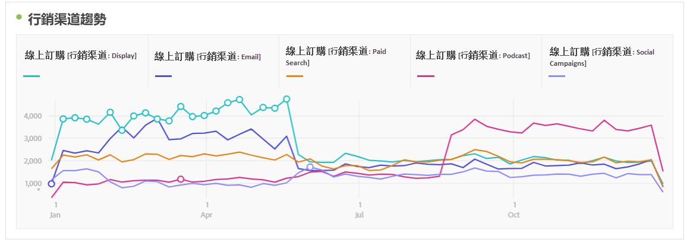
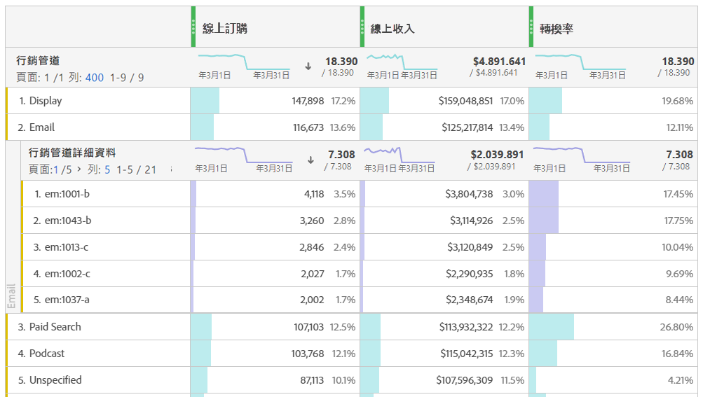
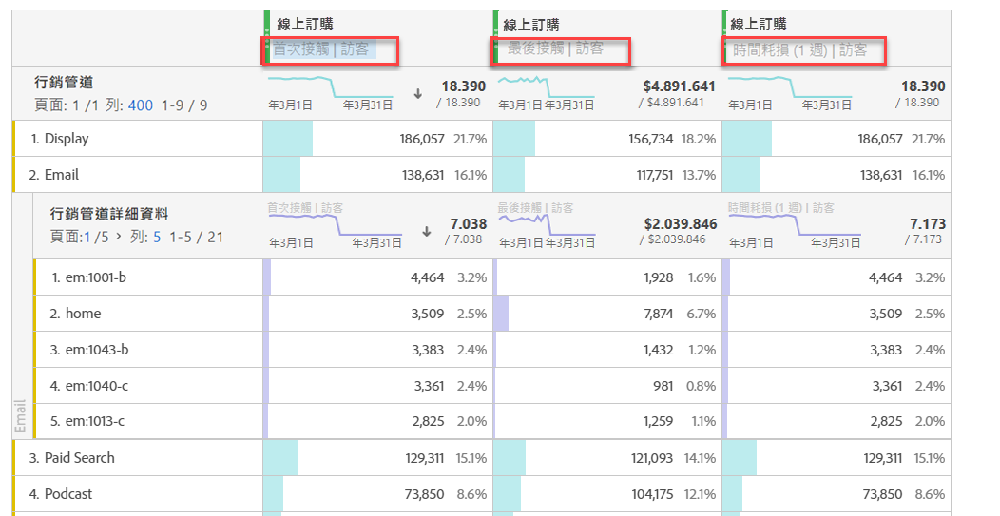
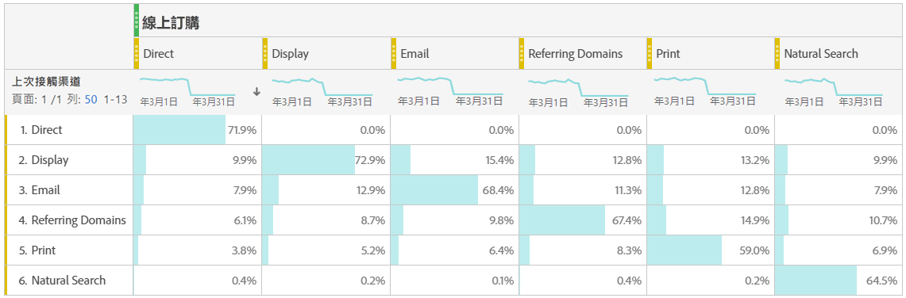

# 分析行銷管道

>[!NOTE]
>
>為了最大化歸因和Adobe Analytics的行銷管道效率，我們已發佈約[個修改過的最佳實務](/help/components/c-marketing-channels/mchannel-best-practices.md)。
>
>Analytics 管理員可以管理其組織的行銷管道，如[管理行銷管道](/help/admin/admin/c-manage-report-suites/c-edit-report-suites/marketing-channels/c-channels.md)中所述。

您可能想知道您的哪些行銷管道對什麼對象最有效，藉此讓行銷目標更為明確，並使付出的行銷資金獲得更高回報。 在 Adobe Analytics 中，Workspace 裡的「行銷管道」維度和量度是能協助您追蹤不同管道對訂單、收入等之影響的其中一項工具，並能為您提供實用的管道分析。以下是您可使用的行銷管道相關維度與量度：

| 維度/量度 | 定義 |
| --- | --- |
| 行銷管道 | 這是我們建議使用的「行銷管道」維度。可在執行階段將歸因模型套用至該維度。 此維度的運作方式與「上次接觸管道」維度相同，但標籤不同，這是為了避免在搭配不同歸因模型使用行銷管道時產生混淆。 |
| 上次接觸管道 | 舊版維度，已預先套用上次接觸歸因模型，且不可變更。 |
| 首次接觸管道 | 舊版維度，已預先套用首次接觸歸因模型，且不可變更。 |
| 行銷管道實例 | 此量度會測量行銷管道定義於影像要求中的次數，包括標準頁面檢視和自訂連結呼叫。不包含保存的值。 |
| 新增參與 | 此量度類似於「實例」，但只有在影像要求中定義首次接觸行銷管道時，此量度才會遞增。 |

## 基本分析

此自由格式表格會顯示每個行銷管道的「線上訂單」、「線上收入」和「轉換率」量度：

您可以在此在環圈圖中，看到每個行銷管道的「線上訂單」和「線上收入」：

此線條圖會顯示各種管道之「線上訂單」隨時間變化的趨勢：

## 進階分析

「行銷管道詳情」可深入分析每個管道，顯示特定的促銷活動、版位等。您可以劃分管道以便顯示詳情：

## 套用歸因模型

您可以使用[歸因](/help/analyze/analysis-workspace/attribution/overview.md)，即時套用不同的歸因模型：

請留意在您套用不同歸因模型時，相同的量度 (「線上訂單」) 會如何產生不同結果。

## 交叉表行銷分析

使用舊的「首次接觸管道」和「上次接觸管道」時，可以檢視關於管道互動的實用資訊：

在此影片中深入了解交叉表行銷分析：[使用交叉表分析探索 Analysis Workspace 內的基本行銷歸因](https://experienceleague.adobe.com/docs/analytics-learn/tutorials/analysis-workspace/attribution-iq/using-cross-tab-analysis-to-explore-basic-marketing-attribution-in-analysis-workspace.html?lang=zh-Hant)。
