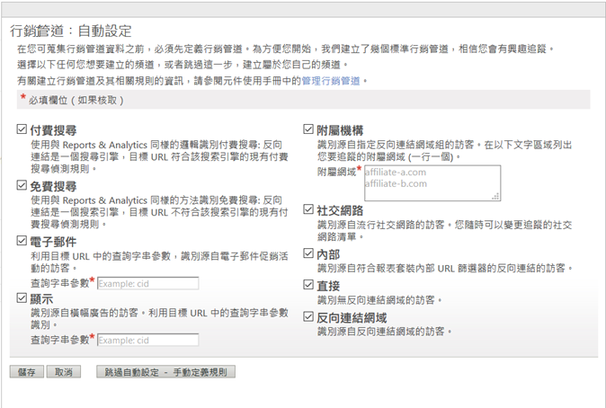

# 自動設定

執行行銷渠道報表的一次性設定。

## 自動設定 {#topic_E9ABE9E9E71B4E40A4E7EA9AD2C0372B}

執行行銷渠道報表的一次性設定。

行銷渠道報表隨附一次性設定頁面，讓您開始使用。 其中提供數個行銷渠道，您可用來追蹤。如果熟悉如何建立渠道和規則，則可跳過該設定。不過，Adobe 仍建議讓精靈替您建立渠道。自動設定可讓您觀看規則的建立方式，您也可自行編輯規則。您可隨時停用或刪除預定義渠道。

## 執行行銷管道自動設定 {#task_0F694146D48B4647BD7D5F060D394AB7}

如何執行行銷管道自動設定。

1. Click **[!UICONTROL Analytics]** &gt; **[!UICONTROL Admin]** &gt; **[!UICONTROL Report Suites]**.
1. 在「[!UICONTROL 報告套裝管理員]」上，選擇一個報告套裝。
1. Click **[!UICONTROL Edit Settings]** &gt; **[!UICONTROL Marketing Channels]** &gt; **[!UICONTROL Marketing Channel Manager]**.

   

   >[!NOTE]
   >
   >The [!UICONTROL Marketing Channels: Auto Setup] page displays automatically when you access channel configuration applications in Admin Tools. (See [Marketing Channel Manager](../../components/c-marketing-channels/c-channels.md#topic_45CF1C6A783B4F96ABF6317EAB6A854F).) 如果報表套裝中包含一個或多個行銷渠道，該頁面不顯示。除非選擇其他不包含行銷渠道的報表，否則無法再存取該頁面。

1. 確保選定想要建立的渠道。

   When selected, **[!UICONTROL Email]**, **[!UICONTROL Display]**, and **[!UICONTROL Affiliate]** are required fields.

   See [Marketing Channel Manager](../../components/c-marketing-channels/c-channels.md#topic_45CF1C6A783B4F96ABF6317EAB6A854F).

1. 按一下&#x200B;**[!UICONTROL 「儲存」]**。
