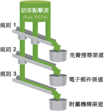

# 關於渠道與規則

報表中要能顯示渠道和渠道資料，首先須建立渠道和處理資料的基本規則。您亦可建立相關渠道的成本和預算額，並指定所需的訪客參與有效期。報表設定工作在「管理工具」中執行。

將渠道想像為瀏覽的容器，而規則是為適當的容器指派瀏覽。

Adobe 在[自動設定](../../components/c-marketing-channels/c-channel-autosetup.md#topic_E9ABE9E9E71B4E40A4E7EA9AD2C0372B)期間提供數個預定義渠道，您可視需求加以編輯。

>[!NOTE]
>
>Adobe建議您在報表套裝中設定報表，以便用作測試用途的範本。您可使用範本將渠道和規則設定總體套用至一個或多個生產報表套裝。
>
>請參閱[套用範本報表套裝設定至多個報表套裝](../../components/c-marketing-channels/t-template.md#task_0DE0A320EDA94FC5A6E5912868B6E2DC)。

檢閱下列主題:

* [必要條件](../../components/c-marketing-channels/c-channels-rules.md#section_9913D2932E3140C099B7978CA95378B2)
* [重要處理注意事項](../../components/c-marketing-channels/c-channels-rules.md#section_DE372EEF02314F2395750CF2892DAAE1)

## 必備條件 {#section_9913D2932E3140C099B7978CA95378B2}

如有必要，請連絡 ClientCare 以協助您釐清這些必要條件:

* In the Administration Console (General Account Settings), enable the **[!UICONTROL Conversion Level]** (e-commerce) option for the report suite.

   See [General Account Settings](https://marketing.adobe.com/resources/help/en_US/reference/general_acct_settings_admin.html) in Analytics help for more information.

* Set up user group access to the **[!UICONTROL Marketing Channel Report]**.

   See [Configure User Group Access](../../components/c-marketing-channels/t-user-groups.md#task_B156E7527FE94055A43A697338FE8C8C).

* Ensure that your account manager has enabled **[!UICONTROL Channel Reports]** for your report suite.

## Important processing notes {#section_DE372EEF02314F2395750CF2892DAAE1}

* 系統以您指定的順序來處理規則，當符合規則後，即停止處理剩餘規則。
* 規則可以存取 VISTA 已設定的變數，但無法存取 VISTA 已刪除的資料。
* 渠道僅儲存轉換量度。流量量度不可用。
* 兩個行銷渠道絕不接收同一事件 (例如購買或點按) 的評分。這將行銷渠道與 eVars (兩個 eVars 可接收同一事件的評分) 區分開來。
* 報表一次最多可處理 25 個渠道。

