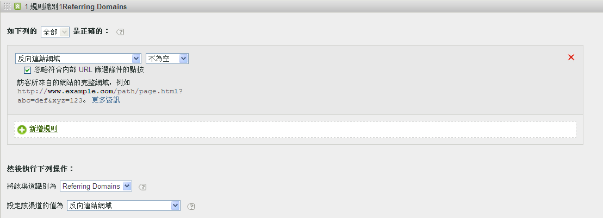

# 行銷渠道常見問答集

行銷管道的常見問題。

## 我的追蹤代碼不遵循模式，而且我必須為「關係企業」渠道指定數千個。

* 使用消除過程。如果「電子郵件」和「附屬機構」渠道使用相同的查詢字串參數，但您只有很少的電子郵件追蹤代碼，則可以在定義電子郵件的規則集中指定電子郵件追蹤代碼。然後使用 *`affiliates.`*
* 在您的電子郵件系統中，新增查詢字串參數至所有著陸頁面 URL，例如 *`&ch=eml`*。建立一個規則集，用於偵測 ch 查詢參數是否等於 *`eml`*。如果不包含 *`eml`*，則為附屬機構。

## 反向連結網域包含的資料比我預期的要多。

* 反向連結網域可能在處理規則清單中排位過高。它應是最後的規則集或之一，因為處理順序至關重要。

## 我已建立符合查詢字串參數的規則，但它無法運作。

* 請確定已在查詢字串參數欄位中指定參數名稱 (通常是字母數字值)。此外，也請確定有在運算元後面指定參數值，如下列電子郵件規則範例所示。

   

## 為什麼我的所有上次接觸流量都歸屬於內部網域？

* 您擁有符合內部流量的規則。請注意，該等規則會處理訪客在您網站上的每一次點按，而不僅是首次訪問。如果您有類似「*`Page URL exists`*」的規則，而沒有其他標準，則該管道會符合網站上的每個後續點按，因為頁面 URL 永遠存在。

## 如何對報告上未識別渠道中顯示的流量進行除錯？

* 規則依順序處理。如果不符合特定標準，點按便會屬於下列三個類別之一：

1. 無反向連結 (直接造訪)。

2. 內部反向連結，位於第一個造訪的頁面上。

3. 頁面上的處理故障。

請確保擁有針對這三種可能性的管道。例如，建立如下規則︰

1. **[!UICONTROL 反向連結]**&#x200B;和&#x200B;**[!UICONTROL 不存在]**&#x200B;和&#x200B;**[!UICONTROL 是第一個造訪的頁面]**。(請參閱[直接](/help/components/c-marketing-channels/c-faq.md)。)

2. **[!UICONTROL 反向連結符合內部 URL 篩選器]**&#x200B;和&#x200B;**[!UICONTROL 是第一個造訪的頁面]**。(請參閱[內部](/help/components/c-marketing-channels/c-faq.md)。)

3. **[!UICONTROL 反向連結]**&#x200B;和&#x200B;**[!UICONTROL 存在]**&#x200B;和&#x200B;**[!UICONTROL 反向連結不匹配內部 URL 篩選器]**。

最後，建立一個擷取剩餘點按的&#x200B;*「其他」*&#x200B;管道，如[未識別管道](/help/components/c-marketing-channels/c-faq.md#no-channel-identified)中所述。

## 首次和上次接觸的關係

若要瞭解舊版首次接觸與上次接觸維度之間的互動關係，並確認覆寫功能正常運作，您可以提取與上次接觸管道報表具有子關聯的首次接觸管道報表，當中含有您新增的關鍵成功量度 (請參閱以下範例)。此範例說明了首次和上次接觸管道之間的互動關係。

首次接觸等於上次接觸的交集之處是表格的對角線。「直接」和「工作階段重新整理」必須同時也是首次接觸管道，才能取得上次接觸管道的評分，因為它們無法從其他持續沿用的管道 (以灰色顯示的列) 取得評分。

## 未識別管道的原因 {#no-channel-identified}

當規則不擷取資料時，或如果規則設定有誤，則報表會顯示報表上[!UICONTROL 「未識別管道」]行中的資料。您可建立一個稱作&#x200B;*「其他」*&#x200B;的規則集，例如在處理順序的末尾，這也可識別內部流量，如下所示。

這類規則涵蓋範圍甚廣，可確保管道流量總是符合外部流量，且通常不會以&#x200B;**[!UICONTROL 未識別管道]**&#x200B;結束。注意不要建立同時識別內部流量的規則。將管道值設定為&#x200B;**[!UICONTROL 「反向連結網域」]**&#x200B;或&#x200B;**[!UICONTROL 「頁面 URL」]**&#x200B;是最常見且實用的建立有效「其他」規則之方法。

>[!NOTE]
>
>可能還會有其他管道流量分類到「未識別管道」類別中。舉例來說：一位訪客造訪網站並將網頁加到書籤中，在同一次造訪中會透過書籤返回該頁面。由於這不是該次造訪的第一頁，並沒有反向連結網域，因此不會分類到「直接管道」或「其他管道」。

## 內部原因 (工作階段重新整理) {#internal}

上次接觸內部（工作階段重新整理）只有在也是首次接觸時才會發生——請參閱上述「首次與上次接觸之間的關係」。 以下案例說明「工作階段重新整理」如何成為首次接觸管道。

* **作業逾時**:訪客來到網站，接著在瀏覽器中開啟標籤，以供日後使用。 訪客的參與期間過期 (或自行刪除 Cookie)，且使用開啟的分頁再次造訪網站。由於反向連結 URL 是內部網域，該次造訪會分類為「工作階段重新整理」。

* **並非所有網站頁面都已標籤**:訪客登陸未標籤的頁面A，接著移至已標籤的頁面B。 系統會將頁面 A 視為內部反向連結，而該次造訪會分類為「工作階段重新整理」。

* **重新導向**:如果未設定重新導向來將反向連結資料傳遞至新的登陸頁面，則會遺失真正的登入反向連結資料，而現在重新導向頁面（可能是內部頁面）會顯示為反向連結網域。 該次造訪將會分類為「工作階段重新整理」。

* **跨網域流量**:訪客會從一個引發至套裝A的網域移至第二個引發至套裝B的網域。如果在套裝B中，內部URL篩選器包含第一個網域，則套裝B中的瀏覽將記錄為內部，因為行銷管道會將其視為第二個套裝中的新瀏覽。 該次造訪將會分類為「工作階段重新整理」。

* **登入頁面載入時間較長**:訪客登陸頁面A，其內容很重，而Adobe Analytics程式碼位於頁面底部。 在系統載入所有內容 (包括 Adobe Analytics 影像要求) 之前，訪客點擊了頁面 B，頁面 B 也觸發了自身的 Adobe Analytics 影像要求。由於頁面 A 的影像要求並未載入完畢，第二個頁面就會在 Adobe Analytics 中顯示為該次造訪的第一次點擊，而頁面 A 則為反向連結。該次造訪會分類為「工作階段重新整理」。

* **清除Cookie中間網站**:訪客來到網站，中階作業會清除其Cookie。 首次和上次接觸管道都會重設，而該次造訪會分類為「工作階段重新整理」(因為反向連結為內部連結)。

以下是將內部（作業重新整理）設為首次和上次接觸渠道的範例：

* 第 1 天：使用者因顯示而造訪網站。系統會將首次和上次接觸管道設為顯示。
* 第 2 天：使用者因免費搜尋而造訪網站。首次接觸仍會維持為顯示，而上次接觸則設為免費搜尋。
* 第 35 天：使用者未造訪網站達 33 天，而且使用在瀏覽器中開啟的分頁返回。在具有 30 天參與回溯期的前提下，該回溯期將已關閉，且行銷管道 Cookie 將會過期。系統會重設首次接觸和上次接觸管道，且由於使用者來自內部 URL，因而會設為工作階段重新整理。

## 為何某些渠道在變更行銷渠道處理規則後未變更？

有時候，行銷渠道處理規則設定不正確，因此必須變更處理規則。 套用變更後，您會看到有些量度仍會將資料歸因於錯誤的渠道。 我們需要考慮幾件事：

* **即時收集行銷渠道資料**:行銷渠道資料會在資料收集時處理，且完全永久。 變更處理規則不會影響資料的回溯性。
* **變更處理規則不會立即影響首次接觸資料**:例如：
   1. 使用者透過您的電子郵件渠道進入，因為其設定不正確，所以離開您的網站。
   2. 第二天，您會變更電子郵件處理規則以加以修正。
   3. 幾天後，該用戶通過自然搜索返回並進行購買。
   4. 電子郵件渠道獲得「首次接觸」評分，而免費搜尋獲得「上次接觸」評分。

   即使在您變更處理規則數天後，您仍可以在錯誤的「首次接觸」管道中收集資料。 首次接觸資料會持續收集到不正確的渠道，直到所有使用者的訪客參與過期為止。

糾正這些差異的最佳方法是執行下列一項或兩項：

* **手動使所有訪客參與期間過期**:此設定會立即過期所有訪客的所有首次和上次接觸渠道：
   1. 前往「管理工具>報表套裝」。
   2. 將滑鼠指標暫留在影像編輯設定>行銷渠道>訪客參與有效期
   3. 按一下「全部過期」。
   4. 按一下「確定」(OK)，查看警告彈出窗口，確認您瞭解該窗口將執行什麼操作。

* **僅檢視您修正規則後的上次接觸量度**:上次接觸量度一律遵循目前的規則集。 檢視前向變更處理規則的開始時間會正確反映最新的處理規則。
