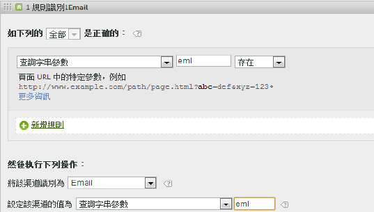

# 行銷渠道常見問答集

請參閱[建立行銷管道處理規則](/help/components/c-marketing-channels/c-rules.md)，瞭解[!UICONTROL 行銷管道處理規則]頁面中所顯示欄位的定義。

## 常見問題集 {#faq}

各行銷管道規則的實作，因您的追蹤代碼而異。若要設定可提供所需結果的規則，需要一些創新的問題解決方法。

**問題**：我的追蹤代碼不遵從模式，而我必須為我的「附屬機構」管道指定上千個模式。

* 使用消除過程。如果「電子郵件」和「附屬機構」渠道使用相同的查詢字串參數，但您只有很少的電子郵件追蹤代碼，則可以在定義電子郵件的規則集中指定電子郵件追蹤代碼。然後使用 *`affiliates.`*
* 在您的電子郵件系統中，新增查詢字串參數至所有著陸頁面 URL，例如 *`&ch=eml`*。建立一個規則集，用於偵測 ch 查詢參數是否等於 *`eml`*。如果不包含 *`eml`*，則為附屬機構。

**問題**：反向連結網域包含的資料多於我的預期。

* 反向連結網域可能在處理規則清單中排位過高。它應是最後的規則集或之一，因為處理順序至關重要。

**問題**：我已經建立了符合查詢字串參數的規則，但不管用。

* 請確定已在查詢字串參數欄位中指定參數名稱 (通常是字母數字值)。此外，也請確定有在運算元後面指定參數值，如下列電子郵件規則範例所示。

   

**問題**：為何我所有的上次接觸流量均歸屬於內部網域？

* 您擁有符合內部流量的規則。請注意，該等規則會處理訪客在您網站上的每一次點按，而不僅是首次訪問。如果您有類似「*`Page URL exists`*」的規則，而沒有其他標準，則該管道會符合網站上的每個後續點按，因為頁面 URL 永遠存在。

**問題**：我如何對報表的「未識別管道」中顯示流量進行除錯？

* 規則依順序處理。如果不符合特定標準，點按便會屬於下列三個類別之一：

1. 無反向連結 (直接造訪)。

2. 內部反向連結，位於第一個造訪的頁面上。

3. 頁面上的處理故障。

請確保擁有針對這三種可能性的管道。例如，建立如下規則︰

1. **[!UICONTROL 反向連結]**&#x200B;和&#x200B;**[!UICONTROL 不存在]**&#x200B;和&#x200B;**[!UICONTROL 是第一個造訪的頁面]**。(請參閱[直接](/help/components/c-marketing-channels/c-faq.md)。)

2. **[!UICONTROL 反向連結符合內部 URL 篩選器]**&#x200B;和&#x200B;**[!UICONTROL 是第一個造訪的頁面]**。(請參閱[內部](/help/components/c-marketing-channels/c-faq.md)。)

3. **[!UICONTROL 反向連結]**&#x200B;和&#x200B;**[!UICONTROL 存在]**&#x200B;和&#x200B;**[!UICONTROL 反向連結不匹配內部 URL 篩選器]**。

最後，建立一個擷取剩餘點按的&#x200B;*「其他」*&#x200B;管道，如[未識別管道](/help/components/c-marketing-channels/c-faq.md#no-channel-identified)中所述。

## 首次和上次接觸的關係

若要瞭解舊版首次接觸和上次接觸維度之間的互動，並確認覆寫如預期般運作，您可以提取與上次接觸渠道報表子關聯的首次接觸渠道報表，並新增關鍵成功度量（請參閱以下範例）。 此範例說明了首次和上次接觸管道之間的互動關係。

第一個等於上次接觸的交點是表的對角線。 「直接」和「工作階段重新整理」都只會在作為首次接觸渠道時獲得上次接觸評價，因為它們無法從其他持續渠道（反白顯示的列）獲得評價。

## 未識別渠道的原因 {#no-channel-identified}

當規則不擷取資料時，或如果規則設定有誤，則報表會顯示報表上[!UICONTROL 「未識別管道」]行中的資料。您可建立一個稱作&#x200B;*「其他」*&#x200B;的規則集，例如在處理順序的末尾，這也可識別內部流量，如下所示。

這類規則涵蓋範圍甚廣，可確保管道流量總是符合外部流量，且通常不會以&#x200B;**[!UICONTROL 未識別管道]**&#x200B;結束。注意不要建立同時識別內部流量的規則。將管道值設定為&#x200B;**[!UICONTROL 「反向連結網域」]**&#x200B;或&#x200B;**[!UICONTROL 「頁面 URL」]**&#x200B;是最常見且實用的建立有效「其他」規則之方法。

>[!NOTE] 可能還會有其他管道流量分類到「未識別管道」類別中。舉例來說：一位訪客造訪網站並將網頁加到書籤中，在同一次造訪中會透過書籤返回該頁面。由於這不是該次造訪的第一頁，並沒有反向連結網域，因此不會分類到「直接管道」或「其他管道」。

## 內部原因（會話刷新） {#internal}

上次接觸作業重新整理只有在也是首次接觸時才會發生——請參閱上述「首次接觸與上次接觸之間的關係」。 以下案例說明「工作階段重新整理」如何成為首次接觸渠道。

**案例 1：工作階段逾時**

訪客造訪網站後，將分頁維持在瀏覽器中開啟，以便日後使用。訪客的參與期間過期 (或自行刪除 Cookie)，且使用開啟的分頁再次造訪網站。由於反向連結 URL 是內部網域，該次造訪會分類為「工作階段重新整理」。

**案例 2：並非所有網頁都經過標記**

訪客登陸未經標記的頁面 A，接著移至已標記的頁面 B。系統會將頁面 A 視為內部反向連結，而該次造訪會分類為「工作階段重新整理」。

**案例 3：重新導向**

如果重新導向未經妥善設定，以致無法將反向連結資料傳遞至新的登陸頁面，則真實的登入反向連結資料就會遺失，而重新導向頁面 (可能是內部頁面) 會因此顯示為反向連結網域。該次造訪將會分類為「工作階段重新整理」。

**案例 4：跨網域流量**

訪客從會觸發套裝 A 的網域移至會觸發套裝 B 的另一個網域。如果套裝 B 的內部 URL 篩選器包含第一個網域，則套裝 B 的該次造訪將記錄為內部，因為行銷管道會將之視為第二個套裝中的新造訪次數。該次造訪將會分類為「工作階段重新整理」。

**案例 5：登入頁面載入時間過長**

訪客登陸了內容繁多的頁面 A，而 Adobe Analytics 程式碼位於該頁面底部。在系統載入所有內容 (包括 Adobe Analytics 影像要求) 之前，訪客點擊了頁面 B，頁面 B 也觸發了自身的 Adobe Analytics 影像要求。由於頁面 A 的影像要求並未載入完畢，第二個頁面就會在 Adobe Analytics 中顯示為該次造訪的第一次點擊，而頁面 A 則為反向連結。該次造訪會分類為「工作階段重新整理」。

**案例 6：清除 Cookie 中繼網站**

訪客造訪網站，而中繼工作階段清除了 Cookie。首次和上次接觸管道都會重設，而該次造訪會分類為「工作階段重新整理」(因為反向連結為內部連結)。

