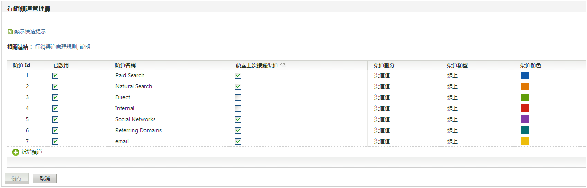

# 行銷管道快速入門

>[!NOTE]
>
>為了讓 Attribution 和 Customer Journey Analytics 的行銷管道獲得最大成效，我們已發佈一些[修改過的最佳做法](/help/components/c-marketing-channels/mchannel-best-practices.md)。
>
>Analytics 管理員可以管理其組織的行銷管道，如[管理行銷管道](/help/admin/admin/c-manage-report-suites/c-edit-report-suites/marketing-channels/c-channels.md)中所述。

「行銷管道」常用來提供訪客如何進入您的網站的相關資訊。您可以根據所要追蹤的管道以及追蹤方式，建立及自訂行銷管道處理規則。

行銷管道的中心為「首次和上次接觸」量度，這是標準轉換量度的元件。

## 行銷管道工作流程

 根據您的業務需求定義每個管道.

定義您使用的管道是行銷管道最重要的組成部分之一。定義管道需要組織中的多人合作。以下是您需要考慮的幾個問題：

* 您使用付費搜尋嗎？
* 您使用電子郵件行銷活動嗎？您使用多個電子郵件行銷活動，而且想分別追蹤嗎？
* 您有附屬機構且其流量會導向至您的網站嗎？您有想要分別追蹤的附屬機構嗎？
* 是否有有利於分別追蹤的外部行銷活動？
* 您要彙總所有社交網站，還是要分別追蹤？
* 還有其他會影響轉換而且您想追蹤的管道嗎？

建議頻道清單可以在「[常見問題和範例](/help/components/c-marketing-channels/c-faq.md)」中找到。先建立您要使用的管道清單，當您建立管道時，進行啟用和定義就會比較輕鬆。

在[!UICONTROL 行銷管道管理員]頁面上新增行銷管道。

定義好要追蹤的管道後，您可在&#x200B;**[!UICONTROL 「管理員]** > **[!UICONTROL 報告套裝」]**&#x200B;中將其啟用。

請參閱[管道和規則](/help/admin/admin/c-manage-report-suites/c-edit-report-suites/marketing-channels/c-channels.md)，瞭解重要的必要條件和概念資訊。

請參閱[新增行銷管道](/help/admin/admin/c-manage-report-suites/c-edit-report-suites/marketing-channels/c-channels.md)以瞭解程序。

>[!NOTE]
>
>如果先前未設定行銷管道，則會顯示[自動設定](/help/components/c-marketing-channels/c-getting-started-mchannel.md)。此設定提供數個預先設定好的行銷管道，供您進行自訂。Adobe 建議您使用這些規則作為範本。不過，如果您已有確定的管道定義，則可跳過自動設定。

在[!UICONTROL 「行銷管道處理規則」]頁面上設定或調整每個管道的規則。

當您在[!UICONTROL 「行銷頻道管理員」]頁面上建立管道後，接著請設定規則，讓管道可以擷取及報告資料。

請參閱[行銷管道處理規則](/help/admin/admin/c-manage-report-suites/c-edit-report-suites/marketing-channels/c-rules.md)。

如果管道是以自動設定建立的，則這些管道的規則已經定義好。您可修改規則以便符合您的需求。

## 行銷管道的自動設定 {#run-auto-setup}

行銷管道報告隨附一次性設定頁面，可協助您開始使用。其中提供數個行銷管道，您可用來追蹤。如果熟悉如何建立管道和規則，則可跳過該設定。不過，Adobe 仍建議讓精靈替您建立管道。自動設定可讓您觀看規則的建立方式，您也可自行編輯規則。您可隨時停用或刪除預定義管道。

如何執行行銷管道自動設定。

1. 按一下 **[!UICONTROL Analytics]** > **[!UICONTROL 管理員]** > **[!UICONTROL 報告套裝]**。
1. 在「[!UICONTROL 報告套裝管理員]」上，選擇一個報告套裝。
1. 按一下&#x200B;**[!UICONTROL 「編輯設定]** > **[!UICONTROL 行銷管道]** > **[!UICONTROL 行銷管道管理員」]**。

   

   >[!NOTE]
   >
   >存取管理工具中的管道設定應用程式時，會自動顯示[!UICONTROL 行銷管道：自動設定]頁面。(請參閱[行銷管道管理員](/help/admin/admin/c-manage-report-suites/c-edit-report-suites/marketing-channels/c-channels.md))。如果報告套裝中包含一個或多個行銷管道，該頁面不顯示。除非選擇其他不包含行銷管道的報告，否則無法再存取該頁面。

1. 確保選定想要建立的管道。

   選定後，**[!UICONTROL 電子郵件]**、**[!UICONTROL 顯示]**&#x200B;和&#x200B;**[!UICONTROL 附屬機構]**&#x200B;為必填欄位。

1. 按一下&#x200B;**[!UICONTROL 「儲存」]**。

## 套用範本報告套裝設定至多個報告套裝

如何將主報告套裝作為範本，以測試行銷管道設定。為節省時間，您可在大量更新中，將該範本套用至一個或多個生產報告套裝。您需為管道和規則集分別執行該任務。

>[!NOTE]
>
>套用規則集之前，必須先從範本套用管道。執行該程序時，所有報告套裝中的管道必須相同。

1. 按一下 **[!UICONTROL Analytics]** > **[!UICONTROL 管理員]** > **[!UICONTROL 報告套裝]**。
1. 在&#x200B;**[!UICONTROL 「報告套裝管理員」]**&#x200B;頁面上，選擇範本報告套裝，以及一個或多個目標報告套裝。
1. 按一下&#x200B;**[!UICONTROL 「編輯設定]** > **[!UICONTROL 行銷管道]** > **[!UICONTROL 行銷管道管理員」]**。
1. **[!UICONTROL 在「選擇主報告套裝」頁面上，選擇範本報告套裝。]**
1. 按一下&#x200B;**[!UICONTROL 「儲存全部」]**。
1. 從範本套用規則至多個報告套裝：
   1. 返回[!UICONTROL 「報告套裝管理員」]頁面。
   1. 選取範本報告套裝，以及一個或多個目標報告套裝。
   1. 按一下&#x200B;**[!UICONTROL 「編輯設定]** > **[!UICONTROL 行銷管道]** > **[!UICONTROL 行銷管道處理規則」]**。
   1. 按一下&#x200B;**[!UICONTROL 「儲存」]**。如果「儲存」按鈕在此步驟中是停用的，請展開一個規則以便啟用它。
