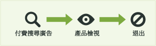
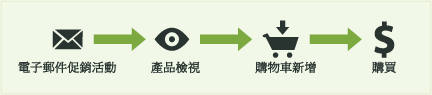
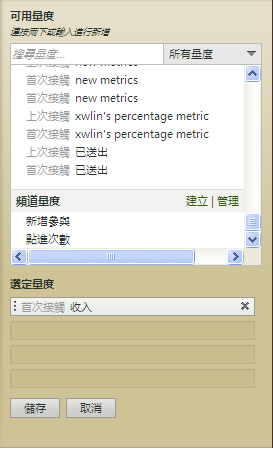

# 用於行銷渠道報表中的量度

如何在行銷管道報表中使用量度。

新增 (或編輯) 量度。

新增欄至報表。

## 首次和上次接觸量度 {#first-and-last-touch}

首次接觸和上次接觸是管道屬性，可讓您查看訪客在管道中的活動產生了多少新參與 (或產品檢視次數、收入和訂單等量度資料)。

發生成功事件時，Analytics 會查看整個訪客活動和歷史記錄 (直到[訪客參與有效期](/help/components/c-marketing-channels/visitor-engagement.md))。它會記下使用者進入的第一個渠道，以及最近的渠道。接著將成功事件的評價給予每個適當的渠道。

<!-- 

<note>
  A first-touch value has a rolling expiration based on the frequency of a visitor returning to the site. This first-touch expiration resets whenever a visitor returns to the site. This effects reporting by causing first-touch values to persist longer than you might expect. For example, this can occur if an instance of an first-touch channel was created a year ago. Remove the values on the eVar in the admin console to reset.
</note>

 -->

**範例**

假設您設定兩個行銷渠道: 付費搜尋和電子郵件促銷活動。

付費搜尋是一個產品廣告。它獲知訪客的興趣並產生產品檢視，但無法導致轉換事件。

一個月後，您執行針對同一產品的電子郵件促銷活動。它導致了 $100 的購買 (或其他所需的轉換事件)。

在行銷渠道報表中，該結果可顯示為:

付費搜尋渠道接收 $100 的評價作為首次接觸渠道的收入，同時帶有 1 個首次接觸訂購。電子郵件促銷活動渠道接收 $100 作為上次接觸渠道的收入 (轉換事件之前，使用者上次接觸的渠道)，同時帶有 1 個上次接觸訂購。即是說，該報表的主要目的在於顯示首次接觸渠道和上次接觸渠道的收入劃分差異。

每個成功事件例項都有剛好一個「首次接觸」渠道以及剛好一個「上次接觸」渠道。這表示如果您加總任一成功事件的某個量度欄，會剛好等於同一時段的總計。此總計也會剛好等於適當之[!UICONTROL 「網站量度] &gt; [!UICONTROL 自訂事件」]報表中的事件總數。非成功事件量度 (如存取和訪客) 不會符合 1 對 1，因為同一次存取中可以觸發多個渠道。

> [!NOTE] 此報表使用每個量度的首次接觸或上次接觸版本。因此，[!UICONTROL 「行銷渠道」]報表中顯示的資料，可能不符合其他報表中顯示的資料。

## 量度定義 {#metric-defs}

| 量度 | 定義 |
|--- |--- |
| 首次接觸渠道 | 吸引訪客參與的第一個行銷渠道。從技術方面來說，首次接觸管道是指使用原始配置的 eVar。 |
| 首次接觸訪客 | 在管道報表中，首次接觸訪客是指源自某個管道產生的每日獨特訪客。訪客的參與資料會在其參與網站的時間內加以儲存，時間可持續多次瀏覽。 |
| 上次接觸渠道 | 轉換渠道是指上一個吸引訪客參與並導致轉換的行銷渠道。只有一個渠道被設為首次接觸渠道。上次接觸渠道可隨每一次回訪網站而變更。每次瀏覽都包含一個首次接觸渠道和上次接觸渠道，但是首次接觸渠道的值始終不會隨著後續瀏覽而變更。 |

## 點進 {#click-through}

點進是上次接觸渠道中的例項。它是使用最新分配的 eVar。

例如，假設訪客每日訪問一次您的網站，每次都是從不同的行銷渠道開始瀏覽:

* 第 1 天: 付費搜尋
* 第 2 天: 顯示
* 第 3 天: 免費搜尋
* 第 4 天: 顯示
* 第 5 天: 付費搜尋
* 第 6 天: 顯示
* 第 7 天: 免費搜尋

首次接觸渠道報表將會顯示 1 個付費搜尋的新增參與。其他每個渠道顯示為 0 個新增參與。上次接觸渠道報表將顯示付費搜尋點進次數為 2 次；顯示點進次數為 3 次；以及免費搜尋點進次數為 2 次。

## 新增量度至行銷管道報表 {#add-metrics-to-mktg-channel-rpt}

新增量度至行銷管道報表。您可為報表中的每一欄新增最多四個量度，欄數不限。

1. 開啟[!UICONTROL 行銷渠道報表]。
1. 按一下「新增量度」。

   

1. 在[!UICONTROL 「可用量度」]下，將量度從[!UICONTROL 「可用量度」]區段拖放至[!UICONTROL 「選定量度」]區段。

   

1. 若要建立計算量度，請捲動至[!UICONTROL 計算量度]並按一下&#x200B;**[!UICONTROL 「建立」]**。
1. 按一下&#x200B;**[!UICONTROL 「儲存」]**。
