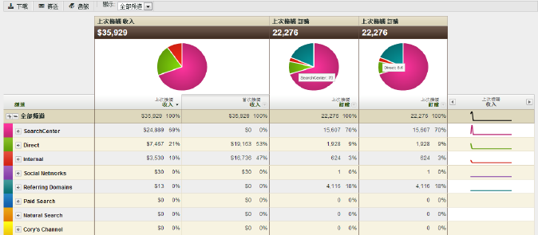

# 關於行銷渠道報表

行銷渠道報表可讓您瞭解您的行銷渠道產生了多少收入。這些報表包括首次接觸和上次接觸渠道配置的概述報表，並搭配重要的標準量度，如收入、訂購和成本。

渠道定義規則是在「管理工具」中設定。也可使用渠道報表專屬的 API。無需外部實施變更，便可執行[!UICONTROL 行銷渠道報表]。

* [報表範例](/help/components/c-marketing-channels/c-overview.md)
* [可用報表](/help/components/c-marketing-channels/c-overview.md)

## 報表範例 {#example-rpt}

控制面板、API、Report Builder (Excel 專用)、Ad Hoc Analysis、Data Warehouse 和資料擷取都支援渠道資料。

新增 (或編輯) 量度。

新增欄至報表。

## 可用報表 {#available-rpts}

下列[!UICONTROL 行銷渠道]報表適用於 Experience Cloud。

| 報告 | 說明 |
|--- |--- |
| 頻道概述 | 該概述報表透過顯示圓形圖和圖表來總結所選時段的趨勢。您可為此報表新增首次和上次觸摸量度，或建立計算量度。您也可從概述表格中深入到首次接觸或上次接觸渠道和詳情報表。其他行銷渠道報表提供更深入探究此報表所匯總之資料的方法。在報表中展開渠道後，您可看到該渠道值的劃分報表。渠道值是渠道詳情中未分類的值。 |
| 首次或上次接觸渠道 | 顯示關於特定首次接觸或上次接觸渠道的資料量度。在這些報表中，您可以劃分渠道並顯示每個渠道的詳情。 |
| 首次或上次接觸渠道的詳情 | 顯示頁面名稱和反向連結等報表詳細資料，這些詳細資料取自於您在設定規則時於「設定該管道的值為」選項中設定的管道值。渠道詳情報表使您能夠從概述報表中更詳細地瞭解渠道詳細值。 |
