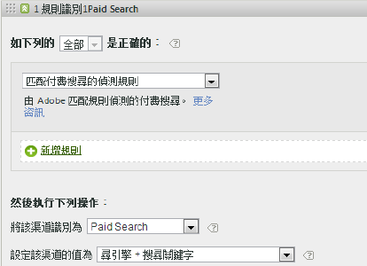
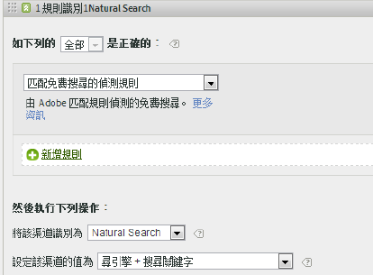
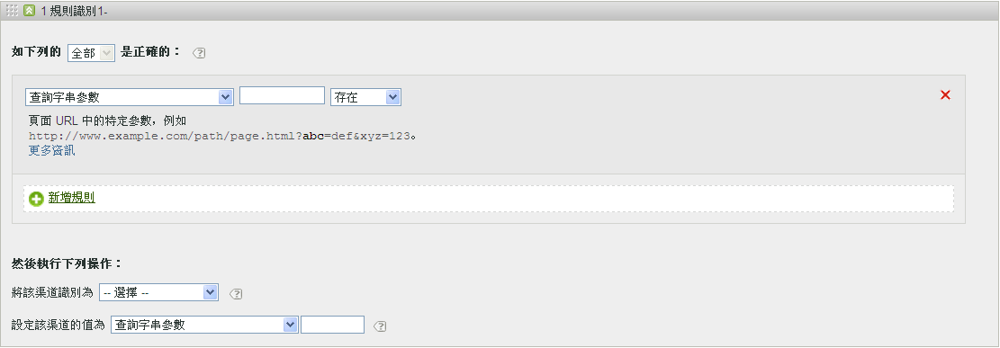
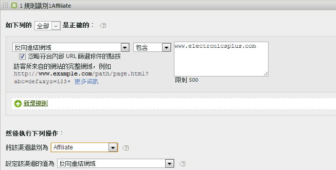
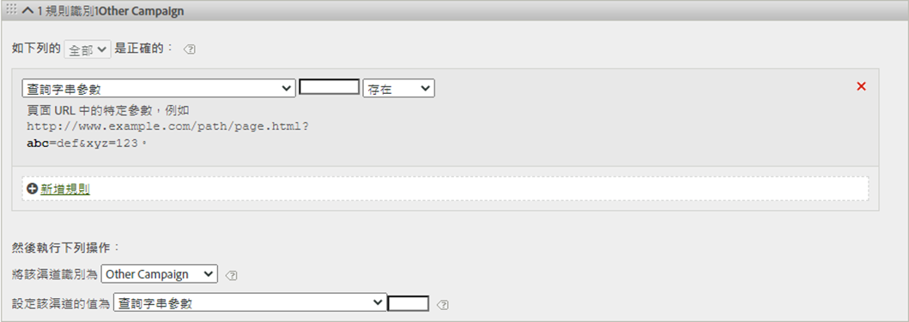
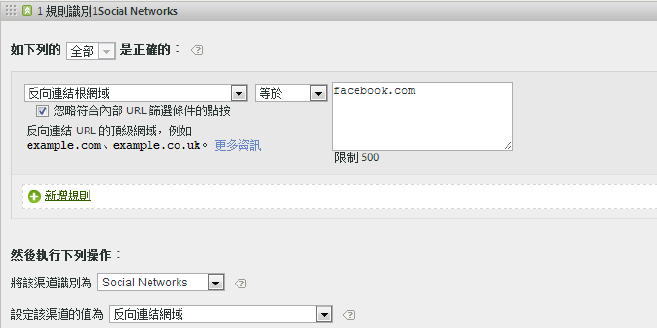
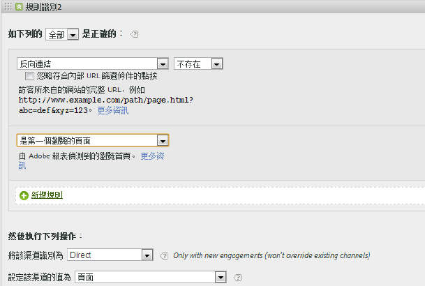
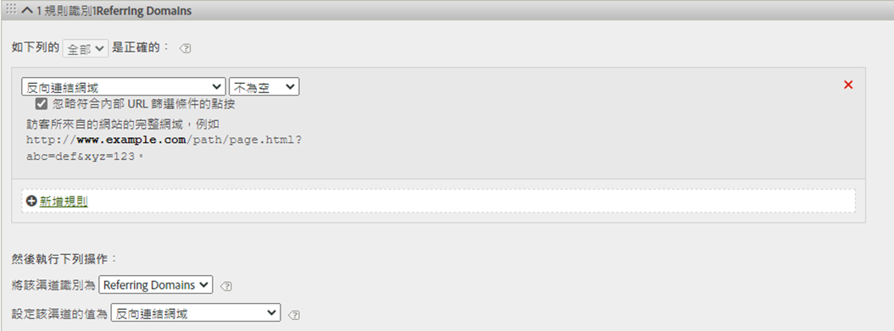

# 行銷管道的處理規則

行銷渠道處理規則會透過處理訪客在您網站上進行的每次點擊，來判斷訪客點擊是否符合指派給渠道的標準。 規則會依您指定的順序處理，當符合規則時，系統會停止處理其餘規則。

有關處理的其他附註：
* 使用這些規則收集的資料一律是永久性的，而在收集資料後更改的規則無法溯及以往。強烈建議您在儲存[!UICONTROL 行銷管道處理規則]前，檢閱並考慮所有的情況，移轉將在錯誤管道中收集的資料。
* 報表一次最多可處理 25 個管道。
* 規則可以存取 VISTA 已設定的變數，但無法存取 VISTA 已刪除的資料。
* 兩個行銷管道絕不接收同一事件 (例如購買或點按) 的評分。這將行銷管道與 eVars (兩個 eVars 可接收同一事件的評分) 區分開來。
* 如果規則有空白涵蓋範圍，您可能會看到未識 [別渠道。](/help/components/c-marketing-channels/c-faq.md)

## 必要條件

* 檢視[行銷管道快速入門](/help/components/c-marketing-channels/c-getting-started-mchannel.md)中的概念資訊。
* 建立一個或多個管道，以便為它們指定規則。請參閱[新增行銷管道](/help/components/c-marketing-channels/c-channels.md)。

## 建立行銷管道處理規則

建立行銷管道處理規則，以判定訪客點按是否符合指派給管道的標準。

此程序使用電子郵件規則做為範例。此範例假設您已新增電子郵件管道至「行銷管道管理員」頁面上的管道清單中。

1. 按一下&#x200B;**[!UICONTROL 「Analytics]** > **[!UICONTROL 管理]** > **[!UICONTROL 報表套裝」]**。
2. 選取報表套裝。

   如果報表套裝尚未定義管道，則會顯示[!UICONTROL 「自動設定」頁面]。

   請參閱[執行自動設定](/help/components/c-marketing-channels/c-getting-started-mchannel.md)。

3. 按一下&#x200B;**[!UICONTROL 「編輯設定]** > **[!UICONTROL 行銷管道]** > **[!UICONTROL 行銷管道處理規則」]**。

   

4. 從&#x200B;**[!UICONTROL 新增新規則集]**&#x200B;功能表中選取&#x200B;**[!UICONTROL 「電子郵件」]**。

   您在此處並非選擇管道，而是選擇範本並以數個必要參數填入規則。您可以視需要修改此範本。

   

5. 若要繼續建立規則，請按一下&#x200B;**[!UICONTROL 「新增規則」]**。
6. 若要排列規則優先順序，請將它們拖放至適當位置。
7. 按一下&#x200B;**[!UICONTROL 「儲存」]**。

繼續下一頁以查看渠道規則順序的建議以及更多定義範例。

### 設定行銷渠道值

**[!UICONTROL 新增規&#x200B;]**則設定渠道的值]**，定義該渠道可用的行銷渠道詳情維度。 這可讓您劃分行銷渠道維度，並檢視有關渠道的詳細資訊。

建議將渠道值設定為與用來定義渠道本身的相同標準。 例如，如果查詢字串參數用於定義渠道，請將查詢字串參數也設為渠道值。

### 規則條件

此參考表格定義欄位、選項和點擊屬性，您可用來定義行銷渠道處理規則。

| 詞語 | 定義 |
|--- |--- |
| 全部 | 僅當編號規則中的全部規則均為 true 時，啟用該管道。 |
| 任何 | 當規則集中的任何規則為 true 時，啟用該管道。該選項僅當編號規則中存在多個規則時方可用。 |
| AMO ID | Advertising Cloud 與 Advertising Analytics 整合所使用的主要追蹤程式碼。當其中一項整合啟用時，追蹤程式碼首碼可用來識別 Advertising Cloud 專用的管道。「AMO ID」的開頭使用「AL」代表 Search，「AC」代表 Display，「AO」則代表 Social。行銷管道中使用 AMO ID 時，點按/成本/曝光量度可歸因為正確的管道 (若未設定，這些量度將變為「直接」或「無」)。 |
| AMO ED ID | Advertising Cloud 使用的次要追蹤程式碼。此追蹤程式碼的主要用途是作為將資料傳回 Ad Cloud 的金鑰。不過，如果您想要將 ClickThroughs 和 ViewThroughs 視為兩個不同的行銷管道，也可以用它來識別 Display ClickThroughs 與 Display ViewThroughs。方法是為以「：d」結尾 (代表 Display ClickThroughs) 或結尾為「：i」(代表 Display ViewThroughs) 的「AMO EF ID」設定行銷管道邏輯。如果您不想將 Display 分割為兩個管道，請改用 AMO ID 維度。 |
| 轉換變數 | 包含為該報表套裝啟用的 eVar，並僅當透過頁面上的 Adobe 代碼設定這些變數時套用。請參閱  實作指南。 |
| 存在 | 具備多個可用選擇，包括：<ul><li>**不存在**：指定請求上並不存在點按屬性。例如，在反向連結網域中，如果使用者輸入 URL 或按一下書籤，反向連結網域屬性並不存在。</li><li>**為空**: 指定點按屬性存在，通常為 eVar 或查詢字串參數，但沒有與點按屬性相關的值。</li><li>**不包含**: 例如，讓您指定某反向連結網域不包含特定數值 (與選項「&quot;包含&quot;.)</li></ul> |
| 將該管道識別為 | 將規則與新增至行銷管道管理員頁面的行銷管道相關聯。請參閱新增行銷管道。 |
| 匹配付費搜尋的偵測規則 | Adobe 偵測的付費搜尋。付費搜尋是指公司付款以將其網站列入搜尋引擎。付費搜尋通常顯示在搜尋結果的頂部或右側。 |
| 匹配免費搜尋的偵測規則 | Adobe 報表偵測的免費搜尋。 |
| 反向連結匹配內部 URL 篩選器 | 瀏覽的頁面 URL 與內部 URL 篩選器匹配，該內部 URL 篩選器是為「管理工具」的報表套裝而定義的。 |
| 反向連結不匹配內部 URL 篩選器 | 反向連結 URL 與一個內部 URL 篩選器不相符，並且這是為「管理工具」的報表套裝而定義的。此設定可搭配使用  頁面 URL  和存在來設定範圍廣泛的規則，如此一來就不會有任何造訪落在報表的未識別管道區段中。 |
| 忽略符合內部 URL 篩選條件的點按 | (適用於反向連結) 僅跟蹤來自外部反向連結網站的點按。通常，除非您想要包含內部流量，否則此設定保留啟用。 |
| 是第一個瀏覽的頁面 | 由 Adobe 報表偵測到的瀏覽首頁。 |
| 頁面 | 您網站上使用 Adobe 網站信標所標記的網頁之頁面名稱。此值等同於  s.pageName 。範例如下：`Home Page` 和 `About Us`。 |
| 頁面網域 | 訪客著陸的頁面網域，例如 `products.example.co.uk`。 |
| 頁面網域和路徑 | 網域和路徑，例如 `products.example.co.uk/mens/pants/overview.html`。 |
| 頁面根網域 (TLD+1) | 訪客著陸的頁面根網域，例如 example.co.uk。 |
| 頁面 URL | 您網站某個網頁的 URL。 |
| 反向連結網域 | 訪客在瀏覽您的網站前所處的網域，例如，源自 `abcsite.com` 與 `xyzsite.com` 的反向連結。 |
| 查詢字串參數 | 如果網頁 URL 類似於 `https://example.com/?page=12345&cat=1`，則 page 和 cat 均為查詢字串參數。(如需此工具的其他相關資訊，請參閱 `https://en.wikipedia.org/wiki/Query_string`。)  您可為每個規則集僅指定一個查詢字串參數。若要新增其他查詢字串參數，請使用 `ANY` 作為運算元，然後新增查詢字串參數至此規則。 |
| 反向連結 | 訪客在來到您網站之前所處的網頁位置 (完整 URL)。反向連結存在於您所定義網域之外。 |
| 反向連結網域和路徑 | 反向連結網域和 URL 路徑的串連例如：    `www.example.com/products/id/12345` 或 `ad.example.com/foo` |
| 反向連結參數 | 反向連結 URL 上的查詢字串參數。例如，如果訪客來自 `example.com/?page=12345&cat=1`，則 page 和 cat 為反向連結參數。 |
| 反向連結根網域 | 反向連結的根網域。反向連結存在於您所定義網域之外。 |
| 搜尋引擎 | 類似 Google 或 Yahoo! 將訪客帶至您網站的搜尋引擎。 |
| 搜尋關鍵字 | 使用搜尋引擎來執行搜尋的一個詞。 |
| 搜尋引擎 + 關鍵字 | 搜尋關鍵字和搜尋引擎的串連，以唯一識別搜尋引擎。例如，如果搜尋 computer，則搜尋引擎和關鍵字的識別如下所示：`Search Tracking Code = "<search_type>:<search engine>:<search keyword>" where    search_type = "n" or "p", search_engine = "Google", and search_keyword = "computer"`**注意：**n = 免費; p = 付費 |
| 設定該管道的值為 | 除了瞭解為您網站帶來訪客的行銷管道之外，您還能知道管道內的哪些橫幅廣告、搜尋關鍵字或電子郵件促銷活動為訪客的網站活動獲得評分。該 ID 是與管道一同儲存的管道值。該值通常為內嵌於著陸頁面或反向連結 URL 中的促銷活動 ID，有時也是搜尋引擎和搜尋關鍵字組合，或是最近識別特定管道中訪客的反向連結 URL。 |

## 行銷渠道規則順序與定義 {#channel-rules}

渠道規則會依您指定的順序處理。 建議的渠道訂購方式是先將付費或受管理的渠道（例如付費搜尋、免費搜尋、展示、電子郵件）放在首位，讓其接收信用，接著接收有機渠道（例如直接、內部、反向連結網域）。

以下是渠道規則的建議順序以及範例定義：

### 付費搜尋 {#paid-search}

付費搜尋是指您向搜尋引擎付款以放置在搜尋結果中的字詞或片語。 此渠道通常是根據查詢字串參數（請參閱顯示渠道範例）或付費搜尋偵測規則來定義。 此決定取決於您要記錄的行銷渠道詳情。

#### 付費搜尋偵測

為了比對付費搜尋偵測規則，行銷管道使用[!UICONTROL 「付費搜尋偵測」]頁面上的設定。(**[!UICONTROL 管理員]** > **[!UICONTROL 報表套裝]** > **[!UICONTROL 編輯設定]** > **[!UICONTROL 一般]** > **[!UICONTROL 付費搜尋偵測]**)。目標 URL 符合搜索引擎的現存付費搜尋偵測規則。

對於行銷管道規則，[!UICONTROL 付費搜尋]設定如下：

如需詳細資訊，請參閱「管理員」中的[「付費搜尋偵測」](https://docs.adobe.com/content/help/zh-Hant/analytics/admin/admin-tools/paid-search-detection/paid-search-detection.html)。

### 免費搜尋 {#natural-search}

訪客經由某個網站搜尋找到您的網站 (您不須支付排名費用，即由該搜尋引擎排名您的網站)，則為「免費」搜尋。

分析不會偵測免費搜尋。在您設定付費搜尋偵測後，系統會知道如果某個搜尋反向連結不是付費搜尋反向連結，它一定是免費搜尋反向連結。如需詳細資訊，請參閱「管理員」中的[「付費搜尋偵測」](https://docs.adobe.com/content/help/zh-Hant/analytics/admin/admin-tools/paid-search-detection/paid-search-detection.html)。

對於行銷管道規則，免費搜尋設定如下：

### 顯示 {#display}

該規則可識別源自橫幅廣告的訪客。透過目標 URL 中的查詢字串參數來識別，本例中為  *`Ad_01`*。

### 「電子郵件」{#email}

此規則可識別源自電子郵件促銷活動的訪客。 It is identified by a query string parameter in the destination URL, in this case *`eml`*:

### 附加產品 {#afilliates}

此規則可識別源自指定反向連結網域集的訪客。 透過該規則，您可列出想要追蹤的附屬機構網域，如下所示：

### 其他促銷活動 {#other-campaigns}

最佳實務是納入「其他促銷活動」渠道，遵循所有付費渠道規則。 此渠道對於未分類的付費流量而言是「萬全之策」。

### 社交網路 {#social-networks}

該規則可識別源自社交網路的訪客，例如 Facebook*。頻道通常會重新命名為Organic Social。 設定值如下：

### 內部 (工作階段重新整理) 管道 {#internal}

此規則訪客的反向連結URL符合「管理控制台」中的「內部URL篩選器」設定，這表示訪客來自網站以開始瀏覽。 此頻道通常重新命名為「作業重新整理」。

如需 [發生此頻道的詳細資訊，請參閱內部（工作階段重新整理）](https://docs.adobe.com/content/help/en/analytics/components/marketing-channels/c-faq.html) 。

### 直接 {#direct}

此規則可識別沒有反向連結網域的訪客，此反向連結網域包括直接來到您網站的訪客，例如從「我的最愛」連結或在其瀏覽器中貼上連結。 此渠道通常重新命名為「直接分類／建立書籤」。

### 反向連結網域渠道 {#referring-domains}

「反向連結網域」渠道可識別具有反向連結網域的訪客。 內部網域、直接網域和反向連結網域渠道搭配使用，可針對所有尚未分類至渠道的其餘點擊提供全面資訊。

