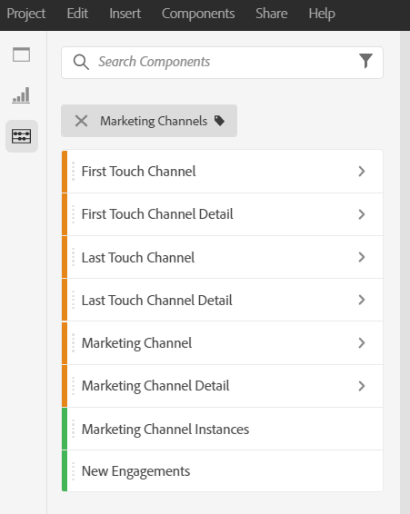
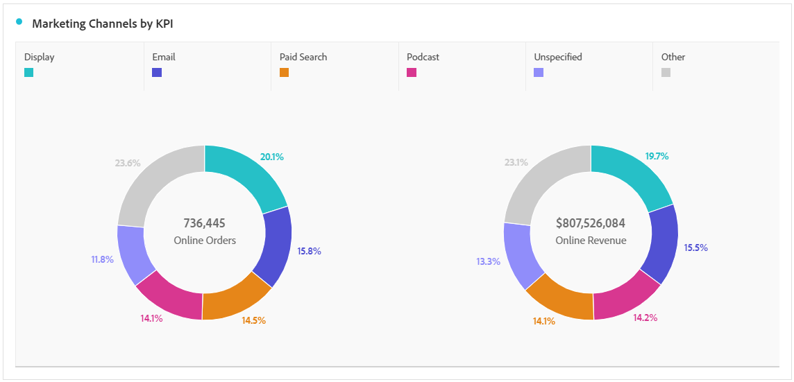

# 分析行銷渠道

您可能想要知道哪些行銷通道最有效，以及與誰合作，以便更好地鎖定您的工作目標，並獲得更好的行銷回報。 在Adobe Analytics中，工作區中的行銷管道維度和量度是可協助您追蹤不同管道對訂購、收入等的影響的工具之一。 並為您提供有用的通路見解。 以下是您可使用與行銷渠道相關的維度和量度：

| 維度／量度 | 定義 |
|---|---|
| 行銷渠道 | 這是我們建議使用的行銷渠道維度。 可在執行時期套用歸因IQ模型。 一般行銷渠道維度的運作方式與上次接觸渠道維度相同，但標籤不同，以防止與不同歸因模型搭配使用時混淆。 |
| 上次接觸渠道 | 舊版維度，其歸因模型已預先套用且不可變更。 |
| 首次接觸渠道 | 舊版維度，其歸因模型已預先套用且不可變更。 |
| [行銷渠道例項此度量……] |
| 新增參與 | 這是舊式量度，只有在渠道套用「首次接觸」配置時，才會遞增。 |

## 基本分析

此自由表格顯示每個行銷渠道的量度線上訂購、線上收入和轉換率：

在此，您可以在環圈圖中看到每個行銷渠道的線上訂購和線上收入：

此折線圖顯示不同渠道的線上訂單隨時間變化的趨勢：

## 進階分析

行銷渠道詳細資訊深入探討每個渠道，以顯示特定的促銷活動、位置等。 您可以將每個行銷渠道細分為詳細資訊：

## 套用歸因模型

您可以使用 [Attribution IQ](https://docs.adobe.com/content/help/en/analytics/analyze/analysis-workspace/panels/attribution/use-attribution.html) ，即時套用不同的歸因模型：

請注意，當您套用不同的歸因模型時，相同的量度（線上訂購）如何產生不同的結果。

以下是幾個影片，詳細說明歸因IQ:Attribution [IQ播放清單](https://www.youtube.com/playlist?list=PL2tCx83mn7GuDzYEZ8jQlaScruZr3tBTR)。

## 跨標籤行銷分析

使用舊版「首次接觸渠道」和「上次接觸渠道」，您可以獲得渠道互動的有用視圖：

透過此影片進 [一步瞭解](https://www.youtube.com/watch?v=M3EOdONa-3E)。