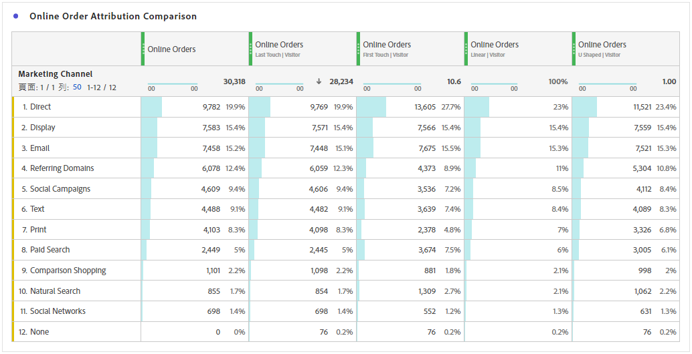
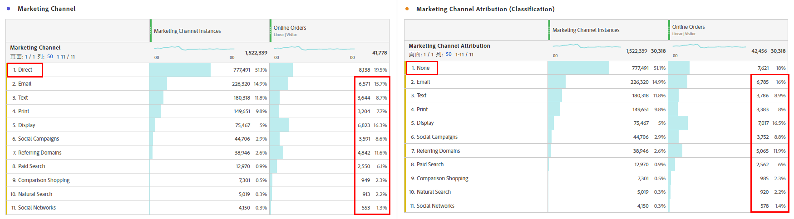
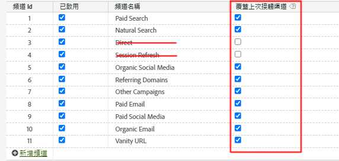
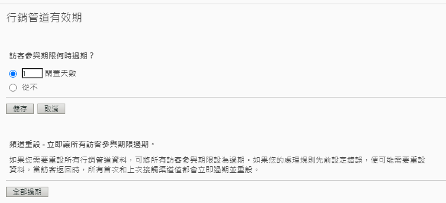

# 搭配行銷管道使用 Attribution - 最佳做法

[行銷管道](/help/components/c-marketing-channels/c-getting-started-mchannel.md)是 Adobe Analytics 的一項有價值且強大的功能。 目前有關行銷管道實作的指引是在 [Attribution](/help/analyze/analysis-workspace/attribution/overview.md) 和 [Customer Journey Analytics](https://experienceleague.adobe.com/docs/analytics-platform/using/cja-usecases/marketing-channels.html#cja-usecases) 都尚未存在時所制定。

為了讓您的行銷管道實作更具前瞻性及確保 Attribution 與 Customer Journey Analytics 之間的報告一致性，我們正在發佈一組更新的最佳做法。 如果您已在使用行銷管道，您可以根據這些新準則來選擇最佳選項。 如果您是行銷管道的新手，我們建議您遵循所有新的最佳做法。

當我們最初推出行銷管道時，只提供「首次接觸」和「上次接觸」維度。 有了最新版本的歸因，就不再需要明確的首次/上次接觸維度。 Adobe 提供通用的「行銷管道」和「行銷管道詳細資料」維度，讓您可將其用於所需的歸因模式。這些通用維度的行為與「上次接觸管道」維度相同，但標籤不同，這是為了避免搭配不同歸因模式使用行銷管道時產生混淆。

由於行銷管道維度以傳統的造訪定義 (由維度本身的處理規則為定義) 為依據，因此無法使用虛擬報告套裝來變更造訪定義。這些修改過的作法透過Attribution和Adobe Analytics啟用清楚且受控制的回顧期間。

## 最佳做法 1：利用 Attribution 進行受控制的分析

我們建議您使用 [Attribution](/help/analyze/analysis-workspace/attribution/overview.md) 來取代現有的行銷管道歸因，以調整您的行銷管道分析。 請遵循其他最佳做法，以確保使用 Attribution 進行分析的一致性並對該分析擁有強大的控制力。

* 「行銷管道」和「行銷管道詳細資料」維度設定會建立有待評估的接觸點 (與每個「行銷管道」實例相對應)。
* 若要進行量度分析，貴組織應該根據一個或多個歸因模式進行調整。請儲存此模式的自訂量度，以方便重複使用。
* 根據預設，資料的配置方式是使用「上次接觸」及「訪客參與期間」設定。 Attribution 量度模式提供對回顧視窗的更大控制力及更多樣性，包括[演算法歸因](/help/analyze/analysis-workspace/attribution/algorithmic.md#analysis-workspace)。

## 最佳做法 2：「非直接」和「工作階段重新整理」管道定義

不建議將「直接」和「內部/工作階段重新整理」管道用於自訂歸因模式。

如果貴組織已設定「直接」和「工作階段重新整理」，該怎麼做？ 在此情況下，Adobe建議您[為首次接觸/上次接觸](/help/admin/tools/manage-rs/edit-settings/marketing-channels/classifications-mchannel.md)建立分類，並將「直接」和「工作階段重新整理」管道保留為未分類。 分類的維度會產生類似從未設定這些管道的歸因結果。

如果您停用這些管道並移除其行銷管道處理規則，則結果與分類方法會略有不同。 值`None`代表不符合任何行銷管道處理規則的造訪。 當符合任何管道的造訪追蹤符合某個管道的造訪時，便可能出現差異。

在任何情況下，您都仍然可以使用自訂歸因模型，以套用回顧期間和歸因模型。

## 最佳做法 3：對所有管道啟用上次接觸管道覆寫

當啟用這項設定時，在 Workspace 中搭配「行銷管道」維度使用的自訂歸因模式會有最好的成效。 啟用此設定會在遇到新的管道/詳細資料時，讓「行銷管道實例」執行計算。 您應該針對「直接」或「內部/工作階段重新整理」以外的所有管道啟用此設定，我們已不建議將前兩者用於自訂歸因模式。

## 最佳做法 4：將訪客參與期間最小化

將訪客參與期間設定為最小值「1 天」可將保存值的可能性降至最低。 由於自訂歸因模式 (AIQ) 允許彈性回顧視窗，所以我們建議您設定最小值，以便將此設定的影響降至最低。

## 最佳做法 5：應該只有已啟用的管道才有行銷管道處理規則存在

請務必針對已停用的管道移除任何行銷管道處理規則。 只有已選為已啟用的行銷管道才應該有規則存在。
