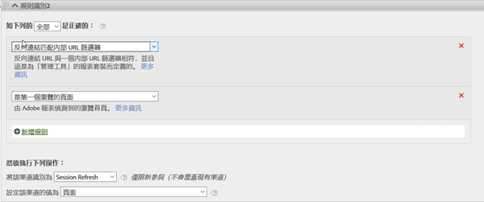
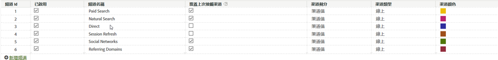

# 內部（作業階段重新整理）頻道

內部渠道（通常重新命名為「作業重新整理」）包含對網站的瀏覽，而反向連結URL與「管理控制台」中的「內部URL篩選器」設定相符，這表示訪客來自網站以開始瀏覽。

## 覆寫最佳實務

最佳做法是取消勾選「直接」和「內部」渠道的「覆寫上次接觸」選項，讓他們無法從其他持續的上次接觸渠道（或彼此）獲得評價。

>[!NOTE]本檔案假設「直接重新整理」和「作業重新整理」未勾選「覆寫」設定。

## 參與期間

訪客的首次和上次接觸渠道都會在該瀏覽器上閒置30天後重設。

>[!NOTE] 30天是預設值，可視需要透過「管理」設定加以修改。

如果訪客經常使用網站，則參與視窗會與他們一起顯示。 它們必須在30天內處於非活動狀態，期間才會過期，頻道必須重設。
範例:

* 第1天：使用者進入顯示網站。 首次和上次接觸渠道將設為「顯示」。

* 第2天：使用者在免費搜尋中進入網站。 首次接觸仍會保留「顯示」，而「上次接觸」則設為「免費搜尋」。

* 第35天：使用者33天內未造訪過網站，而且使用在瀏覽器中開啟的標籤回來。 假設30天參與視窗已關閉，行銷渠道Cookie將過期。 首次接觸和上次接觸渠道將會重設，且會由於使用者來自內部URL而設為「工作階段重新整理」。

## 首次和上次接觸的關係

若要瞭解首次接觸與上次接觸之間的互動，並確認覆寫的功能如預期般運作，您可以提取與上次接觸渠道報表子關聯的首次接觸渠道報表，並新增關鍵成功度量（請參閱以下範例）。 此範例示範首次和上次接觸渠道之間的互動。

第一個等於上次接觸的交叉點會以橙色加亮顯示。 「直接」和「工作階段重新整理」都只會在作為首次接觸渠道時獲得上次接觸評價，因為它們無法從其他持續渠道（以灰色反白顯示的列）獲得評價。

## 為什麼會重新整理作業？

由於我們知道上次接觸「工作階段重新整理」只有在也是首次接觸時才會發生，因此下列案例說明「工作階段重新整理」如何成為首次接觸渠道。

### 方案1:作業逾時

訪客來到網站，接著在瀏覽器中開啟標籤，以供日後使用。 訪客的參與期間過期（或主動刪除其Cookie），他們會使用開啟的標籤再次造訪網站。 由於反向連結URL是內部網域，因此該次瀏覽會分類為「工作階段重新整理」。

### 方案2:並非所有網站頁面都已標籤

訪客登陸未標籤的頁面A，接著移至已標籤的頁面B。 頁面A會被視為內部反向連結，而瀏覽會被分類為「工作階段重新整理」。

### 方案3:重新導向

如果未設定重新導向來將反向連結資料傳遞至新的著陸頁面，則會遺失真正的登入反向連結資料，而現在重新導向頁面（可能是內部頁面）會顯示為反向連結網域。 該次瀏覽將被分類為「作業重新整理」。

### 方案4:跨網域流量

訪客會從一個引發至套裝A的網域移至第二個引發至套裝B的網域。如果在套裝B中，內部URL篩選器包含第一個網域，則套裝B中的瀏覽將記錄為內部，因為行銷管道會將其視為第二個套裝中的新瀏覽。 該次瀏覽將被分類為「作業重新整理」。

### 方案5:登入頁面載入時間較長

訪客登陸頁面A，其內容很重，而Adobe Analytics程式碼位於頁面底部。 在所有內容（包括Adobe Analytics影像要求）可載入之前，訪客點按頁面B。頁面B會觸發其Adobe Analytics影像要求。 由於頁面A的影像要求從未載入，因此在Adobe Analytics中，第二個頁面會顯示為瀏覽的第一次點擊，而頁面A則為反向連結。 瀏覽會被分類為「工作階段重新整理」。

### 方案6:清除Cookie中間網站

訪客來到網站，中階作業會清除其Cookie。 「首次和上次接觸」渠道都會重設，且瀏覽會分類為「工作階段重新整理」（因為反向連結會是內部的）。
