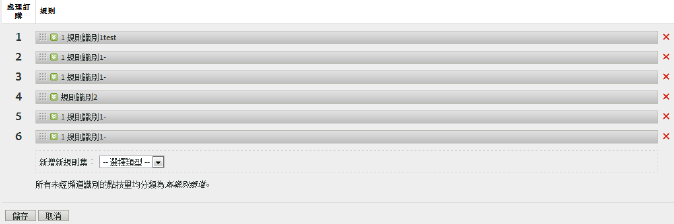
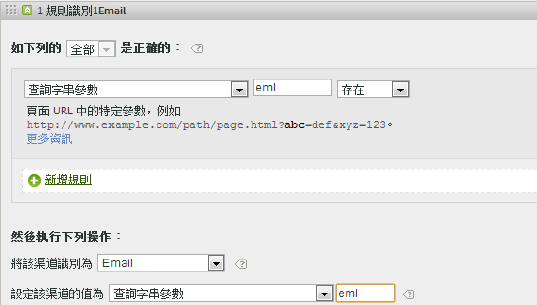

# 建立行銷管道處理規則

建立行銷管道處理規則，以判定訪客點按是否符合指派給管道的標準。

此程序使用電子郵件規則做為範例。此範例假設您已新增電子郵件渠道至「行銷渠道管理員」頁面上的渠道清單中。

1. 按一下&#x200B;**[!UICONTROL 「Analytics]** &gt; **[!UICONTROL 管理員]** &gt; **[!UICONTROL 報表套裝」]**。
1. 選取報表套裝。

   如果報表套裝尚未定義渠道，則會顯示[!UICONTROL 「自動設定」頁面]。

   請參閱[執行自動設定](/help/components/c-marketing-channels/c-channel-autosetup.md)。

1. 按一下&#x200B;**[!UICONTROL 「編輯設定]** &gt; **[!UICONTROL 行銷管道]** &gt; **[!UICONTROL 行銷管道處理規則」]**。

   

1. 從&#x200B;**[!UICONTROL 新增新規則集]**&#x200B;功能表中選取&#x200B;**[!UICONTROL 「電子郵件」]**。

   您在此處並非選擇渠道，而是選擇範本並以數個必要參數填入規則。

   

   使用布林邏輯 (if/then 陳述式) 來設定規則。例如，在電子郵件渠道規則中，您提供下列規則陳述式中強調的設定或資訊: 

   `"If **[!UICONTROL All]** or **[!UICONTROL Any]** of the following are true:  **[!UICONTROL Query String Parameter]** *<value>* **[!UICONTROL exists]**...`

   `"Then identify the channel as **[!UICONTROL Email]**...`

   `"Then set the channel's value to **[!UICONTROL Query String Parameter]** *<value>*."`

   在此範例中，*`<value>`* 是用於電子郵件促銷活動的查詢字串參數，例如 *`eml`*
1. 若要繼續建立規則，請按一下&#x200B;**[!UICONTROL 「新增規則」]**。
1. 若要排列規則優先順序，請將它們拖放至適當位置。
1. 按一下&#x200B;**[!UICONTROL 「儲存」]**。

>[!MORELIKETHIS]
>
>* [常問問題和範例](/help/components/c-marketing-channels/c-faq.md)

