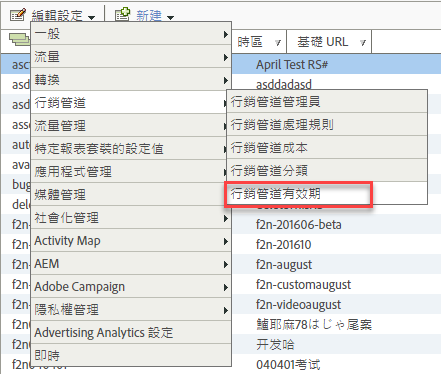

# 訪客參與有效期

瞭解如何在行銷管道中指定訪客參與有效期。

訪客參與是指允許將訪客的之前網站活動歸屬為首次接觸渠道的時間。

例如，訪客經常點進付費搜尋促銷活動並新增產品至購物車，但在轉換事件之前終止作業。如果訪客稍後回訪並實施購買，則您可指定是否將其之前和目前活動計為同一次參與。預設有效期為 30 天。

| 欄位 | 定義 |
|--- |--- |
| 閑置天數 | 訪客的首次接觸參與過期之前必須經過的天數。預設值為 30。 |
| 從不 | 訪客參與期限從不過期。 |
| 渠道重設 | 將所有訪客參與期限設為過期。如果您需要重設所有行銷渠道資料，可將所有訪客參與期限設為過期。如果您的處理規則先前設定錯誤，便可能需要重設資料。當訪客返回時，所有首次和上次接觸渠道值都會立即過期並重設。 |

## 指定訪客參與有效期 {#specify-visitor-expire}

指定訪客參與有效期。

1. 按一下&#x200B;**[!UICONTROL 「Analytics]** &gt; **[!UICONTROL 管理員]** &gt; **[!UICONTROL 報表套裝」]**。
1. 在[!UICONTROL 報表套裝管理器]中，按一下&#x200B;**[!UICONTROL 「編輯設定]** &gt; **[!UICONTROL 行銷管道]** &gt; **[!UICONTROL 行銷管道有效期」]**。

   

1. 設定訪客參與有效期欄位。
1. 按一下&#x200B;**[!UICONTROL 「儲存」]**。
