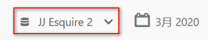
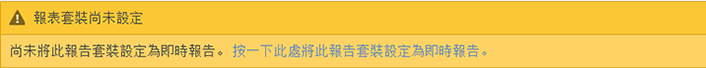
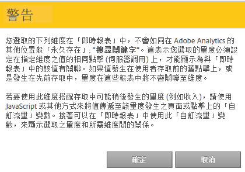

# 設定即時報告

設定即時報表的管理步驟。

Setting up real-time reports within [!UICONTROL Reports &amp; Analytics] consists of selecting the report suite and configuring up to 3 reports for it.

1. 選取您要啟用即時報告的報表套裝。

   Navigate to **[!UICONTROL Analytics]** &gt; **[!UICONTROL Reports]** &gt; **[!UICONTROL View All Reports &gt; Site Metrics]** &gt; **[!UICONTROL Real-Time]** and select the report suite from the drop-down at the top:

   

   如果您嘗試對尚未設定即時報表的報表套裝檢視即時報表，會出現一則訊息，供您設定報表套裝。

   

1. Click **[!UICONTROL Configure]** (gear icon) to run the [!UICONTROL Report Suite Manager].

   (Also available under **[!UICONTROL Analytics]** &gt; **[!UICONTROL Admin &gt; Report Suites]** &gt; **[!UICONTROL Edit Settings]** &gt; **[!UICONTROL Real-Time]**.)

1. Turn on the **[!UICONTROL Enable Real-Time]** setting.
1. 設定最多 3 個報告的即時資料收集，每個報告各一個量度和三個維度或分類。

   

   For information on supported real-time metrics and dimensions, see [Supported Metrics and Dimensions](../../components/c-real-time-reporting/realtime-metrics.md#concept_B86D8DF89AD448839332AD84B1DF2AE7).

   如果您已定義分類，則會以縮排顯示在其所定義的維度下方:

   

   >[!NOTE]
   >
   >對於單一即時報告，我們目前不支援啓用重復維度，即使為每個維度選取不同的分類亦然。

   For more information about classifications, see [About Classifications](../../components/c-classifications2/c-classifications.md#concept_4CEC7FF1A9E24204A7DA6B9AC70709DE).

   >[!NOTE]
   >
   >有些維度(例如「搜尋關鍵字」或「產品」)不會像在Adobe Analytics中其他位置一樣持續存在於即時。選取非持續性的量度時，會出現此警告:

   

1. Click **[!UICONTROL Save]** or **[!UICONTROL Save and View Report]**.

   初始設定報告後，最多可能需要 20 分鐘，才會開始串流資料。從那時起，資料就立即可用。如需檢視即時報告的詳細資訊，請參閱[執行即時報告](https://marketing.adobe.com/resources/help/en_US/sc/user/reports_realtime.html)。

1. 依預設，所有使用者都能存取即時報告。
