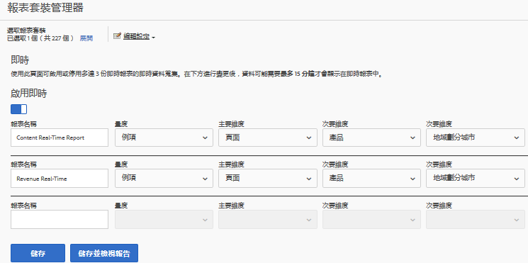
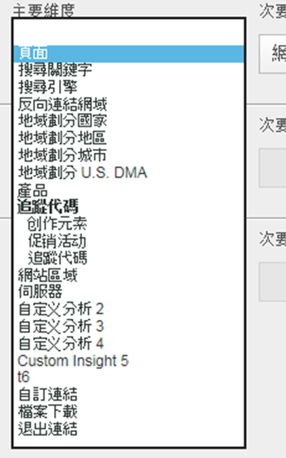

# 設定即時報程

下列資訊包含設定即時報表的管理步驟。

這包括選取報表套裝，以及為其設定最多3個報表。

1. 選取您要啟用即時報告的報表套裝。

   1. 在Analysis Workspace中，選取&#x200B;[!UICONTROL **Workspace**]&#x200B;索引標籤，然後選取&#x200B;[!UICONTROL **報表**] > [!UICONTROL **參與**] > **[!UICONTROL 即時]**。

   1. 從上方的下拉式清單中選取報表套裝：

      

      如果您嘗試對尚未設定即時報表的報表套裝檢視即時報表，會出現一則訊息，供您設定報表套裝。

      

1. 選取&#x200B;**[!UICONTROL 設定]**&#x200B;以執行[!UICONTROL 報表套裝管理員]。

   (也可從&#x200B;**[!UICONTROL 「Analytics]** > **[!UICONTROL 管理員 > 報表套裝]** > **[!UICONTROL 編輯設定]** > **[!UICONTROL 即時」]**&#x200B;中存取。)

1. 開啟&#x200B;**[!UICONTROL 啟用即時]**&#x200B;設定。
1. 設定最多 3 個報告的即時資料收集，每個報告各一個量度和三個維度或分類。

   

   如需深入瞭解支援的即時量度和維度，請參閱[支援的量度和維度](/help/admin/tools/manage-rs/edit-settings/realtime/realtime-metrics.md)。

   如果您已定義分類，則會以縮排顯示在其所定義的維度下方：

   

   >[!NOTE]
   >
   >針對單一即時報表，目前不支援啟用重複維度，即使為每個維度選取了不同的分類亦同。

   >[!NOTE]
   >
   >在「即時」中，有些維度 (如「搜尋關鍵字」或「產品」) 不會像在 Adobe Analytics 中的其他位置一樣持續存在。選取非持續性的量度時，會出現此警告：

   

1. 選取&#x200B;**[!UICONTROL 儲存]**&#x200B;或&#x200B;**[!UICONTROL 儲存並檢視報表]**。

   初始設定報告後，最多可能需要 20 分鐘，才會開始串流資料。從那時起，資料立即可用。

1. 依預設，所有使用者都能存取即時報告。
