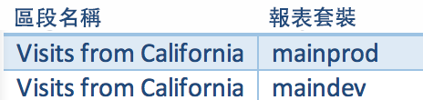

# 刪除區段

列出在刪除區段之前，您應注意的一些事項。

當您刪除區段時，

* 已套用此區段的已計劃報表和控制面板會繼續正常運作，亦即區段或控制面板會繼續使用刪除的區段。
* 當您編輯同名區段時，已計劃的報表不會更新。以下是範例: 假設您有 2 個同名區段分別位在不同報表套裝中:

   

   您有個書籤是引用 mainprod 報表套裝中的區段。然後您會刪除該區段，因為它是重複的。 書籤將會繼續運作，引用已刪除之區段的定義。如果您將剩下那個區段的區段定義變更為納入聖卡塔利娜島和墨西哥提華納市，則書籤所套用的區段並不會變更。它會使用舊的定義。若要修正此問題，請將書籤更新為引用新的定義。如果您不確定書籤、控制面板或排程報表是否使用已刪除的區段，您可以變更剩餘區段的名稱，以便更清楚書籤是否使用剩餘的區段。

## Edit Embedded Deleted Segments in Ad Hoc Analysis {#section_976D601DBD2244E38B0A0222E31D2610}

現在，Ad Hoc Analysis 可讓您在[計算量度產生器](https://marketing.adobe.com/resources/help/en_US/analytics/calcmetrics/)中編輯內嵌的已刪除區段，並針對該區段執行「另存新檔」作業。

不過，參照已刪除區段的其他已刪除區段仍維持不變。
