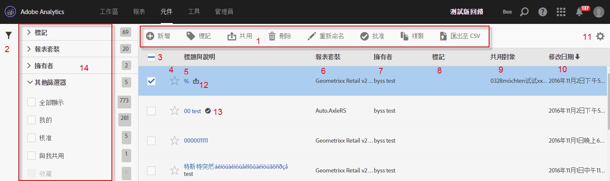
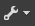
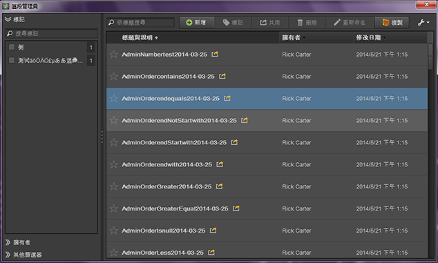

# 管理區段

「區段管理器」提供許多管理區段的方式，例如共用、篩選、核准、複製、刪除和標示為我的最愛。

「Analytics 區段管理器」會顯示您所擁有以及已經與您共用的區段。管理員級使用者可以查看組織中的所有區段。此概覽會介紹「區段管理器」的使用者介面和功能。存取「區段管理器」的方法有:

* 前往頂端導覽中的 **[!UICONTROL Analytics]** &gt; **[!UICONTROL 元件]** &gt; **[!UICONTROL 區段]**。
* 顯示現有報表並按一下左側導覽中的區段圖示 然後按一下&#x200B;**[!UICONTROL 「管理」]**。

## 作法影片 {#section_B3C5DA22DC5248DBA17C56E03DA2D4F2}

此 [Adobe Analytics YouTube 影片](https://www.youtube.com/watch?v=CdfOq98PTrg&index=6&list=PL2tCx83mn7GtHqZicFTa--aE6d02BvvTd)提供如何使用區段管理器的簡短概述。

## 區段管理器使用者介面 {#section_7FDCD12949BE4741A402DB83AB7B37DF}

| # | UI 功能 | 說明 |
|---|---|---|
| 1 | 區段管理工具列 | 如果您勾選區段，便會出現此工具列。多數的管理工作均可以透過此工具列完成。 |
| 2 | 顯示篩選器 | 按一下篩選圖示可開啟篩選功能表。您可以依「標記」、「擁有者」、「全部顯示」(僅限管理員使用)、「我的」、「我的最愛」、「已核准」和「已共用給我」進行篩選。 |
| 3 | 核取方塊 | 勾選要管理的區段。 |
| 4 | 我的最愛 | 按一下區段旁的星號，會使該星號變黃色並將區段標記為我的最愛。 |
| 5 | 區段標題和說明 | 提供於「區段產生器」中。若要編輯標題和說明，請按一下標題連結，如此便會回到「區段產生器」。 |
| 6 | 報表套裝 | 此欄指出上次將區段儲存到的目標報表套裝。 |
| 7 | 擁有者 | 指出區段的擁有者。如果您不是管理員，您只能看見自己所擁有或已共用給您的區段。 |
| 8 | 標記 (未在欄選擇器中勾選，因此此欄不會出現) | 由您或共用區段給您的人員對區段套用的標記。 |
| 9 | 共用對象 | 列出您將區段共用給的目標個人或群組 (僅限管理員使用) 或「全部」(僅限管理員使用)。 |
| 10 | 修改日期 | 顯示上次修改區段的日期。 |
| 11 | 欄選擇器 | 可讓您選取或取消選取「區段管理器」中的欄。 |
| 12 | 共用圖示    | 指出此區段已由您共用或與您共用。 |
| 13 | 批准圖示    | 指出管理員已批准此區段。 |
| 14 | 篩選器 | 可讓您在「標記」、「報表套裝」、「擁有者」及「其他」(「全部顯示」、「我的」、「已共用給我」、「已核准」、「我的最愛」) 底下，看見並選取篩選器。 |

## Ad Hoc Analysis 中的區段管理器 {#section_CC8BDC968EBC4BC1919870869D8443A9}

Ad Hoc Analysis 中的「區段管理器」會顯示所有您所擁有和已共用給您的區段。

若要存取 [!DNL ad hoc analysis] 中的「區段管理器」:

* 前往左側面板中的「**[!UICONTROL 區段]**」標籤，然後按一下扳手圖示 整理區段&#x200B;**」。**

如同 Web 使用者介面中的「區段管理器」，此主控台提供多項功能，包括區段共用、篩選、標記、核准、複製、刪除和標示為我的最愛。
