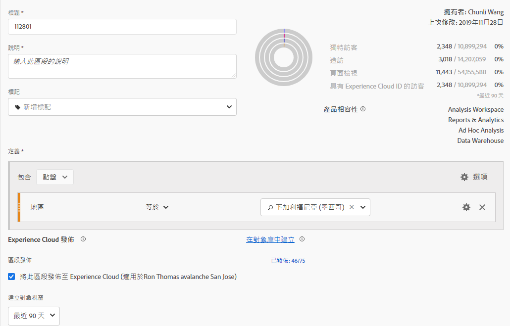
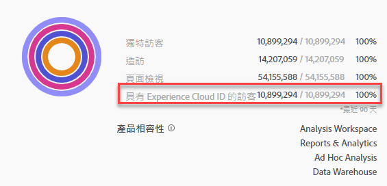
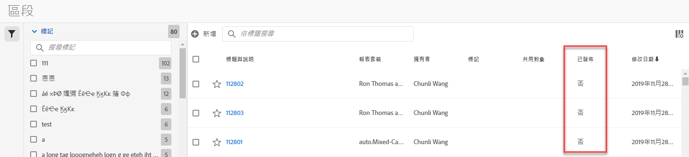

# 發佈區段至 Experience Cloud

Publishing a segment to the Experience Cloud lets you use the segment for marketing activity in the [!UICONTROL Audience Library], [!DNL Target], [!DNL Audience Manager], [!DNL Advertising Cloud], and [!DNL Campaign]. 近期的更新已大幅最佳化發佈工作流程。先前發佈可用區段大約需要 48 小時。

現在最多需要 8 小時來進行處理，但視其他流量和區段大小而定，處理速度可能更快。(不過目前無法通知您區段何時可用，因此您必須手動檢查。)我們也將可發佈區段的數量上限從 20 個增加到 75 個。您可以在「元件 > 區段」中檢視已發佈的區段。

> [!NOTE] Adobe Campaign (Classic 和 Standard 版) 的運作方式不同，除了 8 小時延遲外，還會產生額外的 24 小時延遲。

## 必備條件

* 請確認您要儲存此區段的目標報表套裝[已在 Experience Cloud 上啟用](https://docs.adobe.com/content/help/en/core-services/interface/audiences/t-publish-audience-segment.html)，否則無法將它發佈至 Experience Cloud。
* 請確認您使用的報表套裝已對應至您的 [Experience Cloud 組織](https://docs.adobe.com/content/help/en/core-services/interface/about-core-services/report-suite-mapping.html)。
* 請確認貴組織使用 Experience Cloud ID。
* Before you can publish segments, your Admin needs to assign the [!UICONTROL Segment Publishing] permission to a product profile in the [Admin Console](https://docs.adobe.com/content/help/en/core-services/interface/manage-users-and-products/admin-getting-started.html), and add you to the product profile.

## 考量事項

* **報表套裝限制**：每個報表套裝最多可發佈 75 個區段。此限制會強制執行。如果已發佈 75 個區段，則必須取消發佈足夠的區段，讓區段數少於 75 個區段的臨界值，才能發佈其他任何區段。
* **成員限制**：透過 Analytics 與 [!DNL Experience Cloud] 共用的對象不能超過 2,000 萬名獨特成員。
* **資料隱私權**：系統不會根據訪客的驗證狀態篩選對象。如果訪客可在未驗證和已驗證狀態下瀏覽您的網站，當訪客未驗證時發生的動作仍會使系統將訪客納入受眾。請參閱 [Adobe Experience Cloud 隱私權](https://www.adobe.com/privacy/experience-cloud.html)以瞭解對象共享的完整隱私權意涵。
* 有關 **[!DNL Adobe Analytics]和[!DNL Audience Manager]**中區段之間差異的探討，請前往[這裡](https://docs.adobe.com/content/help/en/analytics/integration/audience-analytics/audience-analytics-workflow/aam-analytics-segments.html)。

## 區段發佈時間軸

| 可用功能 | 可用時間 | 可用位置 |
|---|---|---|
| 中繼資料 (區段標題和定義) | 發佈後立即生效 | [!DNL Audience Manager], [!UICONTROL Experience Cloud Audience Library], [!DNL Target] |
| 可用的具成員資格區段 | 發佈後 8 小時內 | [!DNL Audience Manager] 中的訪客資料檢視器 |
| 特徵與成員母群體 | 24 - 48小時內 | [!DNL Audience Manager] |

## 發佈區段於 [!UICONTROL Segment Builder]

1. 導覽至 **[!UICONTROL Analytics > Workspace > Components > Segments]> +**
1. 在中建立區段 [!UICONTROL Segment Builder]。
1. 提供區段的標題和說明 (如未提供便無法儲存)。
1. 檢查 **[!UICONTROL Publish this segment to the Experience Cloud (for *報表套裝&#x200B;*)]**。

>[!IMPORTANT]
>
>在 Analytics 中查看區段預覽時，請務必使用「具有 Experience Cloud ID 的訪客」，而非比較 Adobe Analytics 數字與 Audience Manager 數字時的「獨特訪客」區段預覽總數：
>
>

| 元素 | 說明 |
|---|---|
| **[!UICONTROL Publish this segment to the Experience Cloud (for *<report suite>*)]** | 此選項啟用時，區段標題和定義 (即廣告平台中常用的殼層對象) 會立即與 Experience Cloud 共用，而系統每 4 小時會評估和共用區段成員資格一次。 例如，將對象與 [!DNL Target] 中的活動建立關聯後，[!DNL Analytics] 會開始傳送 ID 給符合 Experience Cloud 和 [!DNL Target] 對象資格的訪客。此時，Experience Cloud 對象頁面上會開始顯示對象名稱和相應的資料。  |
| **[!UICONTROL Audience Creation Window]** | 您選取的時間範圍會用於依時序建立對象。例如，「最近 30 天」(預設值) 包含自當天 (並非建立區段的原始日期) 起的過去 30 天內符合對象資格的訪客。 |
| **[!UICONTROL Create in Audience Library]** | 您所建立和發佈的區段可在 Experience Cloud 對象庫中無延遲提供使用，這些區段不依賴 Analytics 更新。這些區段不會計入 75 個已發佈區段的限制中。 |
| **[!UICONTROL x of 75 Published]** | 顯示您已發佈至 Experience Cloud 的區段數。按一下連結，可檢視已發佈區段及其關聯報表套裝和擁有者的清單。 |
| **[!UICONTROL Save]** | 儲存此區段。 |

## 取消發佈或刪除區段

若要刪除已發佈至 Experience Cloud 的區段，必須先將其取消發佈。若要取消發佈區段，只需&#x200B;**取消勾選**&#x200B;您用來發佈該區段的核取方塊即可。

> [!NOTE]您&#x200B;**無法**&#x200B;取消發佈下列任何 Adobe 解決方案目前正在使用的區段：[!DNL Analytics] (在 [!DNL Audience Analytics] 中)、[!DNL Campaign]、[!DNL Advertising Cloud] (適用於 [!DNL Core Service] 和 [!DNL Audience Manager] 客戶) 以及所有其他外部合作夥伴 (適用於 [!DNL Audience Manager] 客戶)。您&#x200B;**可以**&#x200B;取消發佈 [!DNL Target] 正在使用的區段。

## View segment publishing status in the [!UICONTROL Segment Manager]

1. 導覽至 [!UICONTROL Analytics > Components > Segments]。
1. Notice the new [!UICONTROL Published] column. 「是/否」指的是區段是否已發佈至 Experience Cloud。

## 擷取 [!DNL Audience Manager] UUID

有兩種方式可擷取目前與瀏覽器相關聯的 AAM UUID：

* Adobe Experience Cloud Debugger
* 瀏覽器中的原生開發者工具 (例如 Chrome 開發者工具)

下列螢幕擷取畫面顯示如何在瀏覽器上擷取 AAM UUID，並在 Audience Manager 訪客資料檢視器中用它來驗證特徵和區段成員資格。

**方法 1：使用 Adobe Experience Cloud Debugger**

1. 在 Chrome 線上應用程式商店中下載並安裝 [Adobe Experience Cloud Debugger](https://docs.adobe.com/content/help/en/analytics/implementation/testing-and-validation/debugger.html)。
1. 載入頁面時啟動除錯程式。
1. 捲動至 Audience Manager 區段，並尋找目前瀏覽器頁面上設定的 AAM UUID
(以下範例中為 `50814298273775797762943354787774730612`)

**方法 2：使用 Chrome 開發者工具 (或其他瀏覽器開發者工具)**

1. 載入頁面之前先啟動 Chrome 開發者工具
1. 載入頁面並勾選「應用程式 > Cookie」。AAM UUID 應在第三方 Demdex Cookie (以下範例中為 [adobe.demdex.net](https://marketing.adobe.com/resources/help/en_US/aam/demdex-calls.html)) 中設定。demdex 欄位是瀏覽器上設定的 AAM UUID (在以下範例中為 `50814298273775797762943354787774730612`)。

## 使用Audience Manager [!UICONTROL Visitor Profile Viewer]

The AAM UUID on the browser will be used by default when [!UICONTROL Visitor Profile Viewer] is loaded. If verifying trait realizations for other users, input a UUID in the UUID field and click [!UICONTROL Refresh]. 如需詳細資訊，請參閱[訪客資料檢視器](https://marketing.adobe.com/resources/help/en_US/aam/t_visitor_profile_viewer.html)。

## 在 [!DNL Audience Manager] 中檢視區段特徵

在 AAM 中，當 Analytics 與 Experience Cloud 共用區段時，會以串流方式評估指定區段的訪客清單 (含 ECID)。

1. 在 [!DNL Audience Manager]中，轉到 [!UICONTROL Audience Data > Traits > Analytics Traits]。 您將會看到已對應至您 Experience Cloud 組織的每個 Analytics 報表套裝的資料夾。當設定檔和對象/人員核心服務啟動或佈建時，就會建立這些資料夾 (特徵、區段和資料來源)。
1. 選取您先前建立要與 [!DNL Audience Manager] 共用之區段的報表套裝資料夾。這時會看到您建立的區段/對象。當您共用區段時，[!DNL Audience Manager] 中會發生下列兩件事：
* 系統會建立一個特徵，一開始不含任何資料。大約在區段發佈 8 小時後，[!DNL Analytics] ECID 清單就會上線並與 [!DNL Audience Manager] 及其他 Experience Cloud 解決方案共用。

* 系統會建立一個單一特徵區段。這個區段使用的資料來源與您發佈該區段的報表套裝相關聯。

## 在 [!DNL Adobe Target] 中檢視區段

The [!UICONTROL Publish this segment to the Experience Cloud] checkbox during the segment creation process in Adobe Analytics allows the segment to be available within the Adobe Target&#39;s custom audience library. 在 Analytics 或 Audience Manager 中建立的區隔皆適用於 Target 中的活動。例如，您可以根據 Analytics 中建立的 Analytics 轉換量度和受眾區隔來建立行銷活動。], click [!UICONTROL Audiences].
1. On the [!UICONTROL Audiences] page, locate the audience sourced from the [!DNL Experience Cloud]. 這些對象可在 [!DNL Target] 活動中使用。

