# 建立循序區段

循序區段是使用THEN運算子來建立，而非AND或OR。 THEN表示會出現一個區段標準，接著是另一個。 依預設，循序區段會識別所有相符的資料，並顯示「包括所有使用者」篩選條件。可使用「僅限序列之前」和「僅限序列之後」選項，將循序區段進一步篩選成相符點擊的子集。

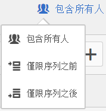

此外，您可以使用 [After 和 Within 運算子](/help/components/c-segmentation/c-segmentation-workflow/seg-sequential-build.md)，將查核點之間的循序區段限制為特定時段、粒度和計數。

## 包括所有使用者 {#section_75ADDD5D41F04800A09E592BB2940B35}

當建立一個區段並設定「包括所有使用者」，區段會識別整體符合指定模式的路徑。這是基本序列區段的範例，其中尋找同一訪客瀏覽的點擊（頁面A），接著另一個點擊（頁面B）。 區段設為「包含每個人」。

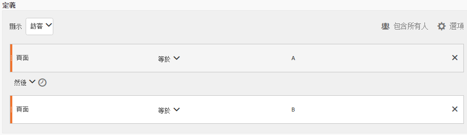

| 如果結果… | 序列 |
|--- |--- |
| 符合 | A 然後 B A 然後 (在不同次造訪中) B A 然後 D 然後 B |
| 不符合 | B 然後 A |

## 僅限序列前和序列後 {#section_736E255C8CFF43C2A2CAAA6D312ED574}

這些選 **[!UICONTROL Only Before Sequence]** 項 **[!UICONTROL Only After Sequence]** 會將區段篩選為指定序列之前或之後的資料子集。

* **「僅限序列之前」**：包括序列之前的所有點擊，以及該序列本身的首次點擊 (請參閱範例 1、3)。如果序列在路徑中出現多次，則「僅限序列之前」包括最後一個出現序列的首次點擊，以及先前的所有點擊 (請參閱範例 2)。
* **「僅限序列之後」**：包括序列之後的所有點擊，以及該序列本身的最後點擊 (請參閱範例 1、3)。如果序列在路徑中出現多次，則「僅限序列之後」包括第一個出現序列的最後點擊，以及之後的所有點擊 (請參閱範例 2)。

例如，假設有一個 B -> D 的序列。這三種篩選條件會依照下列方式識別點擊：

**範例 1：B 然後 D 出現一次**

| 範例 | A | B | C | D | E | 五 |
|---|---|---|---|---|---|---|
| 包括所有使用者 | A | B | C | D | E | 五 |
| 僅限序列之前 | A | B |  |  |  |  |
| 僅在序列之後 |  |  |  | D | E | 五 |

**範例 2：B 然後 D 出現多次**

| 範例 | A | B | C | D | B | C | D | E |
|---|---|---|---|---|---|---|---|---|
| 包括所有使用者 | A | B | C | D | B | C | D | E |
| 僅限序列之前 | A | B | C | D | B |  |  |  |
| 僅在序列之後 |  |  |  | D | B | C | D | E |

讓我們用「點擊深度」維度來建構此概念。

**範例 3：點擊深度 3 然後 5**

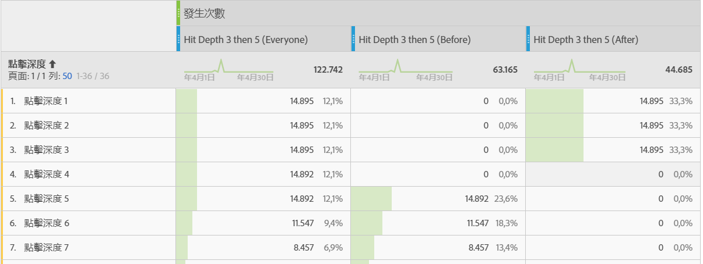

## 維度限制 {#section_EAFD755F8E674F32BCE9B642F7F909DB}

在「within」子句裡，您可以在「THEN」陳述式之間加入「within 1 search keyword instance」、「within 1 eVar 47 instance」之類的文字。這樣會將區段限制在某個維度的一個例項內。

在規則之間設定「維度內」子句，讓區段可以限制資料為只符合該子句的序列。請看下面的例子，其限制設定為「1 頁面以內」：

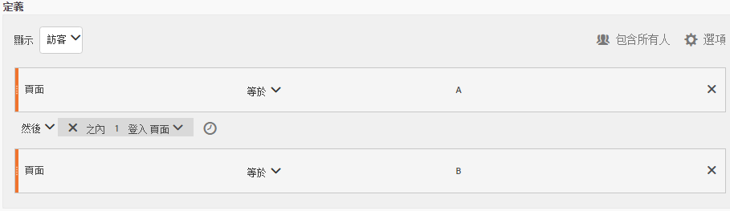

| 如果結果… | 序列 |
|--- |--- |
| 符合 | A 然後 B |
| 不符合 | A 然後 C 然後 B (因為 B 不在 A 的第 1 頁內)  **注意&#x200B;**：如果取出維度限制，「A 然後 B」和「A 然後 C 然後 B」都符合。 |

## 簡易頁面檢視序列

識別先檢視某個頁面接著再檢視另一個頁面的訪客。 點擊層級資料會篩選此序列，而不考慮先前、過去或過渡瀏覽作業，或兩者之間發生的頁面檢視次數或時間。

**範例**：訪客檢視頁面 A，然後在同次造訪或另一次造訪中檢視頁面 B。

**使用個案**

以下是如何使用區段的範例。

1. 體育網站的訪客會檢視足球登陸頁面，然後依序檢視籃球登陸頁面，但不一定是在同一次瀏覽中。 這會提示促銷活動在足球季期間將籃球內容推送給足球觀眾。
1. 車輛零售商識別進行以下活動的訪客彼此之間的關係：先登陸客戶忠誠度頁面，然後在任何時候於當次或另一次瀏覽期間前往影片頁面。

**建立此區段**

You nest two page rules within a top-level [!UICONTROL Visitor] container and sequence the page hits using the [!UICONTROL THEN] operator.

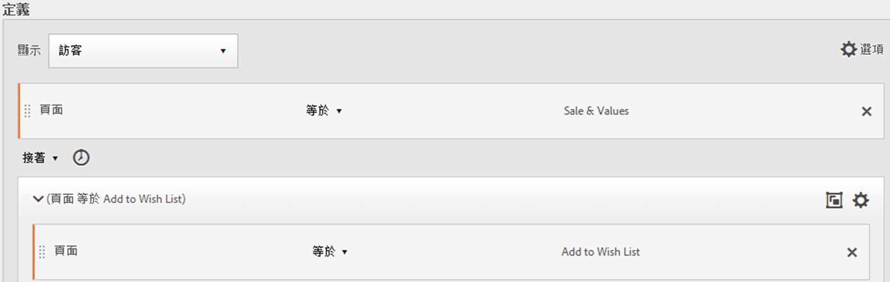

## 跨造訪的訪客序列

識別離開行銷活動但在其他作業中返回頁面檢視序列的訪客。

**範例**：訪客在單次造訪中檢視頁面 A，接著在另一次造訪中檢視頁面 B。

**使用個案**

以下是如何使用這類區段的範例：

* 進入新聞網站「運動」頁面的訪客接著在另一個作業中重新瀏覽「運動」頁面。
* 服飾零售商查看進行下列活動的訪客之間的關係：在某次作業中進入登陸頁面，然後在另一次作業中直接進入結帳頁面。

**建立此區段**

This example nests two **[!UICONTROL Visit]** containers within the top-level **[!UICONTROL Visitor]** container and sequences the segment using the [!UICONTROL THEN] operator.

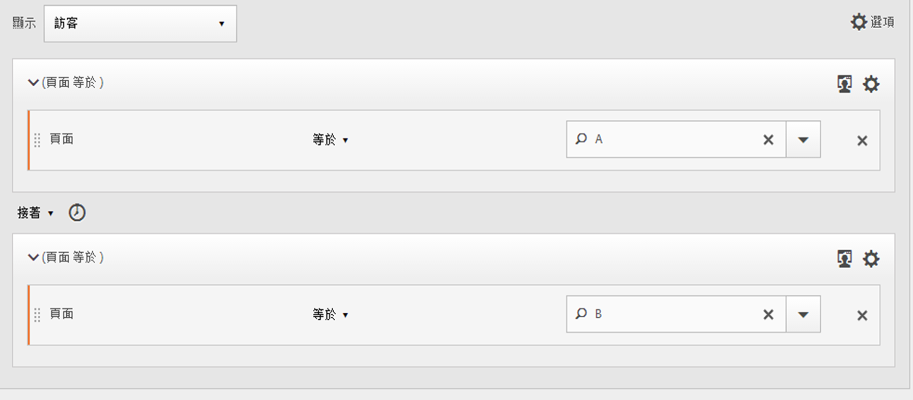

## 混合層級序列

識別在次數不定的瀏覽中檢視兩個頁面，然後在另一次瀏覽中檢視第三個頁面的訪客。

**範例**：訪客在一或多次造訪中造訪頁面 A 然後造訪頁面 B，接著在另一次造訪中造訪頁面 C。

**使用個案**

以下是如何使用這類區段的範例：

* 訪客先瀏覽新聞網站，然後在同次瀏覽中檢視運動頁面。 在另一次瀏覽中，訪客會瀏覽氣象頁面。
* 零售商定義進入「主要」頁面接著前往「我的帳戶」頁面的訪客。 在另一次瀏覽中，他們會造訪「檢視購物車」頁面。

**建立此區段**

1. 從左窗格拖曳兩個頁面維度至頂層容 [!UICONTROL Visitor] 器。
1. 在它們之間添加THEN運算子。
1. 按一 **[!UICONTROL Options]** 下> **[!UICONTROL Add container]** 並在層級下方新增容器， [!UICONTROL Visit] 然後使用運算子進行 [!UICONTROL Visitor][!UICONTROL THEN] 排序。

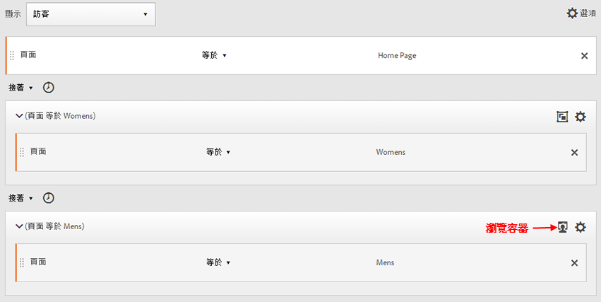

## 彙總容器

在容器中 [!UICONTROL Hit] 新增多個容器 [!UICONTROL Visitor] 可讓您在相同類型的容器之間運用適當的運算子，並使用規則和維度（例如「頁面」和「瀏覽次數」）來定義頁面檢視並在容器中提供序列維 [!UICONTROL Hit] 度。 在「點擊」層級套用邏輯可讓您限制並結合容器內相同點擊層級的符合項目，以 [!UICONTROL Visitor] 建立多種區段類型。

**範例**：訪客在頁面檢視序列的首次點擊 (在範例中為頁面 D) 後瀏覽頁面 A，接著瀏覽頁面 B 或頁面 C (不管瀏覽幾次)。

**使用個案**

以下是如何使用這類區段的範例：

* 識別在一次瀏覽中前往「主要」著陸頁面的訪客，然後在另一次瀏覽中檢視「男裝」頁面，然後在另一次瀏覽中檢視「女裝」或「兒童」著陸頁面。
* 電子雜誌進行下列活動的訪客：在某次瀏覽中前往首頁、在另一次瀏覽中前往「體育」頁面、並又在另一次瀏覽中前往「意見」頁面。

**建立此區段**

1. 選取 [!UICONTROL Visitor] 容器做為頂層容器。
1. 新增兩 [!UICONTROL Hit]個層級容器——一個維度，其中有適當的數值維度由和運算子以相 [!UICONTROL Hit] 同的層 [!UICONTROL AND] 級連結 [!UICONTROL OR] 。
1. 在容器 [!UICONTROL Visit] 中，新增另一個容 [!UICONTROL Hit] 器，並巢狀內嵌兩個以或運算子連結 [!UICONTROL Hit] 的其他容 [!UICONTROL OR] 器( [!UICONTROL AND] 或)。

   使用運算子 [!UICONTROL Hit] 來排序這些巢狀 [!UICONTROL THEN] 容器。

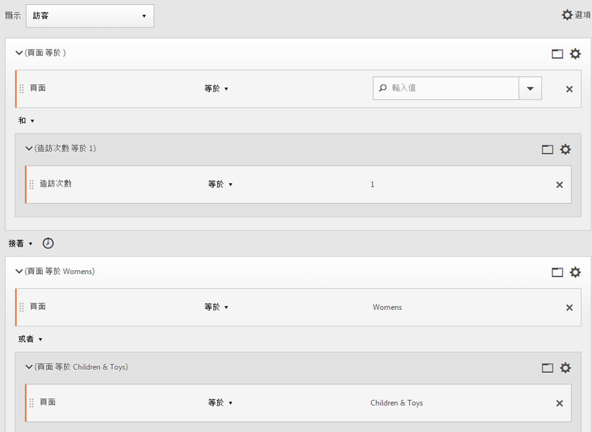

## 循序區段中的「巢狀內嵌」

By placing checkpoints at both the [!UICONTROL Visit] and [!UICONTROL Hit] level, you can constrain the segment to meet requirements within a specific visit as well as a specific hit.

**範例**：訪客在同次造訪內先造訪頁面 A，接著造訪頁面 B。在新瀏覽中，訪客接著前往頁面 C。

**建立此區段**

1. Underneath a top-level [!UICONTROL Visit] container, drag in two page dimensions.
1. 多選兩個規則，按一下 **[!UICONTROL Options]** > **[!UICONTROL Add container from selection]** 並變更為容 [!UICONTROL Visit] 器。
1. 使用運算子將它們 [!UICONTROL THEN] 連結。
1. 建立「點擊」容器作為與容器對 [!UICONTROL Visit] 等的容器，並拖曳頁面維度。
1. 使用另一個運算子，將容器 [!UICONTROL Visit] 中的巢狀序 [!UICONTROL Hit] 列與容器 [!UICONTROL THEN] 連結。

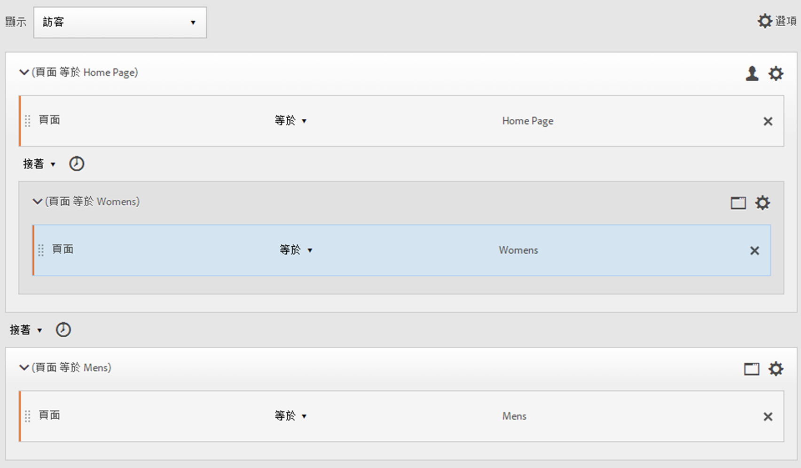

## 排除點擊

除非您特別使用規則排除、 [!UICONTROL Visitor]或資 [!UICONTROL Visit]料，否 [!UICONTROL Hit] 則區段規則會包含所有 [!UICONTROL Exclude] 資料。 它可讓您消除常見資料，並建立更專注的區段。 或者，您可以建立區段來排除找到的群組，以識別剩餘的資料集，例如建立規則，其中包含下訂單的成功訪客，然後排除這些訪客以識別「非購買者」。 但是，在大多數情況下，建立排除廣泛值的規則比嘗試使用規則來定位特 [!UICONTROL Exclude] 定包含值更好。

例如：

* **排除頁面**。 使用區段規則將特定頁面(例如 *`Home Page`*)從報表中剔除、建立頁面等於「首頁」的點擊規則，然後排除它。 此規則會自動包含「首頁」以外的所有值。
* **排除反向連結網域**。 使用只包含Google.com反向連結網域且排除所有其他網域的規則。
* **識別非購買者**。 識別訂單大於零的時間，然後排除 [!UICONTROL Visitor]。

運 [!UICONTROL Exclude] 算子可用於識別訪客未執行特定瀏覽或點擊的序列。 [!UICONTROL Exclude Checkpoints] 也可包含在邏輯 [群組中](/help/components/c-segmentation/c-segmentation-workflow/seg-sequential-build.md)。

### 查核點之間排除

當另兩個查核點之間未明確發生查核點時，強制對區段訪客執行邏輯。

**範例**：訪客造訪了頁面 A，然後就造訪頁面 C 而未造訪頁面 B。

**使用個案**

以下是如何使用這類區段的範例：

* 訪客進入「生活方式」頁面，接著進入「劇院」區段，而未進入「藝術」頁面。
* 汽車零售商查看進行下列活動的訪客彼此之間的關係：瀏覽主要登陸頁面，然後直接進入「不感興趣」促銷活動，而未進入「汽車」頁面。

**建立此區段**

建立區段，就像建立簡單、混合層級或巢狀循序區段一樣，然後設定容 [!UICONTROL EXCLUDE] 器元素的運算子。 以下範例是匯整區段，其中三個容器拖曳至畫布、指派為加入容器邏輯的運算元，然後排除中間頁面檢視容器，僅包含從頁面A移至頁面C的訪客。 [!UICONTROL Hit][!UICONTROL THEN]

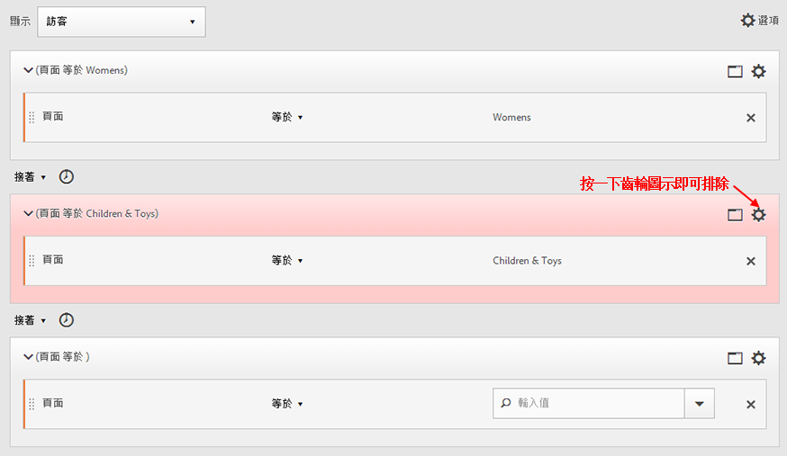

### 在序列開頭處排除

如果排除查核點位於循序區段的開頭，則可確保排除的頁面檢視不會發生在第一個非排除的點擊之前。

**範例**：訪客造訪了頁面 A 而未造訪頁面 B。

**使用個案**

以下是如何使用這類區段的範例使用案例：

* 瀏覽頁面A且未瀏覽頁面B的訪客。
* 餐廳想要看到避開主登陸頁面並直接前往「下單」頁面的老手使用者。

**建立此區段**

在頂層「訪客」容器內建立兩個不同的「點擊」容器。 然後設定 [!UICONTROL EXCLUDE] 第一個容器的運算子。

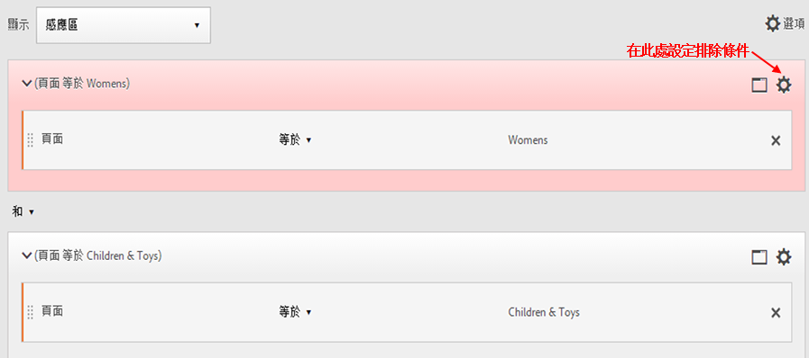

### 在序列結尾處排除

如果排除查核點位於序列結尾，則可確保最後一個非排除查核點與訪客序列結尾之間不會出現此查核點。

**範例**：訪客造訪頁面 A 接著未在目前或後續造訪中造訪頁面 B。

**使用個案**

以下是如何使用這類區段的範例：

* 瀏覽頁面A且未瀏覽頁面B的訪客。
* 餐廳想要看到避開主登陸頁面並直接前往「下單」頁面的老手使用者。

**建立此區段**

Build a simple sequence segment by dragging two [!UICONTROL Hit] containers to the canvas and connecting them using the [!UICONTROL THEN] operator. Then assign the [!UICONTROL EXCLUDE] operator to the second [!UICONTROL Hit] container in the sequence.

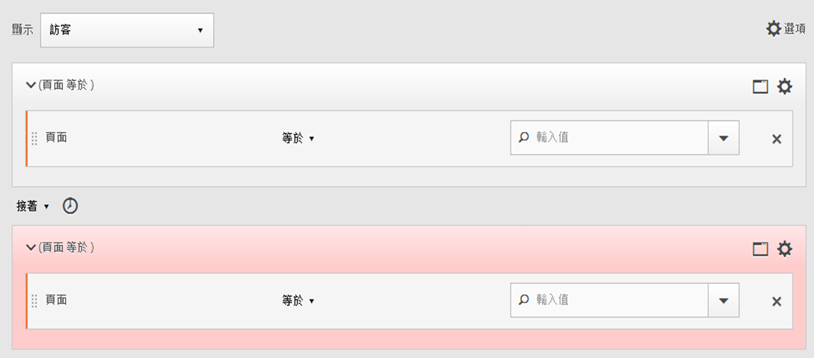

## 邏輯群組容器

邏輯群組容器必須將條件分組至單一循序區段查核點。特殊邏輯群組容器僅適用於循序區段，以確保其條件在任何先前的循序查核點之後，以及任何後續的循序查核點之前皆符合。邏輯群組查核點本身內的條件可依任何順序符合。相較之下，非循序容器 (點擊、造訪、訪客) 不要求其條件在整個序列中均符合，如果搭配使用 THEN 運算子會產生非直覺式結果。The [!UICONTROL Logic Group] container was designed to treat *several checkpoints as a group*, *without any ordering* among the grouped checkpoints. 換句話說，該群組內的查核點順序並無影響。For example, you can&#39;t nest a [!UICONTROL Visitor] container within a [!UICONTROL Visitor] container. But instead, you can nest a [!UICONTROL Logic Group] container within a [!UICONTROL Visitor] container with specific [!UICONTROL Visit]-level and [!UICONTROL Hit]-level checkpoints.

>[!NOTE] 只 [!UICONTROL Logic Group] 能在循序區段中定義運算子，這表示運 [!UICONTROL THEN] 算子在運算式中使用。

| 容器階層 | 圖例 | 定義 |
|---|---|---|
| 標準容器階層 |  | 在容器 [!UICONTROL Visitor] 內，會依序巢 [!UICONTROL Visit] 狀內嵌和容 [!UICONTROL Hit] 器，以根據點擊、瀏覽次數和訪客來擷取區段。 |
| 邏輯容器階層 |  | 標準容器階層也需要位於容器外部 [!UICONTROL Logic Group] 。 但在容器內 [!UICONTROL Logic Group] ，查核點不需要既定的順序或階層，這些查核點只需訪客依任何順序來符合。 |

邏輯群組似乎令人望之卻步，以下是一些使用邏輯群組的最佳作法：

**邏輯群組或點擊/造訪容器？**
如果要將循序查核點分組，則「容器」為邏輯群組。不過，如果這些循序查核點必須發生在單一點擊或造訪範圍內，則需要「點擊」或「造訪」容器。(當然，「點擊」對於一組循序查核點來說並沒有意義，因為一次點擊最多只會評為一個查核點)。

**邏輯群組是否可簡化建立循序區段的流程？**
是的，可以。假設您正嘗試回答以下問題：**訪客在查看頁面 A 以後有查看頁面 B、頁面 C 或頁面 D 嗎？**

您可以在不使用邏輯群組容器的情況下建立此區段，但是過程既複雜又費力：
* `Visitor Container [Page A THEN Page B THEN Page C THEN Page D] or`
* `Visitor Container [Page A THEN Page B THEN Page D THEN Page C] or`
* `Visitor Container [Page A THEN Page C THEN Page B THEN Page D] or`
* `Visitor Container [Page A THEN Page C THEN Page D THEN Page B] or`
* `Visitor Container [Page A THEN Page D THEN Page B THEN Page C] or`
* `Visitor Container [Page A THEN Page D THEN Page C THEN Page B]`

邏輯群組容器可大幅簡化建立此區段的流程，如下所示：

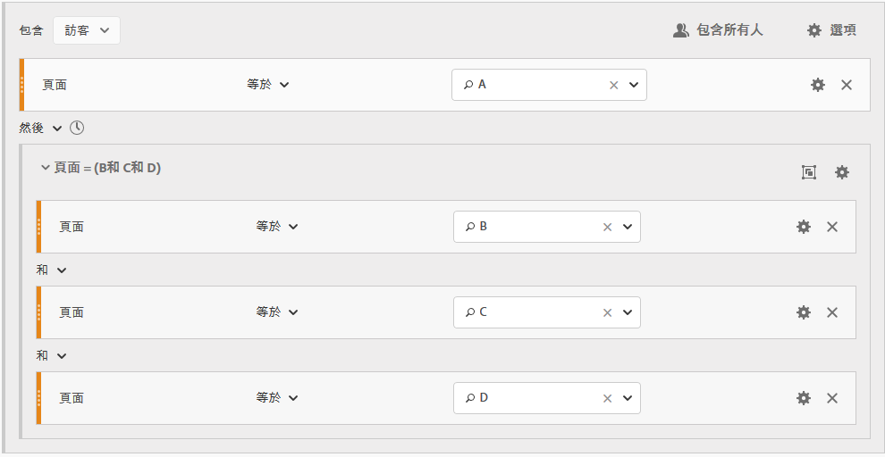

### 建立邏輯群組區段 {#section_A5DDC96E72194668AA91BBD89E575D2E}

和其他容器一樣 [!UICONTROL Logic Group] ，容器可在中以多種方式建立 [!UICONTROL Segment Builder]。 Here is a preferred way to nest [!UICONTROL Logic Group] containers:

1. 從左窗格拖曳維度、事件或區段。
1. 將頂端容器變更為容 [!UICONTROL Visitor] 器。
1. 將依預 [!UICONTROL AND] 設插入 [!UICONTROL OR] 的或運算子變更為THEN運算子。
1. 選取容 [!UICONTROL Hit] 器（維度、事件或項目），然後按一下 **[!UICONTROL Options]** > **[!UICONTROL Add container from selection]**。
1. Click the container icon and select **[!UICONTROL Logic Group]**.  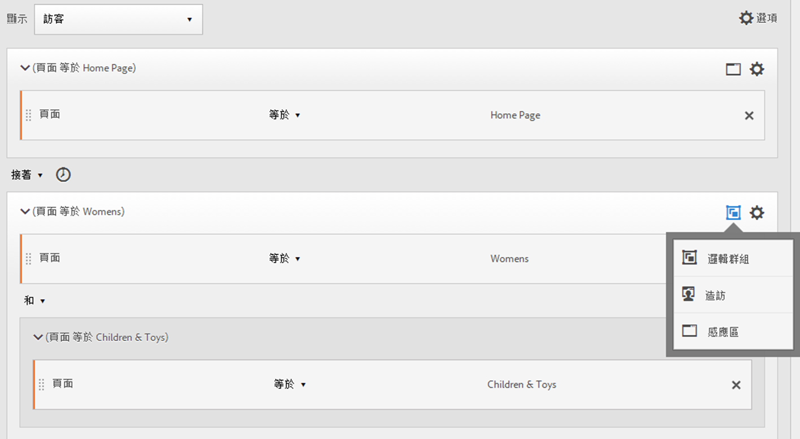
1. You can now set the [!UICONTROL Hit] within the [!UICONTROL Logic Group] container without regard to hierarchy.

### 任意順序的邏輯群組查核點

Using the [!UICONTROL Logic Group] lets you meet conditions within that group that reside outside of the sequence. This allows you to build segments where a [!UICONTROL Visit] or [!UICONTROL Hit] container happens irrespective of the normal hierarchy.

**範例**：訪客造訪頁面 A，接著以任意順序造訪頁面 B 和頁面 C。

**建立此區段**

Page B and C are nested in a [!UICONTROL Logic Group] container within the outer [!UICONTROL Visitor] container. The [!UICONTROL Hit] container for A is then followed by the [!UICONTROL Logic Group] container with B and C identified using the [!UICONTROL AND] operator. Because it is in the [!UICONTROL Logic Group], the sequence is not defined and hitting both page B and C in any order makes the argument true.

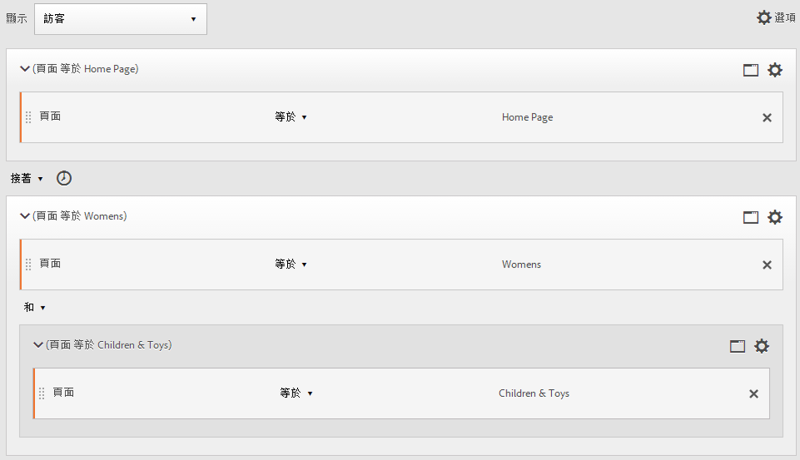

**另一個範例**：訪客造訪頁面 B 或頁面 C，接著造訪頁面 A：

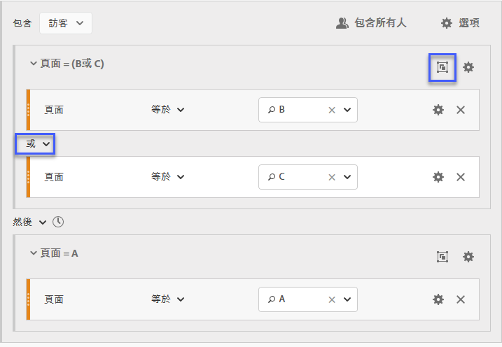

區段至少必須符合一個邏輯群組的查核點 (B 或 C)。此外，邏輯群組條件也可在相同點擊或跨多個點擊中符合。

### 邏輯群組第一個相符

Using the [!UICONTROL Logic Group] lets you meet conditions within that group that reside outside of the sequence. 在此無序的第一個符合區段 [!UICONTROL Logic Group] 中，規則會先識別為頁面B的頁面檢視或頁面C，接著是頁面A的必要檢視。

**範例**：訪客造訪頁面 B 或頁面 C，接著造訪頁面 A。

**建立此區段**

Page B and page C dimensions are grouped within a [!UICONTROL Logic Group] container with the [!UICONTROL OR] operator selected, then the [!UICONTROL Hit]container identifying a page view of page A as the value.

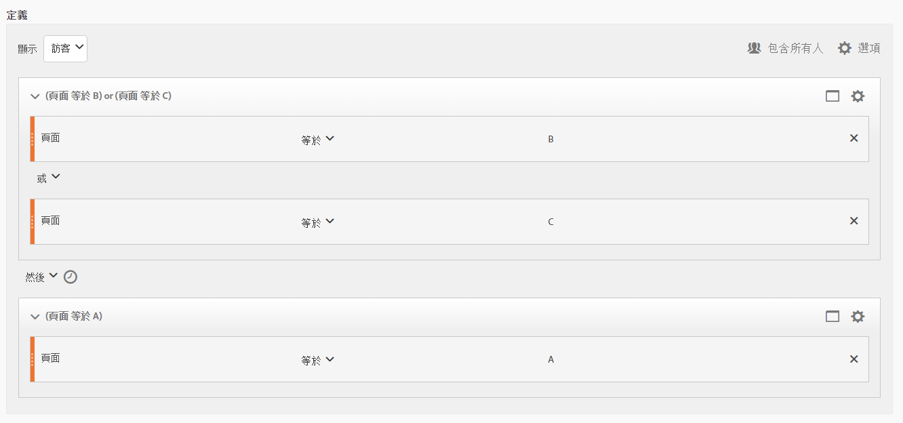

### 邏輯群組排除 AND

Build segments using the [!UICONTROL Logic Group] where multiple page views are aggregated to define what pages were necessary to be hit while other pages were specifically missed. ****

**範例**：訪客造訪頁面 A，接著明確地未造訪頁面 B 或 C，但點擊了頁面 D。

**建立此區段**

從左窗格拖曳維度、事件和預先建立的區段，以建立此區段。請參閱[建立邏輯群組區段](/help/components/c-segmentation/c-segmentation-workflow/seg-sequential-build.md)。

在中巢狀內嵌值後， [!UICONTROL Logic Group]按一下容 **[!UICONTROL Exclude]** 器中的 [!UICONTROL Logic Group] 按鈕。

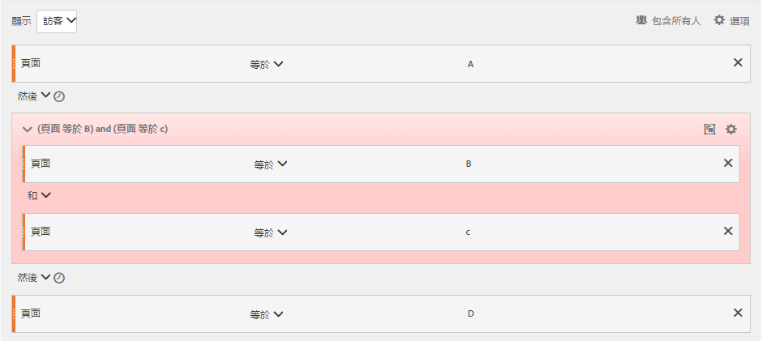

### 邏輯群組排除 OR

Build segments using the [!UICONTROL Logic Group] where multiple page views are aggregated to define what pages were necessary to be hit while other pages were specifically missed.

**範例**：訪客造訪頁面 A，但未在頁面 A 之前造訪頁面 B 或頁面 C。

**建立此區段**

The initial B and C pages are identified in a [!UICONTROL Logic Group] container that is excluded, and then followed by a hit to page A by the visitor.

從左窗格拖曳維度、事件和預先建立的區段，以建立此區段。

在中巢狀內嵌值後， [!UICONTROL Logic Group]按一下容 **[!UICONTROL Exclude]** 器中的 [!UICONTROL Logic Group] 按鈕。

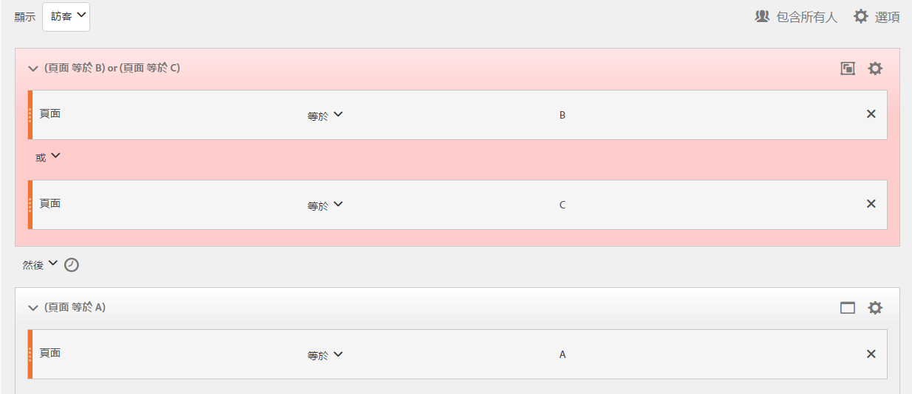

## 建立時間內與時間後區段

使用內 [!UICONTROL Within] 建至 [!UICONTROL After] 每個容器標題的和運算子來定義時間、事件和計數。

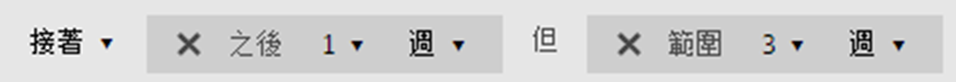

您可以使用和容器並指定詳細程度和計數，將 [!UICONTROL Within] 比對限 [!UICONTROL After] 制為指定的持續時間。 The [!UICONTROL Within] operator is used to specify a max limit on the amount of time between two checkpoints. The [!UICONTROL After] operator is used to specify a minimum limit on the amount of time between two checkpoints.

### After和Within運算子 {#section_CCAF5E44719447CFA7DF8DA4192DA6F8}

持續時間的指定方式是使用代表精細度的單一大寫字母，後接代表精細度重複計數的數字。

**[!UICONTROL Within]** 包括端點 (小於或等於)。

**[!UICONTROL After]** 不包含端點 (大於)。

| 營運商 | 說明 |
|--- |--- |
| AFTER | After 運算子用來指定兩個查核點之間時間量的下限。設定 After 值時，在套用區段後開始時間限制。例如，如果在容器上設定 After 運算子，以便識別造訪了頁面 A 但直到一天後才返回造訪頁面 B 的訪客，則該日將從訪客離開頁面 A 開始。若要將訪客納入區段中，在離開頁面 A 至檢視頁面 B 期間，至少須經過 1440 分鐘 (一天)。 |
| WITHIN | Within 運算子用來指定兩個查核點之間時間量的上限。例如，如果在容器上設定 Within 運算子，以便識別在一天內造訪了頁面 A 然後返回造訪頁面 B 的訪客，則當訪客離開頁面 A 時，該日即開始。若要納入區段中，訪客在開啟頁面 B 前最多有一天的時間。若要將訪客納入區段中，造訪頁面 B 的時間必須落在離開頁面 A 至檢視頁面 B 的 1440 分鐘 (一天) 之內。 |
| AFTER/WITHIN | 同時使用 After 和 Within 運算子時，請務必了解兩個運算子是並行開始和結束，而非連續操作。例如，如果您建立了區段並將容器設為： `After = 1 Week(s) and Within = 2 Week(s)` ，則區段中用以識別訪客的條件僅符合 1 週和 2 週之間。兩個條件都從第一個頁面點擊開始執行。 |

### 使用 After 運算子

* 「之後時間」可讓您依年、月、日、小時和分鐘來追蹤，以符合瀏覽。
* Time After只能套用至容器， [!UICONTROL Hit] 因為它是定義此類精細度的唯一層級。

**範例**：訪客造訪頁面 A，接著在 2 週後才造訪頁面 B。

**建立區段**:此區段是透過新增包含兩個 [!UICONTROL Visitor] 容器的容 [!UICONTROL Hit] 器來建立。 您可以接著設定 [!UICONTROL THEN] 運算子，然後開啟 [!UICONTROL AFTER] 運算子下拉式清單，設定週數。

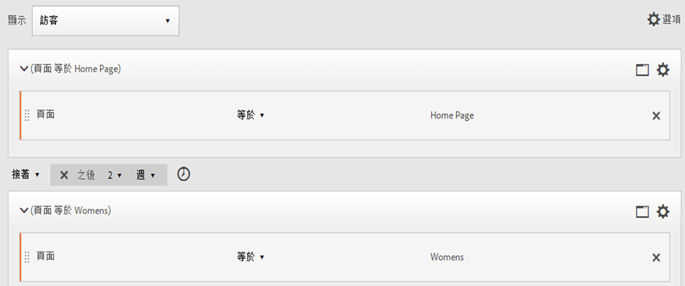

**符合**

設定 “After 2 weeks” 時，如果點擊頁面 A 發生在 2019 年 6 月 1 日 00:01，則後續點擊頁面 B 只要發生在 2019 年 6 月 15 日 00:01 之前 (14 天後) 便符合。

| 點擊A | 點擊B | 匹配 |
|--- |--- |--- |
| **A** 點擊：2019 年 6 月 1 日 00:01 | **B** 點擊：2019 年 6 月 15 日 00:01 | **符合**：這個時間限制符合，因為是在 2019 年 6 月 1 日之後 (兩週)。 |
| **A** 點擊：2019 年 6 月 1 日 00:01 | **B** 點擊：2019 年 6 月 8 日 00:01 B 點擊：2019 年 6 月 15 日 00:01 | **不符合**：頁面 B 的第一次點擊不符合，因為與要求兩週後的限制衝突。 |

### 使用 Within 運算子

* [!UICONTROL Within] 可讓您依年、月、日、小時和分鐘來追蹤，以符合造訪。
* [!UICONTROL Within] 只能套用至容器， [!UICONTROL Hit] 因為它是定義此類精細度的唯一層級。

>[!IMPORTANT]
>
>在「within」子句裡，您可以在「THEN」陳述式之間加入「within 1 search keyword instance」、「within 1 eVar 47 instance」之類的文字。這樣會將區段限制在某個維度的一個例項內。

**範例**：訪客造訪頁面 A，接著在 5 分鐘內造訪頁面 B。

**建立區段**:此區段是透過新增容器，然 [!UICONTROL Visitor] 後拖曳兩個容器來 [!UICONTROL Hit] 建立。 您可以接著設定 [!UICONTROL THEN] 運算子，然後開啟 [!UICONTROL AFTER] 運算子下拉式清單並設定間隔：點擊數、頁面檢視次數、瀏覽次數、分鐘數、小時數、日數、週數、月數、季數或年數。

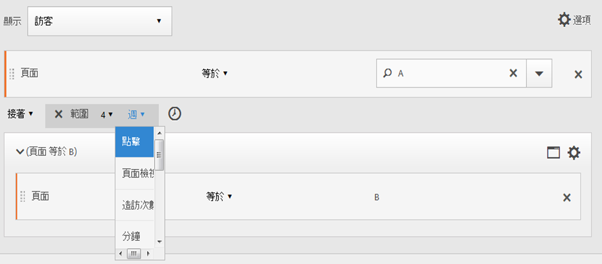

**符合**

必須發生在時間限制內才符合。對於運算式 ，如果訪客點擊頁面 A 發生在 00:01，則後續點擊頁面 B 只要發生在 00:06 時或之前 (5 分鐘後，包括 00:06) 便符合。在該分鐘時點擊也符合。

### Within 和 After 運算子

使用 [!UICONTROL Within] 和 [!UICONTROL After] 可提供區段兩端的最大和最小端點。

**範例**：訪客造訪頁面 A，接著在 2 週後 (一個月內) 造訪頁面 B。

**建立區段**:在容器內排序兩個容 [!UICONTROL Hit] 器以建立 [!UICONTROL Visitor] 區段。 Then set the [!UICONTROL After] and [!UICONTROL Within] operators.

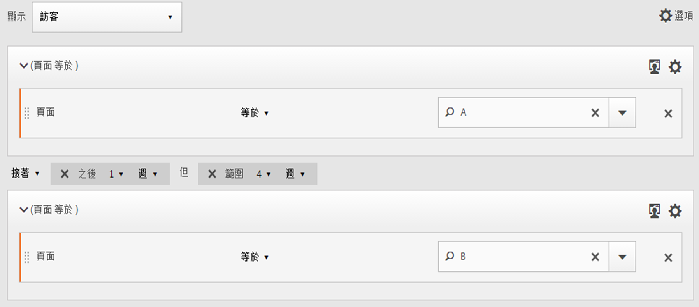

**符合**

在 2019 年 6 月 1 日點擊頁面 A，然後在 2019 年 6 月 15 日 00:01 之後及 2019 年 7 月 1 日&#x200B;*之前*&#x200B;返回的任何訪客，都會納入區段。與排除 [間的時間比較](/help/components/c-segmentation/c-segmentation-workflow/seg-sequential-build.md)。

和運 [!UICONTROL After] 算子 [!UICONTROL Within] 可搭配使用來定義循序區段。

此範例描述兩週後但一個月內第二次點擊頁面B的瀏覽。
