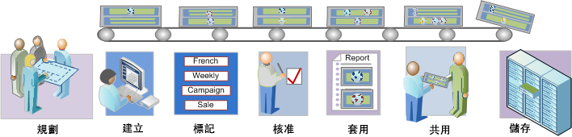

# 區段工作流程概述

針對以「區段產生器」建立並透過「區段管理員」管理的區段，說明建議的工作流程。

## Segmentation workflow overview {#concept_6D2E1A72A3AD4EBBB9135094F2D9DEDF}

針對以「區段產生器」建立並透過「區段管理員」管理的區段，說明建議的工作流程。

<!-- 

seg_workflow.xml

 -->

[ 計劃區段](../../../components/c-segmentation/c-segmentation-workflow/seg-plan.md#concept_D8BE6AB8D8E540E58C3462F9E02F4847)

在建立區段及設定區段管理環境之前，您是否已問過自己所有正確的問題?您設計區段時，是否已想好區段的用途和用法?

請參閱區段規劃檢查清單以取得規劃及組織區段的協助。

 [建立區段](../../../components/c-segmentation/c-segmentation-workflow/seg-build.md#concept_BD4C17B01C5B4E378D0C14C852D055D4)

建立和編輯區段，以用於所有 Analytics 功能中。

請參閱[建立循序區段，以](../../../components/c-segmentation/c-segmentation-workflow/seg-sequential-build.md#concept_83AEC78CD25F442EBEE364856A889560) 瞭解如何使用THEN運算子建立區段。

[ 標記區段](../../../components/c-segmentation/c-segmentation-workflow/seg-tag.md#concept_CD892CEB326C4986A1B67487052DBA50)

標記區段以方便進行組織和共用。標記會取代 Ad Hoc Analysis 中的資料夾階層。請參閱如何規劃和指派標記來進行簡易與進階的搜尋及組織。

[ 核准區段](../../../components/c-segmentation/c-segmentation-workflow/seg-approve.md#concept_DF477F151A9E483A92ED1DDAAF035953)

核准區段以使成為標準區段。

[ 套用區段](../../../components/c-segmentation/c-segmentation-workflow/t-seg-apply.md#task_13E69C7D428A43EF9CCCA7F1104F1E8F)

您可以使用區段邊欄 (顯示區段) 直接在報表中套用區段。

 [ 共用區段](../../../components/c-segmentation/c-segmentation-workflow/t-seg-share.md#task_7DC54643083E42C28F918E4F0845C5A5)

將區段共用給其他 Analytics 工具、Adobe Target 和 Adobe Experience Cloud 中的預定對象。

[ 篩選群體](../../../components/c-segmentation/c-segmentation-workflow/t-seg-filter.md#task_B59946C6D38945629C1FEACF80A85746)

依標記、擁有者和其他篩選器 (「全部顯示」、「我的」、「已共用給我」、「我的最愛」和「已核准」) 進行篩選。

[ 將區段標示為我的最愛](../../../components/c-segmentation/c-segmentation-workflow/t-seg-favorite.md#task_F45DFA3FBF0C4082B46A0D032CB20FC5)

要組織區段以方便使用，將區段標記為我的最愛是另一種方法。

[管理區段](../../../components/c-segmentation/c-segmentation-workflow/seg-manage.md#concept_7A2E019317864065B7C641DC3315928F)

「區段管理員」提供許多管理區段的方式，例如共用、篩選、核准、複製、刪除和標記為我的最愛。