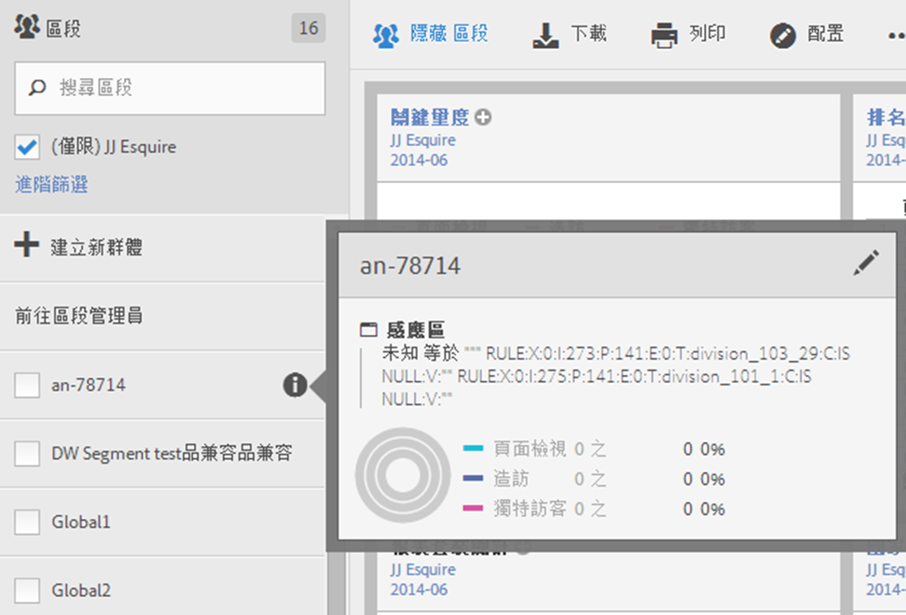
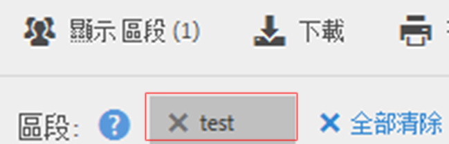

# 選擇與套用區段

如何從區段邊欄套用一或多個區段至報表。

1. 開啟您要套用區段的報表，例如[!UICONTROL 頁面報表]。
1. Click **[!UICONTROL Show Segments]** above the report. 區段邊欄隨即開啟。

   

1. Mark the checkbox next to one or more of the segments or **[!UICONTROL Search Segments]** to find the right segment.

   >[!NOTE]
   >
   >您可以套用多個區段至報表（這稱為區段堆疊）。 套用多個區段時，會先以 'and' 運算子結合每個區段中的準則，然後再進行套用。可以堆疊的區段數目沒有限制。

   >[!NOTE]
   >
   >按一下區段名稱旁的資訊圖示(i)可讓您預覽關鍵量度，以查看您是否有效的區段以及區段的範圍。

1. You can filter by report suite by selecting the **[!UICONTROL (Only)`<report suite name>`]** check box. 如此將只會顯示上次在該報表套裝中儲存的區段。
1. Click **[!UICONTROL Apply Segment]** and the report will refresh. 套用的一或多個區段現在會顯示在報表頂端:

   
