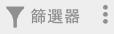
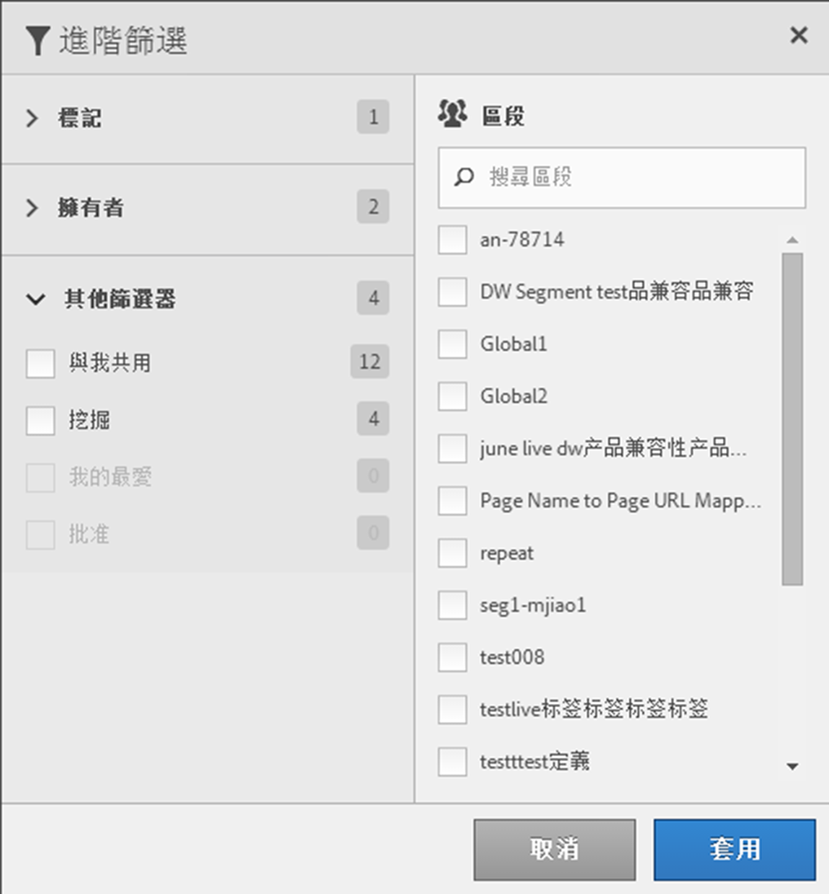

# 篩選區段

依標記、擁有者和其他篩選器 (「全部顯示」、「我的」、「已共用給我」、「我的最愛」和「已核准」) 進行篩選。

篩選可讓您更易於在區段邊欄中搜尋區段。

1. In the Segment Manager, click the **[!UICONTROL Filters]** icon:  

   

1. 下列為可使用的篩選:

   | 篩選器名稱 | 說明 |
   |---|---|
   | 標記 | 讓您篩選出的區段都一定具有特定[標記](../../../components/c-segmentation/c-segmentation-workflow/seg-tag.md#concept_CD892CEB326C4986A1B67487052DBA50)。預設會顯示「標記」欄。 |
   | 擁有者 | 可讓您依擁有者來篩選區段。 |
   | 其他篩選器 &gt; 全部顯示 | **(僅限管理員)** 顯示所有區段、其擁有者和上次修改日期。 |
   | 其他篩選器 &gt; 我的 | 顯示您擁有的所有區段。 |
   | 其他篩選器 &gt; 已共用給我 | 顯示所有由別人[共用](../../../components/c-segmentation/c-segmentation-workflow/t-seg-share.md#task_7DC54643083E42C28F918E4F0845C5A5)給您的區段。 |
   | 其他篩選器 &gt; 我的最愛 | 顯示的區段全都已被您標記為 [我的最愛](../../../components/c-segmentation/c-segmentation-workflow/t-seg-favorite.md#task_F45DFA3FBF0C4082B46A0D032CB20FC5). |
   | 其他篩選條件 &gt; 批准 | 顯示所有已正式[核准](../../../components/c-segmentation/c-segmentation-workflow/seg-approve.md#concept_DF477F151A9E483A92ED1DDAAF035953)的區段。 |
   | 搜尋區段 | 可讓您依名稱來搜尋區段。 |

