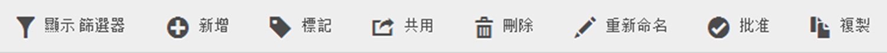
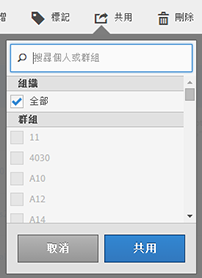

# 共用區段

您可以將區段共用給整個組織、群組或個別使用者 (視您的權限而定)。

| 管理員 | 可以將區段共用給「全部」、「群組」和「使用者」。在管理主控台中，群組是以權限群組的形式設定。 |
|---|---|
| 非管理員 | 僅可將區段共用給個別使用者。 |

何時應將區段共用給整個公司而不僅是一群使用者或個人?以下是您可以遵循的一些最佳實務:

* 身為管理員，如果區段對整個公司都有用，而且每個人都樂於使用它，請將區段共用給&#x200B;**[!UICONTROL 全部]的人。** In this case, you should also consider making it an [approved](../../../components/c-segmentation/c-segmentation-workflow/seg-approve.md#concept_DF477F151A9E483A92ED1DDAAF035953) segment.

* 身為管理員，如果區段可為特定團隊帶來良好的商務價值，請將區段共用給該&#x200B;**[!UICONTROL 群組]。**&#x200B;請勿正式核准此類型的區段。
* 身為管理員或個人使用者，將區段共用給其他個人來審查和檢驗區段。如果效果不如預期，則可加以捨棄。請勿正式核准此類型的區段。

1. 在「區段管理員」中，勾選您要共用之區段旁的核取方塊。區段管理工具列隨即出現:

   

1. 按一下&#x200B;**[!UICONTROL 共用]**。

   

   如果您是管理員，可以選取「**[!UICONTROL 全部]**」或選取貴組織中的「**[!UICONTROL 群組]」和「**&#x200B;使用者&#x200B;**」。**&#x200B;身為非管理員，您只能看見個人使用者。使用「**[!UICONTROL 搜尋]」欄位來搜尋群組或使用者.** 1. Click **[!UICONTROL Share]**.

   「共用」圖示會出現在此區段旁: 

1. You can filter on segments shared with you by going to **[!UICONTROL Filters]** &gt; **[!UICONTROL Other Filters]** &gt; **[!UICONTROL Shared with Me]**.
