# 關於區段與容器

區段可讓您根據特性或網站互動來識別訪客的子集。區段是要設計當成代碼化對象分析，您可針對自己的獨特需求加以建立，然後驗證、編輯和共用給其他團隊成員，或用於其他 Adobe 產品和 Analytics 功能。

區段是根據使用巢狀容器模型的[!UICONTROL 訪客]、[!UICONTROL 瀏覽]和[!UICONTROL 點擊]層級階層。巢狀容器可讓您根據容器間和容器內的規則來定義訪客屬性和動作。您可以在 [!DNL Adobe Experience Cloud] 提供的多項產品和功能中，建立、核准、共用、儲存及執行 Analytics 區段。區段可以產生自報表、內建至控制面板報表，或加入書籤供快速存取。

您可以在「區段產生器」中建立並儲存區段，或從流失報表 (在 [!DNL ad hoc analysis] 中) 產生區段。您也可以根據巢狀內嵌的容器之間的特定規則，運用並擴充預先建立的區段，讓您可以篩選結果並套用至報表。此外，區段可合起來使用成為[堆疊區段](/help/components/c-segmentation/c-segmentation-workflow/seg-workflow.md)。

## 區段 {#section_CC4EBA2A6CCB4F8BBB8437052A880657}

區段可識別訪客的身分 (國家、性別、咖啡店)、他們使用的裝置和服務 (瀏覽器、搜尋引擎、行動裝置)、他們從何處瀏覽過來 (搜尋引擎、先前的退出頁面、免費搜尋)，還有許多功能。

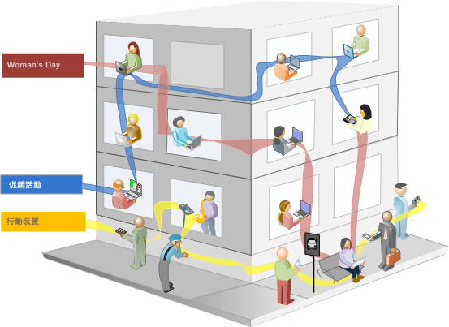

區段可以是根據下列值:

* 根據屬性的訪客: 瀏覽器類型、裝置、造訪次數、國家/地區、性別。
* 根據互動的訪客: 促銷活動、關鍵字搜尋、搜尋引擎。
* 根據進入和退出的訪客: 訪客來自 Facebook、定義的登陸頁面、反向連結網域。
* 根據自訂變數的訪客: 表單欄位、定義的類別、客戶 ID。

在「區段產生器」中建立對象區段時，您會在容器之間使用 [!UICONTROL AND] 和 [!UICONTROL OR] 運算子定義條件。


這類區段會篩選根據以 [!UICONTROL AND] 和 [!UICONTROL OR] 運算子連結的特性來篩選資料集。

## 循序區段 {#section_EE5B14287FC44E0B96E77679A2438948}

循序區段可讓您根據網站上的瀏覽和頁面檢視來識別訪客，提供定義動作和互動的區段。循序區段可協助您識別訪客的好惡。建立循序區段時，會使用 [!UICONTROL THEN] 運算子來定義和排序訪客的瀏覽。


| 瀏覽一 | 瀏覽二 | 瀏覽三 |
|---|---|---|
| 在第一次瀏覽中，訪客到主要登陸頁面 (A)，排除了促銷活動頁面 (B)，然後檢視了「產品」頁面 (C)。 | 在第二次瀏覽中，訪客再次到主要登陸頁面 (A)，排除了促銷活動頁面 (B)，再次進入「產品」頁面 (C)，然後到新頁面 (D)。 | 在第三次瀏覽中，訪客進入並走過與第一次和第二次瀏覽相同的路徑，然後排除頁面 F，直接進入目標產品頁面 (G)。 |

循序區段可以是根據下列點擊值:

* 根據頁面點擊序列的訪客 — 單次瀏覽中的頁面檢視、不同次瀏覽間的頁面檢視、排除了頁面檢視的瀏覽。
* 根據頁面檢視之間和之後的時間的訪客 — 在時限之後、在點擊之間、在事件之後。


循序區段會根據使用 [!UICONTROL THEN] 運算子的使用者動作來篩選資料集。

## 作法影片 {#section_89D6184890AF4086A8056BFBB0B68C29}

此 YouTube TV 影片提供區段容器的定義以及如何使用的簡短概述。

| 影片名稱 | 影片連結 |
|---|---|
| 區段容器 | [Adobe Analytics 中的區段容器](https://www.youtube.com/watch?v=A513j-ej0oc&index=2&list=PL2tCx83mn7GtHqZicFTa--aE6d02BvvTd) |

## 關於容器 {#section_AF2A28BE92474DB386AE85743C71B2D6}

區段會設定條件，以依據訪客的屬性或訪客與網站的互動來篩選訪客。若要在區段中設定條件，您必須設定規則，以依據訪客特性和/或導覽特徵來篩選訪客。若要進一步劃分訪客資料，您可以根據每個訪客的特定造訪和/或頁面檢視點擊進行篩選。「區段產生器」提供簡易的架構，您能以巢狀內嵌、階層的「訪客」、「造訪」或「點擊」容器形式建立這些子集並套用規則。

「區段產生器」中採用的容器架構將&#x200B;**[!UICONTROL 訪客]定義為最外層的容器，內含各瀏覽和頁面檢視的訪客特定整體資料。**&#x200B;巢狀內嵌的&#x200B;**[!UICONTROL 瀏覽]**&#x200B;容器可讓您設定規則，以根據瀏覽來劃分訪客的資料，而巢狀內嵌的&#x200B;**點擊]容器則可讓您依據個別頁面檢視來劃分訪客資訊。[!UICONTROL **&#x200B;每個容器均可讓您根據訪客的歷史記錄、依瀏覽劃分的互動來進行報告，或將個別點擊進行劃分。


**訪客容器**

「訪客」容器包含訪客在指定時間範圍內的每次造訪和頁面檢視。「訪客」層級的區段會傳回符合條件的頁面，加上訪客檢視的所有其他頁面 (並且僅限於定義的日期範圍)。「訪客」容器是定義範圍最廣的容器，在此層級產生的報表會傳回所有瀏覽中的頁面檢視，而可讓您進行多瀏覽分析。因此，「訪客」容器最容易隨定義的日期範圍而發生變更。

「訪客」容器可以包含以訪客整體歷史記錄為基礎的值:

* 首次購買間隔天數
* 原始登入頁面
* 原始反向連結網域

**造訪容器**

「瀏覽」容器可讓您識別特定 Web 工作階段的頁面互動、促銷活動或轉換。「瀏覽」容器是最常使用的容器，因為它會在符合規則時擷取整個瀏覽工作階段的行為，並讓您定義當建立和套用區段時要納入或排除的瀏覽。它可以幫助您解惑，像是有多少個訪客在同次瀏覽中檢視了「新聞與體育」區段? 或是，成功的銷售是來自哪些頁面?

「瀏覽」容器包括以每次瀏覽的出現次數為基礎的值:

* 訪問次數
* 登入頁面
* 回訪頻度
* 參與率量度
* 線性配置的量度

**點擊容器**

「點擊」容器定義您要在區段中納入或排除的頁面點擊。這是範圍最小的可用容器，可讓您識別令某條件成立的特定點按和頁面檢視，並讓您在此過程中檢視單一追蹤代碼或隔離出網站特定區段內的行為。您可能也想要找出動作發生時的特定值 (例如提出訂單時所用的行銷管道)。

「點擊」容器包含以單一頁面劃分為基礎的值:

* 產品
* 清單 Prop
* eVar 清單
* 促銷 eVar (在事件的範圍中)

   >[!NOTE]
   >
   >此容器如果用在持續存在的值 (如 eVar) 上，則會納入該值持續存在於的每個點擊。就一週後過期的追蹤代碼而言，該值可能持續存在於多個瀏覽間。

**邏輯群組容器**

邏輯群組容器可讓您在區段規則中提供個別容器，用以不依據階層篩選實體。例如，您可能會想在區段中提供嵌套的容器，用以依據訪客篩選。這種邏輯類型需要中斷階層 (因為您已有頂層訪客容器)，才能僅篩選選定的訪客。您可以使用邏輯群組容器來達成此目的。請參閱[邏輯群組範例](/help/components/c-segmentation/c-segmentation-workflow/seg-sequential-build.md)以取得詳細資訊。

## 巢狀容器 {#section_7FDF47B3C6A94C38AE40D3559AFFAF70}

在其他容器內建立區段容器時，其實是在區段內建立區段。對巢狀內嵌的容器使用的邏輯如下:

1. 使用最外層的容器，判斷包含的是什麼資料。不符合此外層規則的資料將在劃分的報表中遭到捨棄。
1. 套用巢狀內嵌的規則至其餘資料。巢狀內嵌的規則「不會」套用至第一個規則所排除的任何點擊。
1. 重複此動作，直到計算了所有巢狀內嵌的容器規則為止。然後，留下的資料便會納入到產生的報表中。

您可以在容器之間使用巢狀內嵌，也可以在容器內的規則之間使用巢狀內嵌。以下是您可以在每個容器中巢狀內嵌的項目:

| 容器名稱 | 您可以在其內巢狀內嵌的項目 |
|---|---|
| 點擊 | 僅限「事件」 |
| 瀏覽 | 「點擊」容器、「事件」 |
| 訪客 | 「瀏覽」容器、「點擊」容器、「事件」 |
| 邏輯群組中 | 「訪客」容器、「瀏覽」容器、「點擊」容器 |

**在單一定義中納入多個容器**

您可以將多個區段納入到新的複合區段中，以再進一步調整資料。將兩個現有區段一起拖曳，等於是在指定篩選訪客時要使用「OR」陳述式。所有資料都會受到畫布中所有容器的檢查，而任何符合容器的資料都會納入到報表中。

例如，將「國家」=「美國」的「瀏覽」容器與「訂購」=「True」的「瀏覽」容器一起拖曳

```
Country = United States + Order = True
```

將會建立動作順序如下的區段:

1. 此區段會先查看您整個資料，找出美國境內的所有訪客。
1. 然後該區段會再次查看您所有資料，搜尋是否有任何訪客提出訂單。
1. 最後，這兩組資料都會套用至報表。

## 循序區段的容器 {#section_324AF503F51A4A62806151FE440F3B2E}

循序劃分運用的是相同的基本容器，包括依階層巢狀內嵌的[!UICONTROL 訪客]、[!UICONTROL 瀏覽]和[!UICONTROL 點擊] (包括頁面檢視或其他維度)。


[!UICONTROL 訪客]是循序劃分中最高順序的容器，而[!UICONTROL 訪客]中包含[!UICONTROL 瀏覽]、[!UICONTROL 訪客]或[!UICONTROL 瀏覽]容器中包含[!UICONTROL 點擊]。必須維護這種[容器階層](/help/components/c-segmentation/seg-overview.md#section_7FDF47B3C6A94C38AE40D3559AFFAF70)，才能建立順序良好的循序區段。

**若要建立循序區段**，請使用 [!UICONTROL THEN] 運算子將容器巢狀內嵌並以循序邏輯連結起來，此作業要求每個容器根據訪客次序都為 True。


此容器階層的唯一例外是使用[邏輯群組容器](/help/components/c-segmentation/c-segmentation-workflow/seg-sequential-build.md)。[!UICONTROL 邏輯群組]容器可讓您不依順序在容器內巢狀內嵌點擊，不依順序擷取事件和維度。


## 以容器資料為基礎的報表 {#concept_BE822C12F87C4F07B7147D80BEFBAB87}

容器可讓您根據報表值，用不同方式篩選不同的資料，以劃分區段並將區段套用至報表。

在「訪客」&gt;「瀏覽」&gt;「點擊」容器階層的每個層級擷取的資料都會影響您建立區段的情形。如果您使用相同資料集將相同區段套用於相同報表，則根據產生報表時所用容器的不同，您會得到不同的值。容器報表層級以及值跨點擊的持續存在性等因素，都會對報表的準確度產生重大影響。

## 容器資料基本概念 {#section_9576D970F912450191AFB5B83F7F1656}

例如，下圖中的訪客第一次瀏覽某個網站；他進到首頁後，瀏覽了另外三個頁面，然後與網站完成了一筆銷售。這位訪客後來又瀏覽一次這個網站，但這次是先進到「產品」頁面，然後進到「首頁」、回到「產品」頁面，最後在查看「冬季帽子」後關閉工作階段。根據針對區段的每個容器所擷取之資料的不同，報告中也會顯示不同的值。

以下的&#x200B;*頁面等於冬季外套*&#x200B;區段會套用到&#x200B;**頁面報表**。

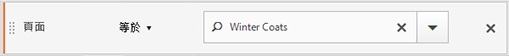

根據所選容器的不同，報表顯示的結果也會不同。

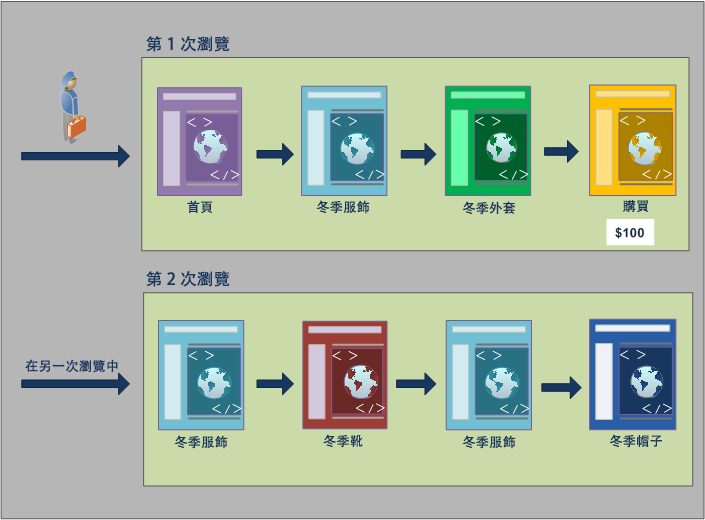

**從點擊容器建立報表**

當此條件是位在「點擊」容器內時，報表只會列出&#x200B;*頁面 = 冬季外套*&#x200B;的頁面。因為此條件是位在只有一個頁面的容器中，而只有一個頁面符合此條件，所以只會顯示「冬季外套」頁面。

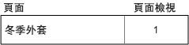

從「點擊」容器建立報表時，您可以看見從不同容器建立報表會如何影響整體報表值。檢視區段報表時可發現，頁面檢視次數約等於瀏覽次數 (約有 2,000 個訪客在單次瀏覽中查看一樣的頁面，這些相加即得出總頁面檢視次數)，而獨特訪客約等於瀏覽次數 (約有 2,000 個獨特訪客瀏覽超過一次)。


>[!IMPORTANT]
>
>在此範例中，無論您是從「點擊」、「造訪」或「訪客」容器檢視資料，都有相同的訪客數 63,541。無論您如何產生報表，初始的訪客條件 (檢視了「冬季外套」頁面的訪客) 仍保持不變。不同的是您在不同層級報告的資料子集。

**從造訪容器建立報表**

如果此相同條件是位在「瀏覽」容器內，報表會列出在令&#x200B;*頁面等於冬季外套*&#x200B;成立的瀏覽中檢視的所有頁面。如此會篩選「冬季外套」頁面，但也會擷取在令此條件成立的瀏覽中查看的所有其他頁面。因為訪客在符合條件的此次瀏覽內也瀏覽了「首頁」、「產品」和「購買」頁面，所以使用「訪客」容器資料建立報告時，這些額外的頁面也會列在報表中。

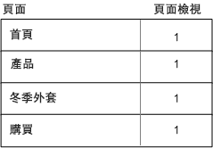

從「瀏覽」容器顯示區段值後可發現，頁面檢視次數已顯著增加。這是因為從「瀏覽」容器建立報表會識別出所有符合條件的頁面，以及該次瀏覽中檢視的所有其他頁面 (每個「瀏覽」容器中都會擷取所有頁面檢視)。


**從訪客容器建立報表**

如果此相同條件是位在「訪客」容器內，報表會列出任何令&#x200B;*頁面等於冬季外套*&#x200B;成立的訪客所檢視的所有頁面。這表示，如果訪客檢視了「冬季外套」頁面，則「訪客」容器中的所有頁面皆會列出，包括在別次瀏覽中檢視的頁面。因此，不合條件的頁面會列在報表中，因為訪客先前檢視過這些頁面。報表中會列出「訪客」容器中的所有頁面，即使這些頁面是在先前檢視，而不明確符合條件也是如此。

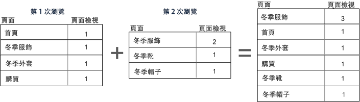

從「訪客」容器的區段後可發現，「頁面檢視」和「瀏覽」次數已增加。這是因為就訪客層級而言，如果訪客僅瀏覽「冬季外套」頁面 (令此條件成立) 一次，則該訪客檢視的所有其他頁面和所有別次瀏覽也都會被擷取。

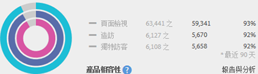

總而言之，瞭解劃分對各種資料劃分的作用方式，是正確解讀所傳回資料的關鍵。

## 根據容器建立報表 {#section_D0604748F2794327B8C668617A31EC18}

每個區段資料劃分皆各自有套用的範圍。多數的劃分是以&#x200B;*頁面檢視*&#x200B;為基礎，但許多寶貴區段是以&#x200B;*造訪*&#x200B;容器為基礎，有些則是以&#x200B;*訪客*&#x200B;容器為基礎。根據容器的範圍來瞭解報表很重要。

以先前的 *頁面 = 冬季外套*&#x200B;區段為例，以下列出的議題會根據套用容器資料的方式，以及資料範圍應如何符合區段類型，來定義您區段的其他層面。

**以相符區段規則為基礎的容器區段**

對自然範圍的資料套用區段容器，可在行項目符合區段規則時帶來預期結果。

* **頁面等於「冬季外套」時的點擊容器***: 檢視具有此區段的頁面報表只會傳回等於「冬季外套」的值。*&#x200B;所有其他頁面則會從報表中排除。
* **登入頁面等於「冬季服飾」時的瀏覽容器***: 使用此區段檢視登入頁面報表只會傳回第二次瀏覽，因為其登入頁面符合區段規則。*
* **瀏覽次數等於 1 時的瀏覽容器**: 檢視第一次瀏覽中的「瀏覽全部」頁面檢視會納入到報表中，因為其符合區段規則。

**瀏覽容器層級的頁面檢視**

許多區段規則都會識別每次瀏覽的頁面檢視數。發生此情況時，只要有一個點擊符合規則，就會套用整個「訪客」容器。此區段報表格外寶貴，因為以瀏覽為基礎的頁面檢視，可提供以每次瀏覽的頁面檢視數為基礎的分析。

* **頁面等於「冬季外套」頁面時的瀏覽容器**: 「訪客」容器層級的「頁面」報表中會針對檢視了「冬季服飾」頁面的瀏覽，顯示這幾次瀏覽中的所有頁面檢視。如果有頁面符合區段規則，則與該次瀏覽關聯的所有頁面檢視都會納入到報表中。
* **頁面等於「首頁」頁面時的瀏覽容器**: 在含有此區段的「頁面」報表中，只會顯示第一次瀏覽的資料。這是因為訪客在第二次瀏覽中並未檢視「首頁」頁面。
* **頁面等於「冬季服飾」時的訪客容器**: 在「頁面」報表中，此區段會擷取這兩次瀏覽的所有資料，因為在這兩次瀏覽中，訪客都檢視了「冬季服飾」頁面。

**區段容器識別比頁面檢視還小的點擊**

使用容器比劃分範圍還小的區段會傳回未預期的資料。使用較小的劃分仍會提取該資料範圍中的所有點擊。

* **登入頁面等於產品頁面時的點擊容器**: 每個頁面皆與該次瀏覽的登入頁面關聯，形成以瀏覽為基礎的劃分。使用此區段不僅會提取登入頁面「產品頁面」，也會提取該次瀏覽中的所有點擊。
* **清單 Var 1 包含 ValueA 時的點擊容器**: 如果已有多個值定義於與清單 Var 相同的點擊上，則所有變數值都會納入到區段中。您無法將發生在同次頁面檢視中的值再做區分，因為「點擊」容器是劃分點擊時的最小區段容器。
* **頁面等於「購買」時的點擊容器**: 如果以頁面檢視作為量度，則只會顯示「購買」頁面 (如預期)。如果使用「收入參與率」報表，則第一次瀏覽中的所有頁面都會得到 $100，因為參與率量度是以瀏覽為基礎。
* **頁面等於「冬季外套」時的點擊容器**: 如果以頁面檢視作為量度，則只會顯示「冬季外套」頁面 (如預期)。如果使用「收入參與率」報表，則沒有頁面會得到評價，因為此維度需要永久性維度。實際上發生購買的頁面檢視 (「購買」頁面) 不會納入到「點擊」容器中，因此沒有項目會得到收入參與值。不過，從「瀏覽」容器執行報表則會納入該次瀏覽中的所有頁面檢視，並將收入參與值 ($100) 分散給工作階段中檢視的所有頁面。

## 跨容器的持續存在性 {#concept_E579D72B1C644AE9A4C4EAF6B47A4DCB}

依跨某個範圍的頁面上持續存在的維度 (例如「促銷活動」eVar 或「反向連結」維度) 進行篩選，將會影響在容器層級收集的資料；須先瞭解這點，才能獲得準確的報表。

區段資料可能因維度或所套用的變數在所有所選頁面上的持續存在性而有所不同。有些維度 (例如「頁面」維度) 會在頁面層級提供唯一值，而且會根據「點擊」容器中的資料受到篩選。(請參閱[以容器資料為基礎的報表](/help/components/c-segmentation/seg-overview.md)範例)。其他維度 (例如「反向連結網域」維度) 則會在同次瀏覽的多個頁面上持續存在。有些維度或套用的變數 (例如「瀏覽期間」) 則會跨訪客的整個歷史記錄。

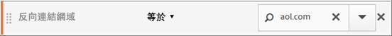

與「頁面」維度相反，「反向連結網域」值會附加至此次瀏覽中的每個頁面。例如，以下訪客是從某個網站轉來首頁。因此，在該瀏覽內的所有頁面都會獲派相同的反向連結網域值。

以下的&#x200B;*反向連結網域等於 aol.com* 的區段會套用至&#x200B;**頁面報表**。

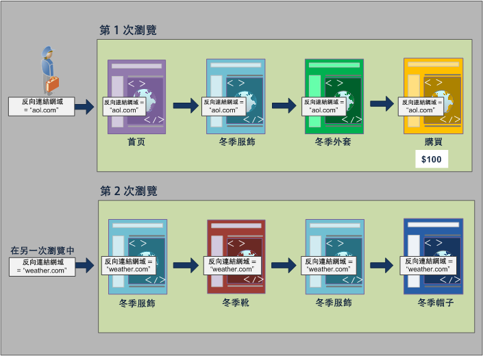

在新瀏覽中，訪客是從另一個網站轉過來。因此，新瀏覽中所有頁面的每個頁面檢視，都會獲派相同的反向連結網域值。

**從點擊容器建立報表**

因為同次瀏覽中的所有頁面檢視都獲派相同的反向連結網域值，所以在&#x200B;*反向連結網域 = "aol.com"* 的「點擊」容器層級建立報表，將會傳回下表所列的所有頁面。

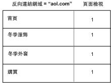

根據「點擊」容器中的資料，32,000 個訪客在 33,000 次造訪中進行了 92,000 次的頁面檢視。平均起來，每次瀏覽中進行了三次頁面檢視，而幾乎所有瀏覽都不是由重複的訪客進行。

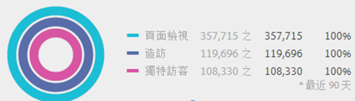

**從造訪容器建立報表**

如果「瀏覽」容器中篩選了相同的條件來建立「頁面」報表，則會列出瀏覽中所有&#x200B;*反向連結網域 = "aol.com"* 的頁面。因為反向連結網域的值是在瀏覽層級設定，所以「頁面檢視」和「瀏覽」層級的報表會相同。


在此範例中，因為根據瀏覽，所有頁面均具有相同的反向連結網域值，所以從「瀏覽」容器層級得到的報表與從「頁面檢視」容器得到的報表 (幾乎) 相同 (但還是有稍微差異，即 98, 234 與 98,248，這是由於有異常資料的關係)。

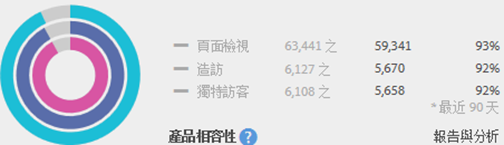

**從訪客容器建立報表**

從「訪客」容器得到的「頁面」報表會列出任何令&#x200B;*反向連結網域等於 "aol.com"* 成立的訪客所檢視的所有頁面。因此，如果訪客在歷史記錄中有任何時候 (在定義的時段內) 的反向連結網域是 *"aol.com"*，則會列出「訪客」容器中的所有頁面，包括別次瀏覽中的頁面檢視。「訪客」容器中即使是不符合主要條件的頁面，也會列在報表中。報表中會列出「訪客」容器中的所有頁面，即使這些頁面是在先前檢視，而不明確符合條件也是如此。

就「反向連結網域」報表而言，在四個頁面檢視中，*反向連結網域 = "aol.com"* 成立，但在訪客點擊的其他頁面中，*反向連結網域 = "weather.com"* 成立。從「訪客」容器，您可以取得令 "aol.com" 成立之訪客的清單，但它也會提供您反向連結網域為 "weather.com" (而非與您在區段中的初始要求相符的值) 的網頁。

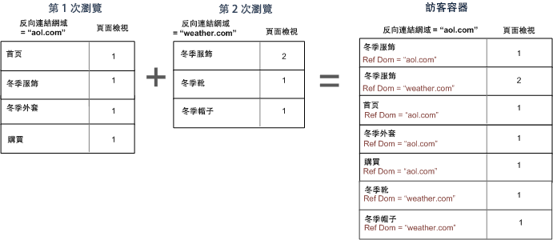

當您檢視「訪客」容器中的資料時，可發現頁面檢視次數已明顯增加 (從 98,248 增加到 112, 925)。這是因為該訪客的所有頁面檢視 (包括在「訪客」容器層級儲存了其他反向連結網域值的頁面檢視) 皆已列出 (還有該訪客的其他瀏覽，如此使得瀏覽次數從 33,203 增加至 43,448)。


總而言之，

* 「瀏覽」容器會針對至少有一個頁面符合準則的瀏覽，傳回該次瀏覽中查看的所有頁面。因此，如果只有在第 1 天的第 1 次瀏覽查看某個頁面，則在該整次瀏覽中檢視的所有頁面都會加到資料中。
* 當劃分條件是使用 eVar 或其他類型的永久性變數時，請小心。例如，您可能會使用「where campaign contains email」條件，而此條件將在 7 天後到期。因此，促銷活動如果是設在第一次瀏覽上，則還會再持續存在 7 天。雖然促銷活動只是設定在第一次瀏覽上，但每次瀏覽都會被納入。其他瀏覽也會被納入 (只要它們是在報表的日期範圍中)。如果您不想納入永久性值，請使用「instance of」事件或同等的 Prop 變數 (如有)。

