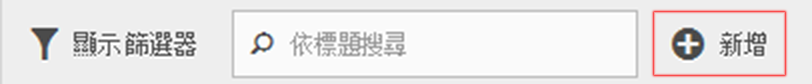
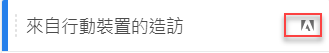

# 常見問題集

有關區段功能、存取權、權限、最佳實務及管理舊式區段的常見問題解答。

## 功能 {#section_BD58629D1A9346BF879E229FA6BEC7A2}

* Analysis Workspace 的區段功能

   * 您可以[比較區段](https://marketing.adobe.com/resources/help/zh_TW/analytics/analysis-workspace/segment-comparison.html)。
   * 在比較時使用[區段作為維度](https://marketing.adobe.com/resources/help/zh_TW/analytics/analysis-workspace/segments_as_dimensions.html)。
   * 在[流失分析](https://marketing.adobe.com/resources/help/zh_TW/analytics/analysis-workspace/graphics/compare-segments-fallout.html)中使用區段。

* 您可以[將多個區段套用至報表或專案](/help/components/c-segmentation/c-segmentation-workflow/seg-workflow.md)。
* 區段在所有報表套裝中都通用。
* [區段生產器](/help/components/c-segmentation/c-segmentation-workflow/seg-workflow.md)簡化了區段的建立流程。
* [區段管理員](/help/components/c-segmentation/c-segmentation-workflow/seg-workflow.md)可讓您藉由區段共用、標記、驗證及核准功能來設定[工作流程](/help/components/c-segmentation/c-segmentation-workflow/seg-workflow.md)。

* 您可以[標記區段](/help/components/c-segmentation/c-segmentation-workflow/seg-workflow.md)來加以組織以供稍後搜尋，而不是透過使用資料夾的方式。之前，您是使用資料夾 (在 [!DNL Ad Hoc Analysis] 中) 來組織區段。

* 您可以在 Ad Hoc Analysis 外建立[循序區段](/help/components/c-segmentation/c-segmentation-workflow/seg-sequential-build.md)。
* 「頁面檢視」容器已重新命名為「點擊」容器，以表示此容器會將所有類型的資料 (而不只是頁面檢視) 分段。例如，連結追蹤呼叫與來自行動 SDK 的 trackAction 呼叫均可在點擊容器中受到納入或排除。請注意，此容器的運作方式並無改變，只是名稱有變而已。

如需詳細資訊，請參閱 Digital Marketing 部落格上的[改進 Adobe Analytics 中的劃分](https://blogs.adobe.com/digitalmarketing/analytics/improving-segmentation-adobe-analytics/)文章。

## 存取區段工具 {#section_088AD0E4E21943DFA8CF7206AEC485DD}

**如何開啟區段產生器？**

存取「區段產生器」的方法有：

* 顯示現有報表並按一下左側導覽中的區段圖示 。在顯示的區段欄中，按一下&#x200B;**[!UICONTROL 「新增」]**，或

* 在「區段管理員」頂端按一下&#x200B;**[!UICONTROL 「+ 新增」]**。

   或

* 按一下「區段管理員」中的現有區段標題，以編輯「區段產生器」中的區段。

**如何開啟區段管理員？**

存取「區段管理員」的方法如下：

* 前往頂端導覽中的「**[!UICONTROL 分析]** > **[!UICONTROL 元件]**」。然後按一下&#x200B;**[!UICONTROL 「區段」]**，或

* 顯示現有報表並按一下左側導覽中的區段圖示 。然後按一下&#x200B;**[!UICONTROL 「管理」]**，或

* 在介面中任意處按正斜線鍵 &#39;/&#39;，然後搜尋區段管理員。

**舊式區段下拉式清單移至何處？**

「Reports &amp; Analytics」中的區段下拉式清單已被功能更豐富的[區段產生器](/help/components/c-segmentation/c-segmentation-workflow/seg-workflow.md)介面取代，該介面可讓您建立可在各報表套裝和 Adobe Analytics 解決方案使用的「通用」區段。若要檢視現有區段的清單，請按一下左側導覽中的「區段」圖示 ，

區段欄隨即顯示。

**舊式報表套裝下拉式清單移至何處？**

報表套裝下拉式清單已移至到每個報表或控制面板右上角的日期選擇器旁邊。

## 權限 {#section_648DFA3A882146C485A84ED014EEC707}

**要使用、建立和管理區段需要有什麼權限？**

依預設，所有使用者均可建立和編輯個人區段。不過，管理員可以決定誰應擁有[建立區段的權限](https://marketing.adobe.com/resources/help/zh_TW/reference/groups.html)，並可將他們指派至特定群組。這些區段可直接共用給任何其他 Analytics 使用者。

管理員可以編輯任何區段，並將區段共用給群組以及組織中的每個人。[更多...](/help/components/c-segmentation/seg-reference/seg-rights.md)

**我是否可以看見公司中的所有區段？**

是的，管理員可以在 [!DNL Analysis Workspace] 和 [!DNL Reports & Analytics] 使用者介面中看見所有區段。

「Ad Hoc Analysis」和「Report Builder」會顯示區段您所擁有和已共用給您的區段。

**我是否可以在區段管理員中管理所有 Analytics 區段？**

是的，所有區段都可以在 Analysis Workspace、Reports &amp; Analytics 和 Ad Hoc Analysis 的「區段管理員」中進行管理。「區段管理員」會顯示擁有者 (即當初建立區段的使用者)、共用使用者和管理員使用者可看見的區段。區段選擇器會顯示使用者所擁有和已共用給該使用者的區段。

管理員可以在 Analysis Workspace 和 [!DNL Reports & Analytics] 使用者介面中看見所有區段。

「Ad Hoc Analysis」和「Report Builder」只會顯示您建立的區段或專門與您共用的區段。

**我為何刪除不了區段？**

如果區段已[發佈至 Experience Cloud](/help/components/c-segmentation/c-segmentation-workflow/seg-workflow.md)，則您無法加以刪除或編輯。不過，您可以加以複製再編輯複製的版本。

## 最佳實務 {#section_E2C3A1B4B4274D1B86CAA9C0359D049C}

**有具有相同名稱、但不同定義的重複區段時該怎麼辦？**&#x200B;現在，由於區段可在多個報表套裝中運作，因此您可能發現有多個區段具有相同名稱。建議您採取以下動作之一：

* 重新命名具有相同名稱、但不同定義的區段，或是
* 刪除不再需要的區段。

**Adobe 對於清除區段有什麼建議？**

* 以 legacy 標記標記所有區段。
* 檢閱您現有的區段。
* 適時將這些區段新增至區段庫。
* 核准要做為標準區段的區段。
* 標記區段時依照[最佳實務](/help/components/c-segmentation/c-segmentation-workflow/seg-workflow.md)。

## 管理舊式區段 {#section_76CF47142D1A4FB6A0718AD9073049FE}

**我現有的區段有什麼改變？**

您現有的區段將繼續如往常般運作。任何已套用這些區段的報表都將繼續正常運作。[更多...](/help/components/c-segmentation/seg-transition.md)

原本預先定義的區段與套裝區段多半會以區段範本的形式移轉至「區段產生器」。區段範本的用途是快速建立具有常見對象的自訂區段。區段範本無法直接套用至報表，但可以輕易儲存成自訂區段。

區段範本在「區段產生器」中有特殊的圖示標記：

**我現有的區段資料夾有什麼改變？**

「區段管理員」不使用 (Ad Hoc Analysis) 資料夾，而是使用標記之間。您的資料夾名稱會自動轉換成標記，而這些標記會套用至對應的區段。

**已套用區段的已計劃報表有什麼改變？**

已計劃的報表會繼續使用您定義的區段正常運作。

當您刪除區段時，已套用此區段的已計劃報表和控制面板會繼續正常運作，亦即區段或控制面板會繼續使用刪除的區段。

當您編輯同名區段時，已計劃的報表不會更新。以下是範例：假設您有 2 個同名區段分別位在不同報表套裝中：

您有個書籤是引用 mainprod 報表套裝中的區段。之後您因為該區段重複而刪除該區段。書籤將會繼續運作，引用已刪除之區段的定義。如果您將 maindev 區段的區段定義變更為納入聖卡塔利娜島和墨西哥提華納市，則書籤所套用的區段並不會變更。它會使用舊的定義。若要修正此問題，請將書籤更新為引用新的定義。如果您不確定書籤、控制面板或已計劃報表是否正在使用已刪除的區段，可以變更剩下那個區段的名稱，如此就更能清楚知道書籤是否正使用剩下那個區段。

**Data Warehouse 區段有何變化？**

所有現有的 Data Warehouse 區段在 Data Warehouse 中仍可繼續運作。大部分 Data Warehouse 區段也可繼續在 Analysis Workspace、Ad Hoc Analysis 和 Reports &amp; Analytics 等其他元件中運作。

您可以在區段產生器/管理員中建立或編輯新的 Data Warehouse 區段。「區段產生器」中的「產品相容性」機制會自動判斷區段是否與 Data Warehouse 相容。

**Ad Hoc Analysis 中的我的最愛區段有什麼變化？**

這些 Ad Hoc Analysis 區段在 Adobe Analytics 中會顯示為一般區段。

不應將它們與「區段管理員」中可讓您將區段標記為我的最愛的「我的最愛」功能混淆。

**預先建立的區段有何變化？**

* **單頁存取次數**
* **來自行動裝置的瀏覽次數**
* **來自免費搜尋的瀏覽次數**
* **來自付費搜尋的瀏覽次數**
* **具有訪客 ID Cookie 的瀏覽次數**

這些區段會以區段範本的形式移轉至「區段產生器」。

已套用這些區段的現有報表將可繼續正常運作。

**Experience Cloud (套裝) 區段有何變化：**

* 非購買者
* 購買者
* 首次瀏覽次數
* 來自社交網站的瀏覽次數
* 超過 10 分鐘的瀏覽次數*
* 先前造訪過 5 次以上的造訪*
* 來自 Facebook 的瀏覽次數*

這些區段 (具有星號 * 標記者除外) 多半將會以區段範本的形式移轉至「區段產生器」。另外，新增了數個新的區段範本。

已套用這些區段的現有報表將可繼續正常運作。

**管理員區段 (也稱為「全域」區段有何變化？**

**管理員**&#x200B;區段將會移轉至新的區段介面，並顯示為共用給每個人的區段。

這些區段的擁有者是設為其帳戶在登入公司的管理員使用者清單中存在最久的管理員，不過所有管理員都可以刪除、編輯和共用這些區段。

「管理主控台」中原本供管理員建立和管理這些全域區段的區段管理介面已不存在。管理員現在應該使用新的區段產生器，來建立區段以及將區段共用給適當的群組/個人或每個人。

<!-- 

seg_definition.xml

 -->

現有區段如果採用的邏輯遭逢本文件所述的變更，仍可繼續正常運作，但要經過更新才能再儲存一次。例如，如果您有個現有區段的「美國州」包含「紐約」，該區段仍可繼續正常運作，但您下次要編輯該區段時，必須將它更新為使用「等於」條件的列舉類型。

**移轉提示**

請參考下列提示來移轉常見維度：

* 地域城市/地區/國家 - 搜尋並選取特定城市、地區或國家，而不是使用局部比對。
* 瀏覽器 - 使用「瀏覽器類型」維度來取得某個類型的所有瀏覽器，例如 Google Chrome
* 作業系統 - 使用「作業系統類型」維度來取得某個類型的所有作業系統，例如 Microsoft Windows。

* [新維度和經過重新命名的維度](/help/components/c-segmentation/seg-transition.md#section_73CF121B64A24DEF8E6499F3167BF742)
* [「包含」的變更](/help/components/c-segmentation/seg-transition.md#section_1A9EDEE5CBC44B5AA6262560052ABE77)
* [「小於」和「大於」的變更](/help/components/c-segmentation/seg-transition.md#section_84A8AAD0344148AD9F9211D3EB271903)

## 新維度和經過重新命名的維度 {#section_73CF121B64A24DEF8E6499F3167BF742}

下表列出「區段產生器」中經過重新命名的維度。

<table id="table_1A8C1940FD0446FA8414C6A7DE66E44C"> 
 <thead> 
  <tr> 
   <th colname="col1" class="entry"> 新維度名稱 </th> 
   <th colname="col2" class="entry"> 舊名稱 </th> 
   <th colname="col3" class="entry"> 附註 </th> 
  </tr> 
 </thead>
 <tbody> 
  <tr> 
   <td colname="col1"> 作業系統類型 </td> 
   <td colname="col2"> 新增 </td> 
   <td colname="col3"> 於 2015 年春季版新增。 </td> 
  </tr> 
  <tr> 
   <td colname="col1"> 瀏覽器寬度 - 範圍化 </td> 
   <td colname="col2"> 瀏覽器寬度 </td> 
   <td colname="col3"> 此維度與所有介面相容，且會依列舉的範圍清單 (而非特定整數值) 分割。如果您需要依特定值分段，請在 Data Warehouse 區段中使用此維度的精細版本。 </td> 
  </tr> 
  <tr> 
   <td colname="col1"> 瀏覽器高度 - 範圍化 </td> 
   <td colname="col2"> 瀏覽器高度 </td> 
   <td colname="col3"> 此維度與所有介面相容，且會依列舉的範圍清單 (而非特定整數值) 分割。如果您需要依特定值分段，請在 Data Warehouse 區段中使用此維度的精細版本。 </td> 
  </tr> 
  <tr> 
   <td colname="col1"> 瀏覽器寬度 - 精細 </td> 
   <td colname="col2"> 瀏覽器寬度 </td> 
   <td colname="col3"> 
此項目經過重新命名，且現在僅與 Data Warehouse 相容。定義與所有介面相容的區段時，請使用列舉類型，即「瀏覽器寬度 - 範圍化」。 
 </td> 
  </tr> 
  <tr> 
   <td colname="col1"> 瀏覽器高度 - 精細 </td> 
   <td colname="col2"> 瀏覽器高度 </td> 
   <td colname="col3"> 
此項目經過重新命名，且現在僅與 Data Warehouse 相容。定義與所有介面相容的區段時，請使用列舉類型，即「瀏覽器高度 - 範圍化」。 
 </td> 
  </tr> 
  <tr> 
   <td colname="col1"> Cookie 支援 </td> 
   <td colname="col2"> Cookie </td> 
   <td colname="col3"> - </td> 
  </tr> 
  <tr> 
   <td colname="col1"> 色彩深度 </td> 
   <td colname="col2"> 監視器色彩深度 </td> 
   <td colname="col3"> - </td> 
  </tr> 
  <tr> 
   <td colname="col1"> - </td> 
   <td colname="col2"> "應用程式 - *" </td> 
   <td colname="col3"> "應用程式 -" 字首已從一些維度類型中移除。因為行動應用程式資料通常是擷取到不含網站資料的報表套裝中，所以這些字首不再有存在的必要。 </td> 
  </tr> 
  <tr> 
   <td colname="col1"> 登入頁面原始 </td> 
   <td colname="col2"> 原始登入頁面 </td> 
   <td colname="col3"> - </td> 
  </tr> 
  <tr> 
   <td colname="col1"> Java 已啟用 </td> 
   <td colname="col2"> Java </td> 
   <td colname="col3"> - </td> 
  </tr> 
  <tr> 
   <td colname="col1"> 行動瀏覽器 URL 的最大長度 </td> 
   <td colname="col2"> 行動瀏覽器 URL 長度 </td> 
   <td colname="col3"> - </td> 
  </tr> 
  <tr> 
   <td colname="col1"> 行動郵件裝飾 </td> 
   <td colname="col2"> 行動裝飾郵件支援 </td> 
   <td colname="col3"> - </td> 
  </tr> 
  <tr> 
   <td colname="col1"> 行動裝置 </td> 
   <td colname="col2"> 行動裝置名稱 </td> 
   <td colname="col3"> - </td> 
  </tr> 
  <tr> 
   <td colname="col1"> 行動書籤 的最大長度 </td> 
   <td colname="col2"> 行動書籤 URL 的最大長度 </td> 
   <td colname="col3"> - </td> 
  </tr> 
  <tr> 
   <td colname="col1"> 行動電子郵件的最大長度 </td> 
   <td colname="col2"> 行動郵件 URL 的最大長度 </td> 
   <td colname="col3"> - </td> 
  </tr> 
  <tr> 
   <td colname="col1"> 行動作業系統 (已淘汰) </td> 
   <td colname="col2"> 行動作業系統 </td> 
   <td colname="col3"> 使用「作業系統」維度並改從行動裝置區段套用瀏覽。 </td> 
  </tr> 
  <tr> 
   <td colname="col1"> 行動即按即說 (Push To Talk) </td> 
   <td colname="col2"> 行動 PTT </td> 
   <td colname="col3"> - </td> 
  </tr> 
  <tr> 
   <td colname="col1"> 調查查看 </td> 
   <td colname="col2"> 總計調查查看 </td> 
   <td colname="col3"> - </td> 
  </tr> 
  <tr> 
   <td colname="col1"> 調查回應 </td> 
   <td colname="col2"> 總計調查回應 </td> 
   <td colname="col3"> - </td> 
  </tr> 
  <tr> 
   <td colname="col1"> 瀏覽深度 </td> 
   <td colname="col2"> 路徑長度 </td> 
   <td colname="col3"> - </td> 
  </tr> 
  <tr> 
   <td colname="col1"> 郵遞區號 </td> 
   <td colname="col2"> ZIP/郵遞區號 </td> 
   <td colname="col3"> - </td> 
  </tr> 
 </tbody> 
</table>

## 對於具有已知值之字串式維度的變更{#section_1A9EDEE5CBC44B5AA6262560052ABE77}

具有一組已知值的字串式維度已變更為列舉類型。使用這些維度建立區段時，清單中會預先填入所有已知值，而唯一支援的運算子為「等於」。如此您便能快速將所要尋找的確切值分段，而不需在使用較不精細的比對時選取到不想要的值。

下列維度已變更為列舉清單：

| 行動製造商 | 行動電子郵件長度 | 色彩深度 |
|---|---|---|
| 行動螢幕大小 | 行動裝置號碼 | 監視器解析度 |
| 行動螢幕高度 | 行動即按即說 (Push To Talk) | 外掛程式 |
| 行動 Cookie 支援 | 行動郵件裝飾 | 作業系統 |
| 行動影像支援 | 行動資訊服務 | 反向連結類型 |
| 行動色彩深度 | 行動裝置類型 | 搜尋引擎 |
| 行動音訊支援 | 瀏覽器類型 | state |
| 行動視訊支援 | 瀏覽器 | 地域國家 |
| 行動 DRM | 連線類型 | 地域地區 |
| 行動網路通訊協定 | 行動電信業者 | 地域城市 |
| 行動作業系統 | Cookie | 地域 DMA |
| 行動 Java VM | 客戶忠誠度 | 永久性 Cookie |
| 行動書籤長度 | Java 已啟用 | 付費搜尋 |
| 行動 URL 長度 | 語言 |  |

## 對於具有已知值之整數式維度的變更{#section_84A8AAD0344148AD9F9211D3EB271903}

具有一組已知值的整數式維度 (例如瀏覽器寬度) 已依列舉範圍分割，讓您可以快速定義特定範圍的區段。這些列舉清單的維度名稱後面附加了「- 範圍化」。下列畫面示範使用舊的和新的「區段產生器」介面時，這些維度的分段方式：

小於、大於和類似運算子現在僅與 Data Warehouse 區段相容。區段如果預計要與所有報表介面相容，則應使用量度的「範圍化」版本並搭配「等於」運算子。
