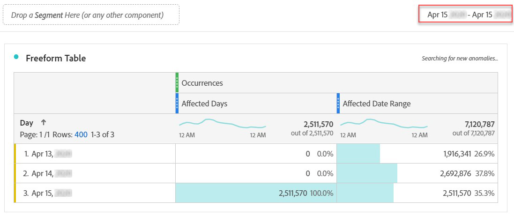

# 在分析中排除特定日期

有時候，日期範圍包含您不想分析的資料。 例如，機器人會傳送包含錯誤收入金額的異常點擊，大幅膨脹量度。 如果您的網站遇到實施問題或資料中有其他差距，您可能會想要將網站排除在報告之外，以防止對部分資料做出決策。

您可以使用區段來排除您不想納入報表的任何日期範圍。

## 隔離受影響的日子

建立可隔離受影響日期或日期範圍的區段。 如果您只想關注問題日，以檢視其影響的詳細資訊，此區段就很實用。

1. 前往>以開啟區段產生器 **[!UICONTROL Components]** , **[!UICONTROL Segments]**&#x200B;然後按一下 **[!UICONTROL Add]**。
2. 將「日」維度拖曳至定義畫布，並將其設為您要隔離的日。
3. 請針對您希望隔離在報表中的每一天重複上述步驟。

Adobe建議使用橘色維度元件，而非紫色日期範圍元件。 如果您使用紫色日期範圍元件，它們會覆寫專案的日曆範圍：

## 排除受影響的天數

建立區段，排除受影響的日期或日期範圍。 如果您想要排除發生問題的日期，以將整體報告的影響降至最低，此區段會很有用。

1. 前往>以開啟區段產生器 **[!UICONTROL Components]** , **[!UICONTROL Segments]**&#x200B;然後按一下 **[!UICONTROL Add]**。
2. 在區段定義畫布的右上方，按一下 **[!UICONTROL Options]** > **[!UICONTROL Exclude]**。
3. 將「日」維度拖曳至定義畫布，並將其設為您要移除的日。
4. 請針對您想在報表中移除的每一天重複上述步驟。

## 在報表中使用這些區段

建立排除區段後，您就可以像使用其他區段一樣使用它。

### 比較趨勢報表中的區段

您可以同時套用報表中的「受影響日」區段和「排除受影響日」區段，以並排比較。 拖曳兩個區段至量度上方或下方以比較：

### 套用排除區段至專案

您可以將「排除受影響的日」區段套用至工作區專案。 將排除區段拖曳至標示為拖曳區段至此處的「工 *作區畫布」區段*。

>[!TIP] 在面板說明中包含排除資料的附註，以協助檢視報表的使用者。 以滑鼠右鍵按一下面板的標題，然後按一下 **[!UICONTROL Edit description]**。

### 在虛擬報表套裝中使用排除區段

您可以在虛擬報表套裝中 [使用區段](../../vrs/vrs-about.md) ，以更方便地排除資料。 此選項最理想的選擇是，您不必記得為包含受影響日期範圍的每個報表套用區段。 如果您已使用虛擬報表套裝作為主要資料來源，則可將區段新增至現有的VRS。

1. 導覽至 **[!UICONTROL Components]** > **[!UICONTROL Virtual report suites]**。
2. 按一下 **[!UICONTROL Add]**.
3. 輸入虛擬報表套裝的所需名稱和說明。
4. 將排除區段拖曳至標示的區域 **[!UICONTROL Add segment]**。
5. 按一 **[!UICONTROL Continue]** 下右上方的，然後按一下 **[!UICONTROL Save]**。

## 其他工具的替代方案

如果您使用「報告與分析」，則可使用日曆事 [件](../../t-calendar-event.md) ，在任何趨勢報表中反白標示受影響的日。

>[!NOTE] 此方法不適用於分析工作區。

1. 導覽至 **[!UICONTROL Components]** > **[!UICONTROL Calendar events]**。
2. 輸入所要的標題、日期範圍和附註文字。
3. 按一下 **[!UICONTROL Save]**.

