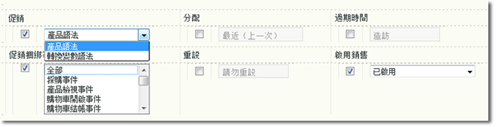

# 實作銷售變數

說明如何啟用和實施銷售變數。

## 啟用銷售變數

**[!UICONTROL 管理工具]** &gt; **[!UICONTROL 報表套裝]** &gt; **[!UICONTROL 轉換變數]**&#x200B;底下的任何自訂 eVar，都可以啟用銷售功能。



| 設定 | 說明 |
|--- |--- |
| 過期時間 | 說明銷售值可持續多久。 |
| 銷售 | **產品語法**: 值是在 `s.products` 中設定。<br>**轉換變數語法**: 值是在指定的銷售 eVar 中設定。 |
| 銷售綁定事件 (僅限轉換變數語法) | 指出產品何時應繫結至目前銷售類別。按住 Ctrl 鍵並按一下清單中的多個項目，可以選取多個事件。選取「轉換變數語法」時，才能選取事件。 |

## 使用產品語法來實施

啟用「產品語法」時，銷售類別會直接填入產品變數，因此不需要選取和設定綁定事件。這是建議使用的方法，您也應使用此方法，除非在發生成功事件時無法將值用於設定 `s.products`。

### 語法

```js
s.products="category;product;quantity;price;event_incrementer;eVarN=merch_category|eVarM=merch_category2";
```

### 範例

```js
s.events="prodView";
s.products=";Snow Goggles;;;;eVar1=goggles";
```

指派 eVar1 的值「護目鏡」給產品「滑雪鏡」。與此產品相關的所有後續成功事件 (產品新增、結帳、購買等) 都評給「護目鏡」。

## 使用轉換變數語法來實施

無法使用 eVar 值來設定 `s.products` 時，應使用轉換變數語法。這通常表示您的頁面沒有銷售管道或尋找方法的上下文。在這種情況下，您必須在到達產品頁面前先設定銷售變數，且值需持續到綁定事件發生為止。

當設定期間選取的綁定事件發生時，eVar 的持續值與產品相關。例如，如果指定 prodView 為綁定事件，銷售類別只有在發生事件時才繫結至目前產品清單。只有後續綁定事件才能更新已指派給產品的銷售 eVar。

### 語法

放在綁定事件的同一頁或上一頁:

```js
s.eVar1="merchandising_category";
```

放在發生綁定事件的頁面上:

```js
s.events="prodView";
s.products="category;product";
```

### 範例

造訪的第 1 頁上:

```js
s.eVar1="Outdoors"
```

造訪的第 2 頁上:

```js
s.events="prodView";
s.products=";Snow Goggles";
```

指派 eVar1 的值「戶外」給產品「滑雪鏡」。與此產品相關的所有後續成功事件 (產品新增、結帳、購買等) 都評給「滑雪鏡」。此外，銷售變數的目前值繫結至所有後續產品，直到滿足下列條件之一:

* eVar 過期 (根據「過期時間」設定)
* 銷售 eVar 被新值覆寫。

## 其他外部資訊

[!DNL analyticsdemystified.com] 上的 [進階轉換語法銷售](https://analyticsdemystified.com/adobe-analytics/advanced-conversion-syntax-merchandising/)
