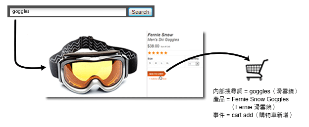
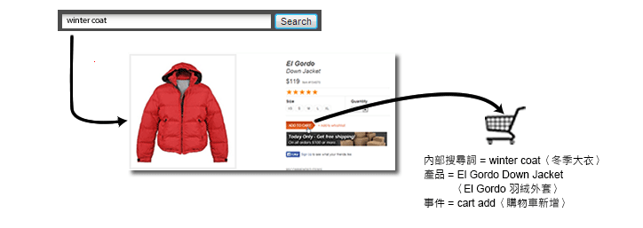

# 銷售變數簡介

測量外部促銷活動或外部搜尋詞的成功情形時，通常會想使用單一值來接收發生之任何成功事件的評分。例如，如果客戶按一下促銷活動電子郵件中的連結而前往您的網站，其隨後進行的所有購買都應評給該促銷活動。

但是，如果是當客戶尋找多個項目，而由內部搜尋或類別瀏覽驅動的事件呢? 例如，客戶在您的網站上搜尋「護目鏡」，接著新增一組產品至購物車:

結帳前，客戶又搜尋「冬季大衣」，然後新增一件羽絨外套至購物車:

完成購買時，如果分配方式仍是「最近」未改變，則購買護目鏡的評分會評給內部搜尋「冬季大衣」。這樣對「冬季大衣」有利，但對行銷決策不利。

| 內部搜尋詞 | 收入 |
|---|---|
| 冬季大衣 | $157 |

**銷售變數如何解決這個問題**

跨類別銷售變數 (或稱「銷售 eVar」) 可讓您在發生成功事件時，指派 eVar 的目前值給產品。即使稍後對該特定 eVar 設定了一或多個新值，這個值仍維持繫結至該產品。

如果在上述範例中啟用了銷售，搜尋詞「護目鏡」就會繫結至「Fernie 滑雪鏡」，而搜尋詞「冬季大衣」會繫結至 El Gordo 羽絨外套。銷售變數會在產品層級分配收入，每個詞語收到與其相關之產品收入金額的評分:

| 內部搜尋詞 | 收入 |
|---|---|
| 冬季大衣 | $119 |
| 護目鏡 | $38 |

