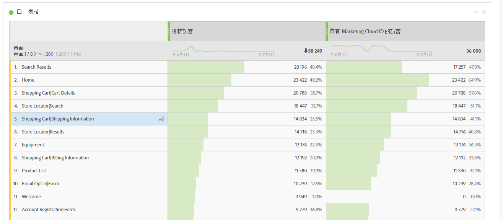
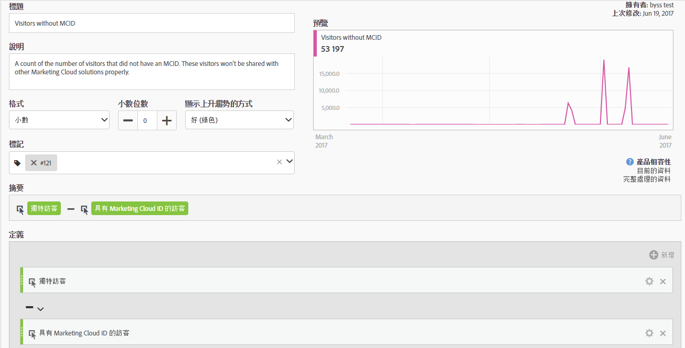
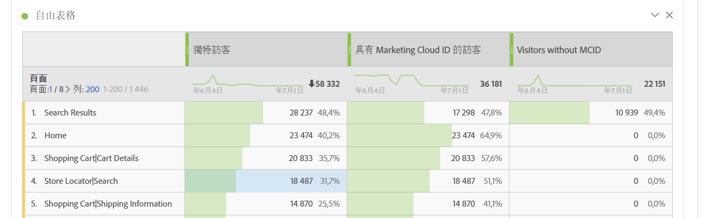
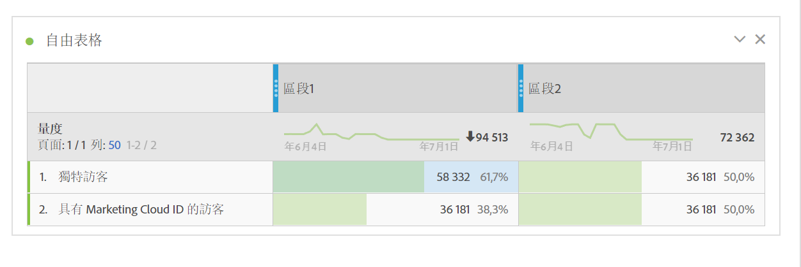

# 具有 Experience Cloud ID 的訪客

在 Analysis Workspace 和「區段產生器」中可供使用。

顯示具有 Experience Cloud ID 的訪客數目。您可以瞭解哪些頁面已部署 Identity Service，並可了解有多少訪客可與其他 Experience Cloud 解決方案共用。您也可以在與 Experience Cloud 共用的區段中使用此量度。

>[!IMPORTANT]
>
>若要顯示此量度，您必須為報表套裝執行 [Identity Service](https://marketing.adobe.com/resources/help/zh_TW/mcvid/)。

## Experience Cloud ID 設定除錯 {#section_679E62142A3E46548FF8FBDA46568005}

[!UICONTROL 具有 Experience Cloud ID 的訪客]量度是 Adobe Analytics 中的實用量度，可協助您找出 [!UICONTROL Identity Service] 設定中的問題並除錯。此量度是報表套裝中的訪客量計數，而該報表套裝是從 Identity Service 分配到 Experience Cloud ID。此量度在進行下列作業時非常有用：診斷某些 Experience Cloud 整合可能無法與如預期數量訪客共用的原因，或找出網站可能尚未部署 MCID 的區域。

若要使用「具有 Experience Cloud ID 的訪客」量度，只需將其拖曳至任何報表內作為量度即可，例如此[!UICONTROL 「頁面」]報表：

在此範例中，請注意每頁的「獨特訪客」數量都與「具有 Experience Cloud ID 的訪客」數量相同。但是，「獨特訪客」的總數卻大於「具有 Experience Cloud ID 的訪客」總數。若要找出沒有為所有訪客設定 MCID 的頁面，請使用此定義[建立計算量度](https://marketing.adobe.com/resources/help/zh_TW/analytics/calcmetrics/cm_build_metrics.html)：

將計算量度加入報表後，您便可為「頁面」報表排序，進而顯示沒有 MCID 的訪客最多頁面：

現在您可以立刻瞭解，「產品快速檢視」頁面並未正確透過 Identity Service 實作，並應儘速更新。您可以任何類型的維度構建類似的報表，例如瀏覽器類型、網站區域或內容類型。

當您識別出訪客沒有 MCID 的頁面，就可以回報給實作團隊，請他們修正這些頁面。

在某些情況下，即使 MCID 服務已在頁面實作，您仍可能會發現少量 MCID 並未設定供部分訪客使用。這類情況很可能是由於在提供報表套裝之前，呼叫了 AppMeasurement 函數的 Analytics JavaScript 或 DTM 設定的常見錯誤設定。若要避免此情況，請務必正確[插入核心 AppMeasurement 代碼](https://marketing.adobe.com/resources/help/en_US/sc/implement/dtm/t_appmeasurement-code.html)。

請注意，您與 Experience Cloud 共用之「產品快速檢視」頁面 (如上所示) 的任何區段，與其他 Experience Cloud 解決方案的符合率很可能會非常低。若要查看任意區段的 MCID 涵蓋率，您可以建構如下的報表：

在這個表格中 (比較「獨特訪客」數量與「具有 Experience Cloud ID 的訪客」數量)，很容易看出「區段 1」的 MCID 涵蓋率未達 100％，而「區段 2」則有。這代表如果我要與 Experience Cloud 共用「區段 1」，則在總計 3,859 名訪客中只有 2,186 名有資格共用。
