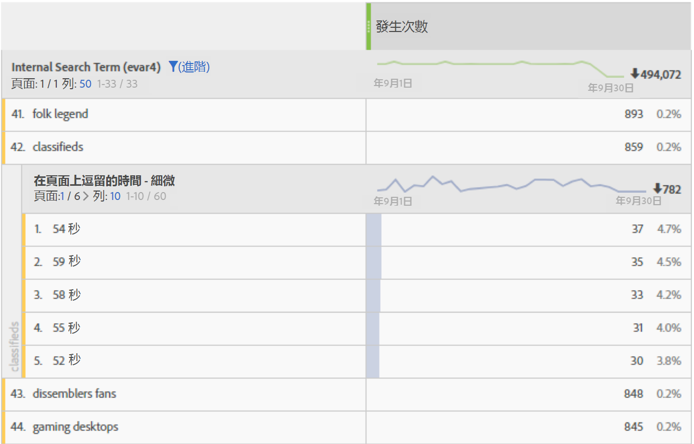
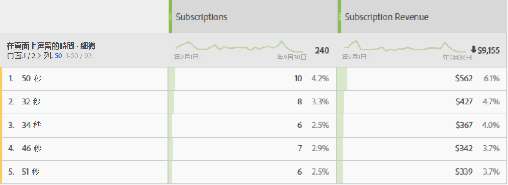

# [!UICONTROL 逗留時間]

Adobe [!UICONTROL Analytics產品提供] 各種逗留時間度量和維度。

## [!UICONTROL 「逗留時間」量度]

| 量度 | 定義 | 適用於 |
|---|---|---|
| [!UICONTROL 花費秒數總計] | 代表訪客與特定維度項目互動的總時間量。包含所有後續點擊的值與永續性例項。 如果是 prop，則會對後續連結事件一併計算逗留時間。 | 分析工作區、報告與分析、報告建立工具（稱為「總逗留時間」）、資料倉庫、臨機分析 |
| [!UICONTROL 每次瀏覽逗留時間] （秒） | *逗留秒數總計/（瀏覽彈回數）* 代表訪客在每次瀏覽期間與特定維度項目互動的平均時間。 | Analysis Workspace、Reports &amp; Analytics、Ad Hoc Analysis |
| [!UICONTROL 每位訪客逗留時間] （秒） | *逗留秒數總計／獨* 特訪客代表訪客在訪客存留期間（其Cookie長度）內與特定維度項目互動的平均時間。 | Analysis Workspace、Reports &amp; Analytics、Ad Hoc Analysis |
| [!UICONTROL 網站平均逗留時間] （秒） | 代表訪客與特定維度項目互動的總時間量，每個序列與一個維度項目互動。這並非單單如其名地只限於「網站」的平均逗留時間。如需序列的詳細資訊，請參閱「如何計算逗留時間」一節。 **注意**:由於計算中的分母差異，此量度很可能與維度項目層級的「每次瀏覽逗留時間」不同。 | 分析工作區、報告與分析（以分鐘顯示）、報告建立工具（以分鐘顯示）、臨機分析 |
| [!UICONTROL 平均頁面逗留時間] | 已停用的量度。  若需要維度項目的平均時間，建議您改用「網站平均逗留時間」。 | Report Builder (請求中包含維度時) |
| [!UICONTROL 作業總長度]，例如上 [!UICONTROL 一個作業長度] | 僅限於行動應用程式 SDK。 針對前一個作業，在下一次應用程式啟動時決定。計算單位為秒，當應用程式在背景中執行時不會計算此量度，只有在使用中才會計算。這是作業層級量度。 範例：我們安裝應用程式ABC，然後啟動並使用它2分鐘，然後關閉應用程式。 不會傳送有關此作業時間的資料。 The next time we launch the app, [!UICONTROL Previous Session Length] will be sent with a value of 120. | 分析工作區、報告與分析、報告建立工具、Mobile Services UI |
| [!UICONTROL 平均作業長度] （行動裝置） | *作業長度總計/（啟動次數——首次啟動）* 行動應用程式SDK。 這是作業層級量度。 | 報告建立工具、Mobile Services UI、臨機分析 |

## 「逗留時間」維度

| 維度 | 定義 | 適用於 |
|---|---|---|
| [!UICONTROL 每次造訪逗留時間 - 精細] | 將瀏覽時的總逗留時間去除尾數後的為最接近的秒數，適用於可套用至屬於瀏覽一部分的每一次點擊。這是造訪層級維度。 | 分析工作區、臨機分析 |
| [!UICONTROL 每次瀏覽逗留時間 - 分組] | 粒度維度分成 9 個不同的範圍。這是造訪層級維度。這些範圍包括:<ul><li>少於 1 分鐘</li><li>1-5 分鐘</li><li>5-10 分鐘</li><li>10-30 分鐘</li><li>30-60 分鐘</li><li>1-2 小時</li><li>2-5 小時</li><li>5-10 小時</li><li>10-15 小時</li></ul>**注意**:存在的時段不能高於此值，因為瀏覽會在活動達12小時後過期。 | 分析工作區、報告與分析、報告建立工具、臨機分析 |
| [!UICONTROL 頁面逗留時間 - 精細] | 每次點擊的總逗留時間，去除尾數後為最接近的秒數。這是點擊層級維度，同時包含頁面檢視和連結事件。 雖然名稱不限，但不限於「頁面」維度。 | 分析工作區、臨機分析 |
| [!UICONTROL 頁面逗留時間 – 分段] | 粒度維度分成 10 個不同範圍；不過分段的維度只會計算頁面檢視次數 (而排除連結事件)。這是點擊層級維度。這些範圍包括:<ul><li>少於 15 秒</li><li>15 至 29 秒</li><li>30 至 59 秒</li><li>1 至 3 分鐘</li><li>3 至 5 分鐘</li><li>5 至 10 分鐘</li><li>10 至 15 分鐘</li><li>15 至 20 分鐘</li><li>20 至 30 分鐘</li><li>超過 30 分鐘</li></ul> | Analysis Workspace、Reports &amp; Analytics、Ad Hoc Analysis |

## 「逗留時間」的計算方式

Adobe Analytics 使用明確值 (包括連結事件和視訊檢視) 來計算[!UICONTROL 「逗留時間」]。

>[!NOTE]
>
>Without link events like [!UICONTROL Video Views] or [!UICONTROL Exit Links], time spent on the last hit of a visit cannot be known. For similar reasons, [!UICONTROL Bounce Visits] (i.e. visits with a single hit) also does not have a 'time spent' associated with it.

The **numerator** in all time spent calculations is total seconds spent.

The **denominator** is not available as a separate metric in Adobe Analytics. 對於點擊層級的「逗留時間」量度，分母為序列。 序列是一組連續點擊，其中的指定變數會包含相同的值 (不論是透過設定、擴散或持續)。「前移」是指Prop在頁面檢視之間（即跨後續連結事件）的持續存在性，以計算逗留時間。

* For example, in the case of [!UICONTROL Page Name] or other dimensions at the hit level, the denominator is essentially [!UICONTROL 'Instances'] or [!UICONTROL 'Page Views'], but with reloads and unset values (e.g. link events) counted as a single interaction (a sequence).

* 反彈和退出點擊也會從分母中移除，因為'逗留時間'無法得知。

## 常見問題解答

**第1季：所有「逗留時間」量度都能套用至任何維度嗎？**

答：可套用至任何維度的「逗留時間」量度為：

* [!UICONTROL 花費秒數總計]

* [!UICONTROL 每次瀏覽逗留時間] （秒）

* [!UICONTROL 每位訪客逗留時間] （秒）

* [!UICONTROL 網站平均逗留時間] （秒）

**第2季：哪個逗留時間維度最適合用於與其他維度的劃分？**

A: The [!UICONTROL Time Spent on Page – granular] dimension is a hit-level dimension. 使用由其他維度來劃分這個項目會告訴您當劃分維度也存在時點擊持續的秒數。在下列範例中，搜尋詞"classifieds"與54秒、59秒等的點擊時間相關聯，可能表示訪客花時間閱讀該詞語傳回的內容。

**第3季：哪些量度適用於「頁面逗留時[!UICONTROL 間——細微」維度]?**

答：任何量度。 維度會顯示事件發生地點的確切點擊逗留時間。 較長的逗留時間表示訪客在事件發生的頁面 (點擊) 上停留較長時間。

**第4季：網站平[!UICONTROL 均逗留時間與每次瀏覽][!UICONTROL 逗留時間有何不同]?**

答：差異在於量度中的分母：

* [!UICONTROL 網站平均逗留時間] ，會使用包含維度項目的序列。

* [!UICONTROL 每次瀏覽逗留時間] ，使用瀏覽計數

因此，這些量度可能會在造訪層級產生類似的結果，但是在點擊層級就會有所差異。

## 逗留時 [!UICONTROL 間計算範例]

假設以下幾組伺服器呼叫是針對一次造訪期間內的單一訪客:

| 造訪點擊編號 | 1 | 2 | 3 | 4 | 5 | 6 | 7 |
|---|---|---|---|---|---|---|---|
| **瀏覽用時（秒）** | 0 | 30 | 80 | 180 | 190 | 230 | 290 |
| **花費秒數** | 30 | 50 | 100 | 10 | 40 | 60 | - |
| **點擊類型** | 頁面 | 連結 | 頁面 | 頁面 | 頁面 | 頁面 | 頁面 |
| **頁面名稱** | 首頁 | - | 產品 | 首頁 | 首頁 (重新載入) | 購物車 | 訂購確認 |
|  |  |  |  |  |  |  |  |
| **prop1** | A (設定) | A（前進） | 未設定 | B（設定） | B（設定） | A(設定) | C (設定) |
| **prop1 花費秒數** | 30 | 50 | - | 10 | 40 | 60 | - |
|  |  |  |  |  |  |  |  |
| **eVar1** | 紅色 (設定) | 紅色（持續） | (已過期) | 藍色 (設定) | 藍色（設定） | 藍色（持續） | 紅色（設定） |
| **eVar1逗留秒數** | 30 | 50 | - | 10 | 40 | 60 | - |

根據上表，逗留時間度量的計算方式如下：

| prop1 | 花費秒數總計 | 每次瀏覽逗留時間 | 每位訪客逗留時間 | 序列計數 | 網站平均逗留時間 |
|---|---|---|---|---|---|
| A | 30+50+60=140 | 140/1=140 | 140/1=140 | 2 | 140/2=70 |
| B | 10+40=50 | 50/1=50 | 50/1=50 | 1 | 50/1=50 |
| C | 0 | 0 | 0 | 0 | 0 |
| 未歸類的時間 | 100 | - | - | - | - |

| eVar1 | 花費秒數總計 | 每次瀏覽逗留時間 | 每位訪客逗留時間 | 序列計數 | 網站平均逗留時間 |
|---|---|---|---|---|---|
| 紅色 | 30+50=80 | 80/1=80 | 80/1=80 | 1 | 80/1=80 |
| 藍色 | 10+40+60=110 | 110/1=110 | 110/1=110 | 1 | 110/1=110 |
| 未歸類的時間 | 100 | - | - | - | - |

每次瀏覽逗留時間（詳細）:290頁面逗留時間（詳細）:10、30、40、50、60、100

可支持此範例的其他附註:

* 所有逗留時間計算皆以瀏覽的經過時間為基礎，該時間從第一次瀏覽點擊的零開始。

* 「逗留秒數」是目前點擊的時間戳記與下次點擊的時間戳記之間的差異。 因此，造訪 (和彈回) 的最後一次點擊沒有逗留時間。

* 「序列」是一組連續點擊，其中的指定變數會包含相同的值 (不論是透過設定、擴散或持續)。例如，prop1「A」有兩個序列: 點擊 1 和 2 以及點擊 6。造訪的最後一次點擊的值不會開始新的序列，因為最後一次點擊沒有逗留時間。網站平均逗留時間會使用序列作為分母。

   * 僅就逗留時間而言，Prop會從頁面點擊「向前擴散」到後續連結點擊，如上所示，在點擊2的prop1。 這得以讓點擊 1 上的 prop1 所設定的值 (「A」) 將逗留時間累積在點擊 2 上。

   * eVar可累積在設定或保存eVar之任何點擊上所花費的時間。 eVar永續性由「分析&gt;管理」中的eVar設定定義。

