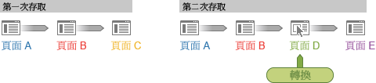

# 訪客參與率 - Ad Hoc Analysis

「訪客參與率」是一個量度系列，可讓您檢視跨訪客作業階段的行銷管道、促銷活動、收入等等的參與率。例如，購買和收入評分可以歸入在下訂單的瀏覽前存取的其他行銷接觸點。Ad Hoc Analysis 提供所有瀏覽的訪客參與率。

**收入 (參與率)**: 將轉換評價分散至單一存取中導致轉換的所有頁面，一直到轉換頁面為止。

**收入 (訪客參與率)**: 根據您指定的時間範圍，將轉換評分分配至所有頁面和所有瀏覽。

**範例 - 跨瀏覽收入參與率**

有位訪客瀏覽了您的網站兩次。轉換事件發生在第二次瀏覽時的頁面 D，獲得 $60 收入: 

在報告中，轉換分配如下:

* **收入**: 分配至該頁面。
* **收入 (參與率)**: 分配至第二次瀏覽。
* **收入 (訪客參與率)**: 平均分配給兩次瀏覽。

<table id="table_91A7244E77854838A8392B49366FB445"> 
 <thead> 
  <tr> 
   <th colname="col1" class="entry"> 頁面 </th> 
   <th colname="col2" class="entry"> 收入 </th> 
   <th colname="col3" class="entry"> 收入 (參與率) </th> 
   <th colname="col4" class="entry"> 收入 (訪客參與率) </th> 
  </tr> 
 </thead>
 <tbody> 
  <tr> 
   <td colname="col1"> 
A 
 </td> 
   <td colname="col2"> 
0 
 </td> 
   <td colname="col3"> 
$60 
 </td> 
   <td colname="col4"> 
$60 
 </td> 
  </tr> 
  <tr> 
   <td colname="col1"> 
B 
 </td> 
   <td colname="col2"> 
0 
 </td> 
   <td colname="col3"> 
$60 
 </td> 
   <td colname="col4"> 
$60 
 </td> 
  </tr> 
  <tr> 
   <td colname="col1"> 
C 
 </td> 
   <td colname="col2"> 
0 
 </td> 
   <td colname="col3"> 
0 
 </td> 
   <td colname="col4"> 
$60 
 </td> 
  </tr> 
  <tr> 
   <td colname="col1"> 
D 
 </td> 
   <td colname="col2"> 
$60 
 </td> 
   <td colname="col3"> 
$60 
 </td> 
   <td colname="col4"> 
$60 
 </td> 
  </tr> 
 </tbody> 
</table>

