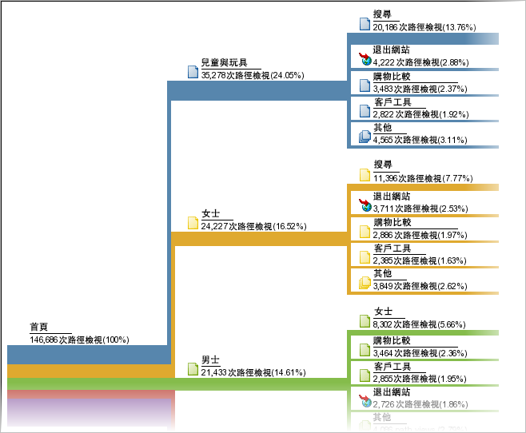

# 路徑分析

以路徑分析為基礎的報告群組。技術上而言，路徑表示從一個頁面名稱移至另一個 (從一個值移至另一個) 的過程。

[Analysis Workspace 流量](https://marketing.adobe.com/resources/help/en_US/analytics/analysis-workspace/flow.html)可提供更具彈性的路徑選項。

> [!NOTE]若要啟用路徑功能，請前往&#x200B;**[!UICONTROL 管理員 &gt; 報表套裝 &gt; 編輯設定 &gt; 流量 &gt; 流量變數]**。若要在「網站區域」及「伺服器」報表啟用路徑功能，請聯絡客戶服務。

若您需要知道值的收集順序，您就必須對收集這些值的變數啟用路徑功能。依預設會為頁面啟用路徑功能。依預設不會為任何 prop 啟用路徑功能，因為它僅適於特定情況。聯絡客戶服務以啟用 prop 的路徑分析。

> [!NOTE] 在臨機分析中，當您對prop啟用分類時，路徑度量將可用於為已啟用prop設定的所有分類。

**範例 - 網站區域的路徑**

為&#x200B;*`s.channel`*&#x200B;變數啟用路徑功能，可讓您追蹤網站訪客在「網站區域」之間移動的情形 (當值變更時)。


接著，路徑即可用於各種不同的路徑報告 (例如[!UICONTROL 下一個網站區域流程])，而顯示訪客瀏覽頁面群組或網站區域的情形。



**範例 - 搜尋的路徑**

這種從一個值移至另一個值的相同概念也可套用至其他流量變數，包括&#x200B;*`s.props`*。例如，如果您為內部搜尋詞啟用路徑分析， *`s.prop`*&#x200B;您可以看到訪客瀏覽搜尋詞的路徑。

**範例 - 根據登入狀態的路徑**

您可能會想根據訪客的登入狀態來瞭解他們瀏覽您的網站的路徑。若要檢視這項資訊，您不應在路徑報告中查看登入狀態，因為這些報告所顯示的是訪客在其中變更值的情形，或是訪客如何從登入變更為登出的情形。此時您應連結區段值與&#x200B;*`s.pageName`*&#x200B;變數，然後為產生的變數建立路徑。以下是根據成員狀態來建立頁面路徑的範例程式碼:

```js
s.pageName="Home Page"; 
s.prop18="Gold"; // Member Status 
s.prop19=s.prop18 + ":" + s.pageName;
```

接著，請為&#x200B;*`s.prop19`*&#x200B;啟用路徑功能，以檢視成員瀏覽頁面的路徑。

> [!NOTE] 如果您執行臨機分析，則可以區隔頁面路徑，而不需要串連區段值，並將任何區段套用至路徑報表。

