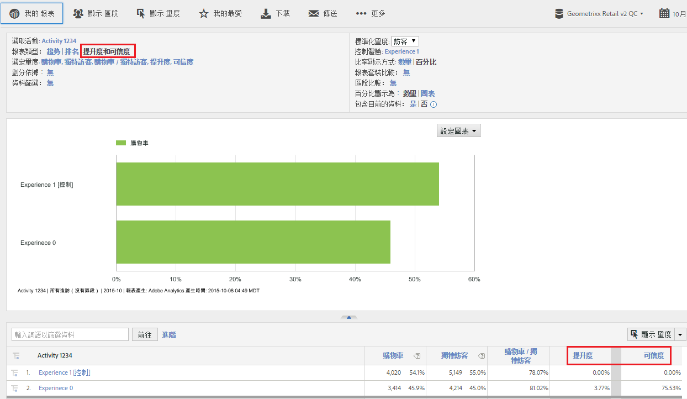

# 目標提升度和可信度

可讓您利用過去在 [!DNL Target Classic] 中使用的方式，在 Adobe Analytics 中評估促銷活動是否成功。

**[!UICONTROL 「Analytics]** > **[!UICONTROL 報表]** > **[!UICONTROL 檢視全部報表]** > **[!UICONTROL Adobe Target]** > **[!UICONTROL 目標分析]** > **[!UICONTROL 目標活動」]**。

Adobe Target 文件包含更多關於[提升度](https://marketing.adobe.com/resources/help/zh_TW/target/target/c_estimating_lift_in_revenue.html)和[可信度](https://marketing.adobe.com/resources/help/zh_TW/rec/c_Confidence_Level_and_Confidence_Interval.html)的詳細資訊。

若要計算提升度和可信度：

1. 在&#x200B;**[!UICONTROL 「目標活動」]**&#x200B;報表中，按一下某個活動以顯示其詳細資料。
1. 在「報表類型」下方選取&#x200B;**[!UICONTROL 「提升度和可信度」]**。
1. 按一下&#x200B;**[!UICONTROL 「顯示量度」]**&#x200B;以新增一個量度。這種報表類型無法新增超過一個量度，因為最佳實務是只依據一個量度來評估測試。多個量度只會增加雜訊，降低測試訊號。
1. (選用) 在&#x200B;**[!UICONTROL 標準化量度]**&#x200B;下方，選取下列其中一個項目：訪客數、造訪次數或曝光數。大部分時候都是預設值「訪客」。

1. 報表會新增這些量度，包括量度和標準化量度之間的比率。

## 報表設定{#section_3508439E09CA4E38B2EA309BA477C01D}

<table id="table_0FBB257C96454CDA82D487DC68459C13"> 
 <thead> 
  <tr> 
   <th colname="col1" class="entry"> 設定 </th> 
   <th colname="col2" class="entry"> 說明 </th> 
  </tr> 
 </thead>
 <tbody> 
  <tr> 
   <td colname="col1"> 選取活動 </td> 
   <td colname="col2"> 您目前檢視和用於計算提升度和可信度的目標活動。 </td> 
  </tr> 
  <tr> 
   <td colname="col1"> 報表類型 </td> 
   <td colname="col2"> 您於此處選取提升度和可信度 - 這些項目會在下方的報表結果中顯示為量度。 </td> 
  </tr> 
  <tr> 
   <td colname="col1"> 選定量度 </td> 
   <td colname="col2"> 顯示您選取的量度 (上述範例中為「收入」)、標準化量度 (「獨特訪客」)、這 2 個量度之間的比率，以及比較「控制體驗」後的「提升度和可信度」計算。 </td> 
  </tr> 
  <tr> 
   <td colname="col1"> 劃分依據 </td> 
   <td colname="col2"> 您可以依據其他報表進一步劃分此報表。 </td> 
  </tr> 
  <tr> 
   <td colname="col1"> 資料篩選 </td> 
   <td colname="col2"> 讓您對此報表套用特定篩選器。 </td> 
  </tr> 
  <tr> 
   <td colname="col1"> 標準化量度 </td> 
   <td colname="col2"> 您可使用造訪、訪客或印象進行標準化。標準化量度將是提升度計算的分母。也會影響在套用可信度計算前彙總資料的方式。 </td> 
  </tr> 
  <tr> 
   <td colname="col1"> 控制體驗 </td> 
   <td colname="col2"> 您要進行比較以及用於計算提升度的目標體驗。 </td> 
  </tr> 
  <tr> 
   <td colname="col1"> 報表套裝比較 </td> 
   <td colname="col2"> 可讓您選擇其他報表套裝以便用於比較。 </td> 
  </tr> 
  <tr> 
   <td colname="col1"> 區段比較 </td> 
   <td colname="col2"> 可讓您選擇區段以便用於比較。 </td> 
  </tr> 
  <tr> 
   <td colname="col1"> 百分比顯示為數字/圖形 </td> 
   <td colname="col2"> 將提升度和可信度百分比顯示為數字或圖形。 </td> 
  </tr> 
  <tr> 
   <td colname="col1"> 包含目前的資料 </td> 
   <td colname="col2"> 
Reports &amp; Analytics 中的「包含目前的資料」選項可讓您檢視最新 Analytics 資料，通常是在資料全部處理完並最終化之前。目前的資料會在數分鐘內顯示最多的量度，提供可操作的資料以幫助快速決策。 
 </td> 
  </tr> 
 </tbody> 
</table>

