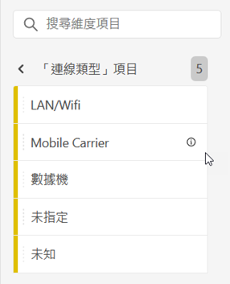
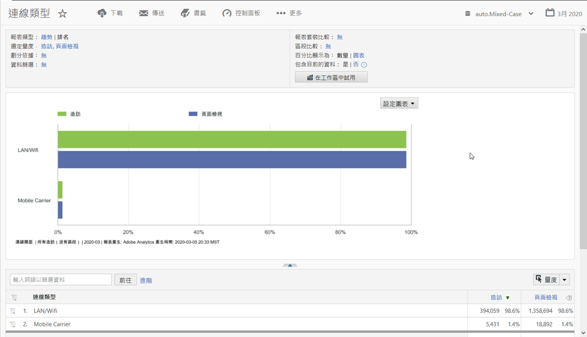

# 連線類型

顯示網際網路連線類型的量度，包括調制解調器、LAN/Wifi、行動電信業者等。

## 範例

下列報表會比較度量「瀏覽」和「頁 [面檢視](https://docs.adobe.com/content/help/en/analytics/components/variables/metrics/metrics-visit.html) 」 [的連線類型](https://docs.adobe.com/content/help/en/analytics/components/variables/dimensions-reports/reports-page-views.html):

您可以檢視「行動電信業者報表」，以找到有關行動電信業者連線類型 [**的其他深入資訊&#x200B;**](https://docs.adobe.com/content/help/en/analytics/components/variables/dimensions-reports/reports-mobile-carrier.html)。
