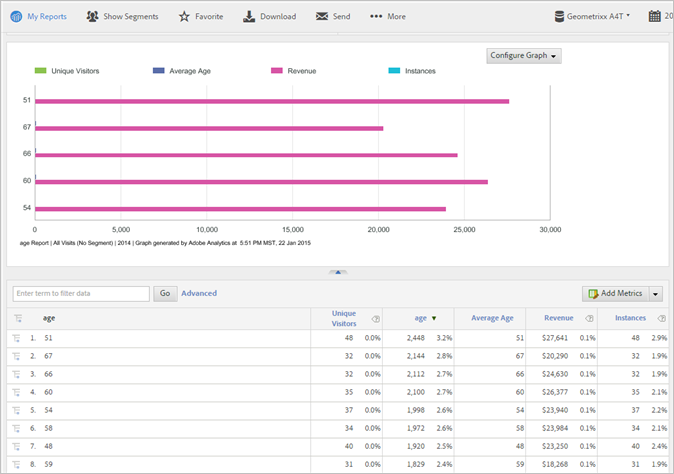

# 客戶屬性

有關客戶屬性的 Analytics 常見問題，以及如何執行「客戶屬性」報表。

**[!UICONTROL 「報表]****[!UICONTROL > 訪客資料]** > **[!UICONTROL 客戶屬性」]**

如果您在客戶關係管理 (CRM) 資料庫中擷取企業客戶資料，您可將該資料上傳至 Experience Cloud 的客戶屬性資料來源。資料上傳後，您可以執行 Reports &amp; Analytics 中的「客戶屬性」報表。

* [Analytics 中的客戶屬性和報表量度](/help/components/c-variables/dimensionslist/reports-customer-attributes.md#section_EF343662146B460A882D3DF772ADD86D)
* [常見問題集 - Analytics 中的客戶屬性](/help/components/c-variables/dimensionslist/reports-customer-attributes.md#section_E29641D1F3D649C1AC9EA5231921F038)

如需有關上傳客戶屬性資料的詳細資訊，請參閱 Experience Cloud 說明中的[客戶屬性](https://marketing.adobe.com/resources/help/zh_TW/mcloud/attributes.html)。

## Analytics 中的客戶屬性和報表量度{#section_EF343662146B460A882D3DF772ADD86D}

上傳客戶屬性並驗證結構後 (在 Experience Cloud 中)，系統會根據您對應至屬性字串和整數的好記名稱 (如 *`age`* 或 *`gender`*) 建立量度。這些量度會出現在「**[!UICONTROL 訪客資料]** > **[!UICONTROL 客戶屬性]**」報表中。

例如：

**[!UICONTROL 訪客資料]** > **[!UICONTROL 客戶屬性]** > **[!UICONTROL 年齡]**

**範例 - 年齡量度**

若您指定字串為&#x200B;*`age`*，系統會建立以下量度和維度：

* 年齡維度：可讓您根據年齡屬性執行報表。
* 年齡量度：可新增至報表的量度，如「唯一訪客」報表。
* 年齡量度計數：可讓您瞭解，舉例來說，訪客是否在表單上指定&#x200B;*`age`*&#x200B;值。

因為量度是報表表格中的總和，所以您應：[建立計算量度](https://marketing.adobe.com/resources/help/zh_TW/analytics/calcmetrics/)用於提供平均年齡。此量度的公式為 `Age / Count of Age`。

## 常見問題集 - Analytics 中的客戶屬性 {#section_E29641D1F3D649C1AC9EA5231921F038}

<table id="table_88631069013B408EBB0A810657662B36"> 
 <thead> 
  <tr> 
   <th colname="col1" class="entry"> 問題 </th> 
   <th colname="col2" class="entry"> 回答 </th> 
  </tr> 
 </thead>
 <tbody> 
  <tr> 
   <td colname="col1"> 
為什麼不在 prop 或 eVar 中填入客戶 ID，而是使用 Identity Service 來設定客戶 ID 比較好？ 
 </td> 
   <td colname="col2"> 
使用 Identity Service 具備許多優點： 
 
    <ul id="ul_5D3659604D43419F9CA5920B4F93728E"> 
     <li id="li_BA2EF0715C5A47EFAFA7191CFAD088A4">若您不是用 Identity Service 設定客戶 ID，客戶記錄將只能供 Adobe Analytics 使用。如果想將客戶記錄用於即時定位，就必須使用 Identity Service。 </li> 
     <li id="li_228358684E474A298E39578D427BF932">使用 Identity Service 設定客戶 ID，可縮短與 Experience Cloud 同步 ID 的時間。如果將客戶 ID 放在 prop 或 eVar 中，會透過後端伺服器同步將客戶 ID 傳送至 Experience Cloud，這種同步為批次執行。Identity Service 會立即與 Experience Cloud 同步客戶 ID。 </li> 
     <li id="li_BCF28219E4014FCF9F747C3D8D270526"> 使用 Identity Service 來代替 prop 或 eVar，可釋出 prop 或 eVar 以用於其他用途。 </li> 
    </ul> </td> 
  </tr> 
  <tr> 
   <td colname="col1"> 
如果我已將客戶 ID 存放在 prop 或 eVar 中，為什麼要使用這個新功能來代替以 CRM 屬性分類我的 prop 或 eVar？ 
 </td> 
   <td colname="col2"> 
Prop 和 eVar 受限於「超出唯一客戶數」的限制。使用這個功能，您可以將屬性資料使用在不限數目的客戶 ID。此外，使用 prop/eVar 會限制提供給 Analytics 的 CRM 資訊。 
 </td> 
  </tr> 
  <tr> 
   <td colname="col1"> 
我的 CRM 屬性將如何出現在 Adobe Analytics 中？ 
 </td> 
   <td colname="col2"> 
CRM 屬性將出現在 Analysis Workspace、Reports &amp; Analytics、Ad Hoc Analysis、Reporting API、Report Builder。文字屬性將以報表/維度呈現。數字屬性將同時以維度和量度呈現。 
 </td> 
  </tr> 
  <tr> 
   <td colname="col1"> 
CRM 資料可以用於 Data Warehouse 和資料摘要中嗎？ 
 </td> 
   <td colname="col2"> 
CRM 資料目前無法用於 Data Warehouse 或 Analytics 資料摘要。 
 </td> 
  </tr> 
 </tbody> 
</table>

