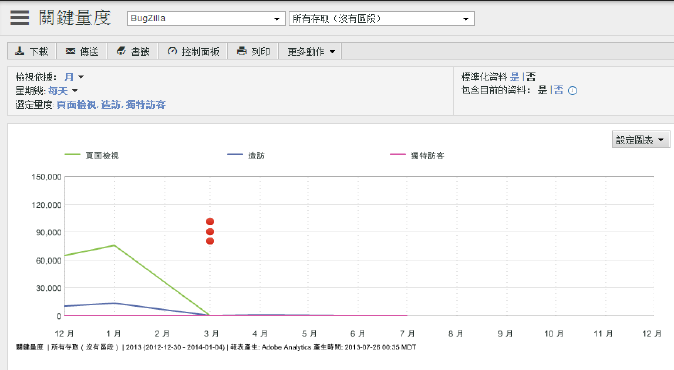

# 關鍵量度

「關鍵量度報告」可讓您比較量度以便同時查看其趨勢。例如: 當頁面檢視次數增加時，您的訪客計數是否也隨之增加?

<!-- 

 <b>Use Cases</b> 
 

Social Media: You can use the Key Metrics Report to examine social groups, such as Total Mentions or Audience Sentiment, and see how they are affecting revenue. How do you tie key metrics like Revenue to Social metrics? Look at the KM report by those groupings--total mentions, total audience, mapped to revenue. i.e. tv grouping, computing grouping, to see if it spikes or drives revenue. 

 -->

