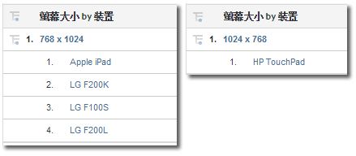

# 行動

顯示可從行動裝置存取的網站相關資訊。「行動裝置」報告透過彙集用於檢視網站的行動裝置相關資料來改進訪客識別。「行動裝置」報告可識別裝置的製造商和功能，例如螢幕大小、影片、音訊、Cookie 支援以及其他量度。「行動裝置」報告適用於所有報表套裝。

## 行動 {#topic_D306EA4558194488AC47A45B9C570150}

顯示可從行動裝置存取的網站相關資訊。「行動裝置」報告透過彙集用於檢視網站的行動裝置相關資料來改進訪客識別。「行動裝置」報告可識別裝置的製造商和功能，例如螢幕大小、影片、音訊、Cookie 支援以及其他量度。「行動裝置」報告適用於所有報表套裝。

> [!NOTE] 行動報表只會顯示行動網路流量。使用原生 iOS、Android 和其他 SDK 收集的行動應用程式資料，需先在「管理工具」啟用該功能，才會顯示在「行動應用」報告中。

提供下列行動報告:

<table id="table_900BB8F2F3A746B6B97DC629B39910DA"> 
 <thead> 
  <tr> 
   <th colname="col1" class="entry"> 報告 </th> 
   <th colname="col2" class="entry"> 說明 </th> 
  </tr> 
 </thead>
 <tbody> 
  <tr> 
   <td colname="col1"> 
裝置 
 </td> 
   <td colname="col2"> 
顯示使用行動裝置 (如執行 iOS 或 Android 的裝置) 瀏覽您網站的訪客人數。此報告有助於您理解行動舉措的影響，以便制定相應的計劃。您可將此報告用於: 
 
 
     <ul id="ul_8CC40461C2944A63AED561E384275D24"> 
      <li id="li_4667815ED7384DE9824FB47F02040374"> 
制定針對行動使用者的策略 
 </li> 
      <li id="li_12C1F430E5464FB4AC29C2D970165935"> 
識別讀者的使用偏好 
 </li> 
      <li id="li_BFECB3B1F5A345BA82FC22BF99E8E418"> 
追蹤無線與行動使用者的出現率 
 </li> 
     </ul> 
 </td> 
  </tr> 
  <tr> 
   <td colname="col1"> 製造商 </td> 
   <td colname="col2"> 依照裝置的製造商，將行動裝置對您網站的點擊分組。報告顯示製造商的類型，每個製造商的檢視次數及對應的百分比。 </td> 
  </tr> 
  <tr> 
   <td colname="col1"> 螢幕大小 </td> 
   <td colname="col2"> 
 依照裝置的螢幕大小，將行動裝置對您網站的點擊分組。報告顯示每種螢幕的大小，使用每種螢幕大小瀏覽您網站的訪客數量，以及每種螢幕大小占總檢視次數的百分比。同「螢幕高度」報告和「螢幕寬度」報告比較，「螢幕大小」報告可同時顯示螢幕大小的高度及寬度。 
 
行動螢幕大小報告目前對於每個裝置都是靜態的。不論螢幕方向為何，報告中每個裝置的螢幕解析度都是固定的。您可依據行動裝置劃分螢幕大小，即可查看此報告。 
 </td> 
  </tr> 
  <tr> 
   <td colname="col1"> 螢幕高度 </td> 
   <td colname="col2"> 
 顯示各種行動裝置的螢幕高度及每種螢幕高度的檢視次數。您還可以檢視「螢幕大小」報告，瞭解螢幕高度和寬度。 
 </td> 
  </tr> 
  <tr> 
   <td colname="col1"> 螢幕寬度 </td> 
   <td colname="col2"> 
 顯示各種行動裝置的螢幕寬度及每種螢幕寬度的檢視次數。您還可以檢視「螢幕大小」報告，瞭解螢幕高度和寬度。 
 </td> 
  </tr> 
  <tr> 
   <td colname="col1"> Cookie 支援 </td> 
   <td colname="col2"> 
依照是否支援 Cookie，將行動裝置的點擊分組。訪客被分為支援 cookie 和不支援 cookie 的群組。行動裝置的類型透過使用者代理字串加以識別。Adobe 會維護已知支援 Cookie 的行動裝置清單。如果使用者代理字串中列出的行動裝置亦在 Adobe 的行動裝置清單中列出，則 Cookie 支援報表中的受支援條列項目會增加。反之則報表中的非受支援條列項目會增加。 
 </td> 
  </tr> 
  <tr> 
   <td colname="col1"> 影像支援 </td> 
   <td colname="col2"> 
 依照行動裝置支援的影像類型對行動裝置分組。 
 
例如，如果訪客的手機支援 .jpeg 影像並存取了網站，則影像支援報表至少會增加一個項目。如果電話支援更多音訊格式，那麼瀏覽網站可以導致該次瀏覽增加多次。換言之，如果您的電話支援 .jpeg、.png 及 .gif 格式，報告中這些群組的每一組都將增加。因此，群組的總數可能比顯示在報告底部的總數大。 
 </td> 
  </tr> 
  <tr> 
   <td colname="col1"> 色彩深度 </td> 
   <td colname="col2"> 
 依據支援的色彩數目對行動裝置的點擊分組。該報告顯示使用行動裝置瀏覽您網站的訪客總數，並依照他們行動裝置中配置的色彩數目對訪客進行分組。 
 
例如，如果訪客的行動電話支援 24 色，則報表會增加與 24 色相對應的條列項目。 
 </td> 
  </tr> 
  <tr> 
   <td colname="col1"> 音訊支援 </td> 
   <td colname="col2"> 
 依照行動裝置支援的音訊格式類型對行動裝置實行分組。 
 
例如，如果訪客的手機支援 .mp3 格式，則音訊支援報表至少會增加一個項目。如果電話支援更多影像格式，那麼瀏覽網站可能導致每個受支援的音訊類型均增加。換言之，如果電話支援 .mp3、.aac 及 .amr 格式，報告中這些群組的每一組都會增加。因此，群組的總數可能比顯示在報告底部的總數大。 
 </td> 
  </tr> 
  <tr> 
   <td colname="col1"> 視訊支援 </td> 
   <td colname="col2"> 
 依照行動裝置支援的影片格式類型對行動裝置分組。 
 
例如，如果訪客的行動裝置支援 .mp4 格式，則當其存取您的網站時，「視訊支援」報告至少增加一。如果電話支援多種影片格式 (如 .mp4 和 .wmv)，則報告中的每一群組都會隨之增加。因此，群組的總數可能比顯示在報告底部的總數大。 
 </td> 
  </tr> 
  <tr> 
   <td colname="col1"> DRM </td> 
   <td colname="col2"> 
 依照行動裝置支援的「數位版權管理」(DRM) 類型對行動裝置分組。DRM 群組包括前進鎖定、組合傳送、單獨傳送和未知。 
 </td> 
  </tr> 
  <tr> 
   <td colname="col1"> 網路通訊協定 </td> 
   <td colname="col2"> 
 依照行動裝置支援的網路通訊協定 (GPRS、CSD、EDGE、HSCSD 等)，將行動裝置分組。該報告還包括無法識別網路通訊協定的「未知」群組。 
 
訪客在使用行動裝置存取網站時，「網路通訊協定」報告將至少增加一。如果電話支援多種網路通訊協定，那麼報告中的每個群組都會隨之增加。因此，群組的總數可能比顯示在報告底部的總數大。 
 </td> 
  </tr> 
  <tr> 
   <td colname="col1"> 作業系統 (已不再使用) </td> 
   <td colname="col2"> 
 依照裝置上執行的行動作業系統對行動裝置分組。行動作業系統包括 Windows、RIM、iOS、Symbian 等。該報告還包括無法識別行動作業系統的「未知」群組。 
 
注意:「技術 &gt; <a href="/help/components/c-variables/dimensionslist/reports-operating-system.md"  >作業系統</a>」報表更新以包含所有作業系統 (包括行動裝置) 時，已將此報表淘汰。您可以建立內含「行動裝置」的區段，並將其套用至「技術 &gt; 作業系統」報表，以便僅檢視行動作業系統。 
 </td> 
  </tr> 
  <tr> 
   <td colname="col1"> Java 版本 </td> 
   <td colname="col2"> 
 依據行動裝置支援的 Java 版本對行動裝置分組。Java 版本報告透過裝置所支援的「Java 規格請求」(JSR) 來識別 Java 版本。該報告還包括無法識別行動作業系統的「未知」群組。 
 
您可以在 <a href="https://jcp.org/en/jsr/overview"  >Java 社區進程</a>網站尋找更多有關指定 JSR 的資訊。 
 </td> 
  </tr> 
  <tr> 
   <td colname="col1"> 書籤 URL 長度 </td> 
   <td colname="col2"> 
 依據支援的書籤 URL 字元長度上限對行動裝置分組。 
 </td> 
  </tr> 
  <tr> 
   <td colname="col1"> 郵件 URL 長度 </td> 
   <td colname="col2"> 
 依照支援的電子郵件 URL 字元長度上限對行動裝置分組。 
 </td> 
  </tr> 
  <tr> 
   <td colname="col1"> 瀏覽器 URL 長度 </td> 
   <td colname="col2"> 
 依據支援的網頁瀏覽器 URL 字元長度上限對行動裝置分組。 
 </td> 
  </tr> 
  <tr> 
   <td colname="col1"> 裝置號碼傳輸 (開/關) </td> 
   <td colname="col2"> 
 依照是否支援「裝置號碼傳輸」對行動裝置分組。該報告還包括對「裝置號碼傳輸」支援無法確定的裝置實行的「未知」群組。 
 </td> 
  </tr> 
  <tr> 
   <td colname="col1"> PTT </td> 
   <td colname="col2"> 
 依照裝置是否支援「隨壓即說」(PTT) 對行動裝置分組。此報告也包括未知群組，適用於無法判斷是否支援 PTT 的裝置。 
 </td> 
  </tr> 
  <tr> 
   <td colname="col1"> 裝飾郵件支援 </td> 
   <td colname="col2"> 
 依照行動裝置是否支援 DecoMail 對行動裝置實行分組，DecoMail 允許使用者使用圖形和動畫來裝飾郵件。此報告也包括未知群組，適用於無法判斷是否支援「裝飾郵件」的裝置。 
 </td> 
  </tr> 
  <tr> 
   <td colname="col1"> 資訊服務 </td> 
   <td colname="col2"> 
 依照行動裝置支援的新聞服務 (Channel I/B、EZ News Flash、W+INFO 等) 對行動裝置實行分組。如果訪客使用的行動裝置支援新聞服務並存取網站，則「資訊服務」報告將至少增加一。如果電話支援多種新聞服務，那麼報告中的每個群組都會隨之增加。因此，群組的總數可能比顯示在報告底部的總數大。 
 </td> 
  </tr> 
 </tbody> 
</table>

