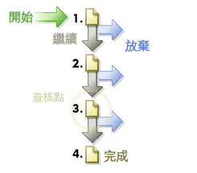

# 路徑

顯示訪客存取您網站網頁之順序的相關資訊。您可以收集訪客瀏覽您網站任何頁面之前及之後所處位置的相關資訊。

## 路徑 {#topic_39F11BCBEDC3495EA1300149FC6D4F14}

顯示訪客存取您網站網頁之順序的相關資訊。您可以收集訪客瀏覽您網站任何頁面之前及之後所處位置的相關資訊。

路徑 報表包含標準的深入分析報表和可選的進階分析報表，可顯示檢視的頁麵點按流。 您可以查明完整路徑、最長路徑和最受歡迎的路徑；透過圖表對頁面流量、流失和中途退出情況進行說明；隨時間顯示新模式和變更模式；以及分析登入與退出路徑。

**[!UICONTROL 下一頁流量]**&#x200B;或&#x200B;**[!UICONTROL 下一網站流量]**: 顯示選定頁面 (或區域、部門等) 的兩層深分支圖形，也就是您的訪客離開選定頁面後的檢視項目。使用此報告可以分析和識別訪客在檢視選定頁面後，最常採取的步驟。您可以:

* 瞭解檢視選取頁面後採用最為頻繁的步驟。
* 最佳化網站路徑設計，以便將訪客流量引至預期的目標頁面。
* 確認訪客進入了哪些除預期目標頁面之外的頁面。

**[!UICONTROL 下一頁]** (或下一類別): 顯示訪客在檢視您的網站上某個選定頁面之後所檢視的頁面，從而提供詳細的網站路徑分析。例如，在選取並報告您整個網站時，此報告會顯示排名前 10 的登陸頁面，每個登陸頁面下方各列出 5 個最受歡迎的下一頁。這項資料可協助您瞭解哪些內容、功能和其他資料最能促使訪客瀏覽您的網站。

**[!UICONTROL 上一頁流量]** (或其他上一類別流量): 顯示訪客在選定頁面之前，所檢視的兩層人氣最高的頁面。該報告還反白標示訪客登入網站的時間。

**[!UICONTROL 上一頁]** (或其他上一類別): 可顯示您的網站訪客在檢視某個選定頁面之前所檢視的頁面，從而提供詳細的網站路徑分析。

**[!UICONTROL 流失]**: 顯示您定義的每個查核點之間的存取量減少情況以及轉換率。步驟依自上向下的順序排列，其中左邊是原始數字與百分數，右邊是轉換與流失百分比。

請參閱[流失報告](/help/components/c-variables/dimensionslist/reports-fallout.md)。

**[!UICONTROL Pathfinder]**: 可讓您進一步將整個路徑剖析為路徑片段，從而得到有助於網站最佳化的精確模式。Pathfinder 精靈允許您指定用於產生報告的選擇標準，以便您能夠分析路徑片段，查詢以特定頁面開頭、以特定頁面結尾的片段，或以一個頁面開頭並以另一個頁面結尾的片段。

**[!UICONTROL 路徑長度]**: 以百分比及總數向您展示網站每位訪客的瀏覽深度。也就是說，該報告將顯示訪客離開您網站前平均檢視的頁面數量。

**[!UICONTROL 頁面分析]**: 包含一個報告子集，可讓您分析以下內容:

* **[!UICONTROL 頁面摘要 / 網站類別摘要]**: 告知您需要瞭解有關頁面報告的所有內容。此報告收集並整理單一頁面的特定資訊並在單一報告中展示此資訊。
* **[!UICONTROL 重新載入]**: 顯示訪客重新載入各頁面的次數。
* **[!UICONTROL 頁面逗留時間 / 網站類別]**: 顯示訪客在瀏覽您網站的各個頁面時逗留的時間長度。逗留時間分為 10 個類別: 少於 15 秒、15-30 秒、30-60 秒、1-3 分鐘、3-5 分鐘、5-10 分鐘、10-15 分鐘、15-20 分鐘、20-30 分鐘和超過 30 分鐘。
* **[!UICONTROL 頁面點按次數]**: 識別訪客用於存取您網站每個頁面的點按次數。要測量頁面深度，需計算在該頁面之前檢視的頁面數量。

**[!UICONTROL 登入與退出]**:「登入頁面」報告以百分比和瀏覽總數的形式，顯示新訪客首先檢視的是哪些網頁。您可檢視︰

* **[!UICONTROL 登入頁面]** (或區域): 以百分比和瀏覽總數的形式，顯示新訪客首先檢視的是哪些網頁。您可以使用該報告來識別您的網站中哪些網頁是最為繁忙的登入點；最佳化您網站上的主要登入點；以及將登入流量引至關鍵訊息。
* **[!UICONTROL 原始登入頁面]**: 顯示初次來到您網站的訪客所檢視的第一個頁面。除非刪除他們的 Cookie 或沒有使用 Cookie 追蹤，否則每個使用者均只計算一次。
* **[!UICONTROL 單頁瀏覽次數]**: 顯示在訪客瀏覽作業階段中，同時作為登入與退出頁面的最常見頁面。
* **[!UICONTROL 退出頁面]**: 以百分比和瀏覽總數的形式，顯示訪客離開網站前最後檢視的頁面。

