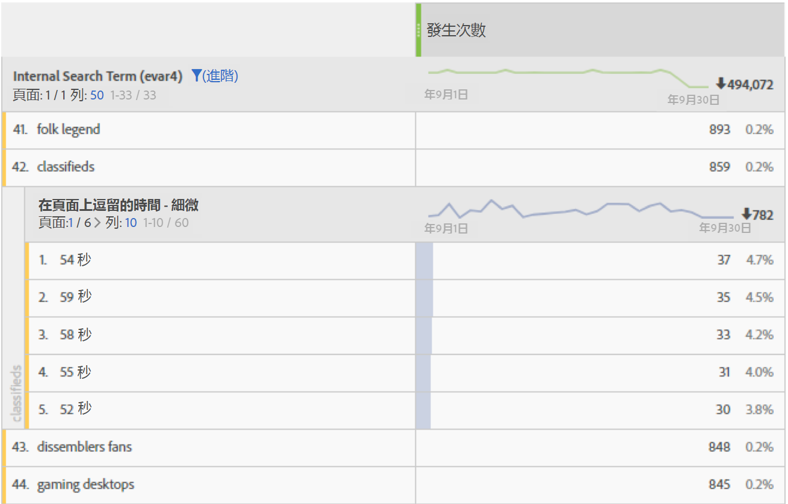

# 頁面逗留時間

Adobe Analytics提供數種方式來判斷Analytics報表逗留時間。 在大多數情況下，逗留時間會使用下列步驟計算：

1. 若是指定的點擊，請查看時間戳記和維度值。
2. 將此點擊與瀏覽中下次點擊的時間戳記進行比較。
3. 這兩個點擊之間經過的時間，會導致該頁面的逗留時間。

檢視逗留時間維度資料時，請牢記下列事項：

* 逗留時間會考量到配置和到期。
* 計算逗留時間資料時，會同時考慮頁面檢視和連結追蹤點擊類型。
* 逗留時間不會在瀏覽的上次點擊期間測量，因為沒有後續影像要求可測量經過的時間。
* 彈回數無法測量逗留時間，因為瀏覽包含單一點擊。

頁面逗留時間會測量瀏覽中點擊之間經過的時間。 粒度和範圍化之 **間存** 在個 **別維度**。

* **** 細微：每個維度值是兩個點擊之間逗留的秒數不同。
* **** 分組：每個維度值都是預先定義的貯體：
   * 少於15秒
   * 15 至 29 秒
   * 1 至 3 分鐘
   * 3 至 5 分鐘
   * 5 至 10 分鐘
   * 10 至 15 分鐘
   * 15 至 20 分鐘
   * 20 至 30 分鐘
   * 超過30分鐘

此維度是以點擊為基礎，若用作劃分，可提供更有意義的資料。 將此維度與每次瀏 [覽逗留時間](reports-time-spent-per-visit.md)（以瀏覽為基礎的維度）作比較。

